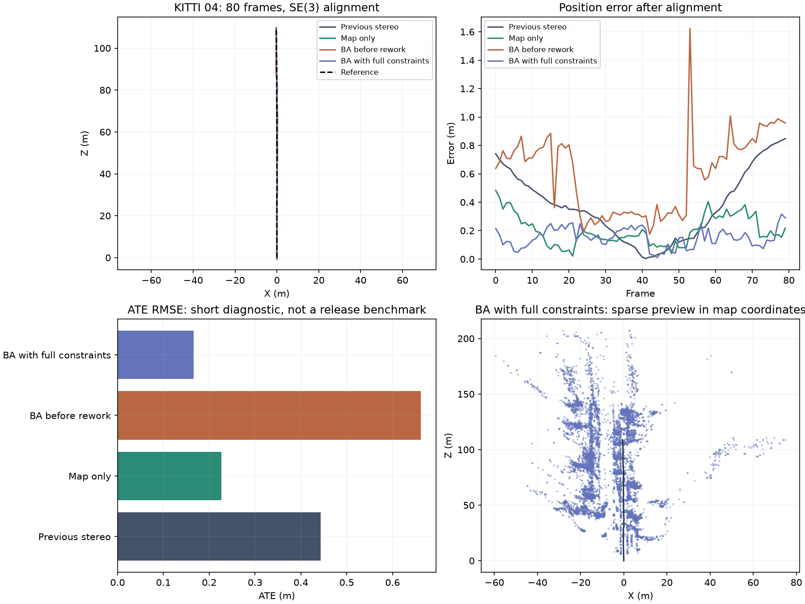
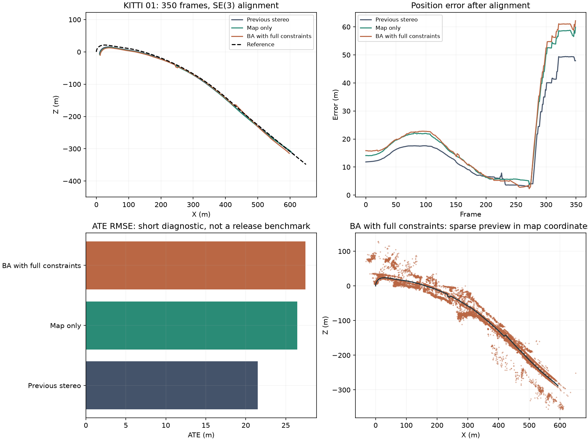
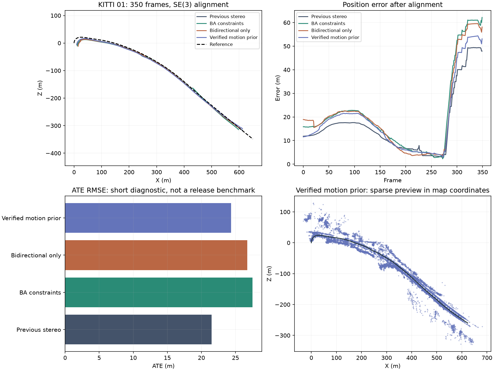
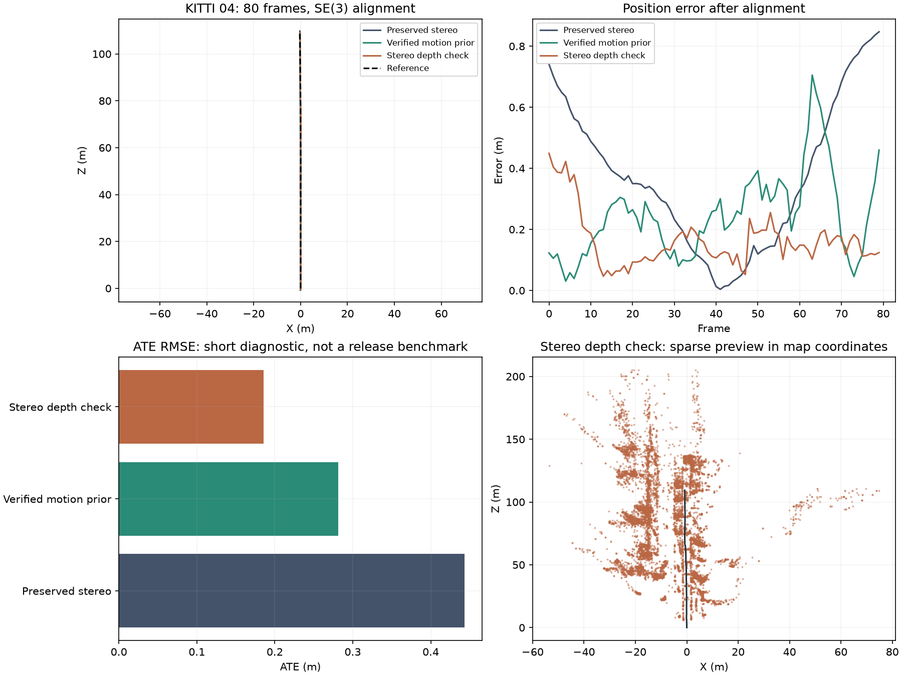

# Stereo reliability development

The shared mapping snapshot is preserved on `codex/shared-slam-reconstruction`.
Reliability changes are developed on `codex/stereo-reliability-rework`; the old
paired benchmark and its scheduler are paused. Completed results are retained,
including regressions and interrupted inputs. Neither branch is a release approval.

## Budgeted checks

Run from the repository root with the project environment. `$data` must contain
`sequences/<id>/calib.txt` and synchronized `image_0`/`image_1` streams. `$poses`
contains evaluator-only reference trajectories.

```powershell
.\.venv\Scripts\python scripts/run_development_tests.py --profile quick --data-root $data --poses-root $poses
.\.venv\Scripts\python scripts/run_development_tests.py --profile focused --variants baseline map-only bundle live offline --data-root $data --poses-root $poses
```

Quick cycles target five minutes and replay 80 stereo 04 frames. Focused cycles
default to a 60-minute total budget, adding the first 350 stereo 01 frames. The
budget includes synthetic checks, input decoding/fingerprinting, replay and plots.
A conservative estimate can defer the next case; run the same command again to
reuse exact matching completed evidence and continue. An interruption is not a
pass. Stateful replays always start at frame zero.

`--feature-cache .datasets/feature-cache` optionally reuses SIFT/depth extraction
in diagnostics. Entries are keyed by image contents, extraction implementation,
OpenCV build, extraction parameters and calibration. Tracking-only changes can
reuse identical extracted features; evaluation results still require the full
estimator and evaluator fingerprints to match. The cache is bounded; reports identify hits and
misses. Cached timings must not be presented as official estimator performance.
Release profiles reject this cache option.

The evaluator also supports `--max-wall-seconds`, `--stop-file`,
`--disable-bundle` and `--loop-mode off|live|offline`. Reference poses are opened
after estimation. Interrupted runs retain checkpoint trajectories and available
finite exports; reconstruction images may be absent from partial runs.

## Evidence and release gates

Compare the preserved stereo tracker, map-only tracking, local bundle adjustment,
live correction and offline correction independently. Inclusive stage timings
overlap; do not add nested stages together. Keep source/configuration/input
fingerprints and frame coverage with every result.

Recovery uses descriptor sketches to shortlist candidates, followed by geometric
verification. A loop solve can cross appended keyframes only when the snapshot
geometry is unchanged. Geometry changes reject the result; updates to the map and
trajectory are atomic. Synthetic correction application and anchored solver checks
cover 300 and 1,000 keyframes. The production 300-keyframe guard remains enabled
pending representative larger-graph validation.

Passing short tests does not establish full-sequence reliability. Before full
paired validation, require finite consistent exports, improved affected failures,
no worse tracking-loss coverage and no unexplained accuracy regression above 5%
against fresh matched baseline runs on 01, 04, then 00 and 07. Review the exact
revision before creating a release gate JSON containing `revision` and `passed`.
The runner requires that assessment for `--profile release --release-ready`.
Estimate cost first; improve performance or obtain a specific extended budget
before starting work expected to exceed an hour. GPU acceleration remains deferred.

## First diagnostic findings

Local bundle adjustment reused global pose-graph propagation and moved landmarks
excluded from its solve. A synthetic regression reproduced a 0.166 m displacement
of an unoptimized world point. Local BA now preserves excluded world coordinates;
global SE(3)/Sim(3) corrections still propagate landmarks through their anchors.

That invariant fix does not resolve the accuracy regression. On KITTI 04's first
80 frames, all variants tracked every frame, but BA still worsened trajectory
accuracy. The before-fix run is retained as a separate source revision.

| Stereo variant | SE(3) ATE RMSE (m) | Translation drift (%) | Lost frames |
| --- | ---: | ---: | ---: |
| Preserved stereo VO | 0.444 | 1.673 | 0 |
| Persistent map, BA and loops off | 0.226 | 0.776 | 0 |
| Local BA before landmark fix | 0.553 | 1.267 | 0 |
| Local BA with landmark fix, loops off | 0.662 | 1.599 | 0 |

These are short diagnostic results with limited segment coverage. Shared runs use
cached feature extraction, so their runtimes are not official performance results.
Ground truth is used only after tracking. No live-loop improvement is established
by this short straight-driving replay.


[Saved diagnostic metrics and exact source fingerprints](benchmark/STEREO_REWORK_DIAGNOSTICS.json)
record the evidence. Local checks passed 97 backend tests, four dashboard socket
tests, type checking and the production build. Anchored synthetic solver checks
passed at 300 and 1,000 keyframes; representative larger loop graphs remain pending.

The release gate remains closed. Next, examine BA pose changes at keyframe
boundaries, evaluate the objective over excluded observations and compare stereo
depth constraints with fixed-landmark camera refinement. Reproduce each change
on this prefix before expanding to stereo 01. Broader input, recovery, monocular
and full-sequence validation are still required. The scheduler stays paused and
main is unchanged.

### BA with complete affected-view constraints

The next diagnostic separated independent multiview landmarks from single-view
stereo points. Excluded multiview observations now constrain the camera solve and
participate in its acceptance objective. Single-view points preserve their measured
camera coordinates when their anchor moves. Explicit landmark updates are validated
and committed with the corrected cameras under the map lock.

All eight BA updates on the 80-frame 04 replay reduced the affected-view objective.
ATE was **0.166 m**, versus **0.226 m** for map-only and **0.444 m** for a fresh
preserved-stereo replay. Translation drift was **0.284%**, **0.776%** and **1.673%**,
respectively; every variant tracked all 80 frames. This is still a one-segment
diagnostic, with cached shared extraction and no verified loop correction.



The matched 350-frame stereo 01 comparison completed in the same 574-second
diagnostic cycle. It failed the wider correctness gate:

| Stereo 01 variant | SE(3) ATE RMSE (m) | Translation drift (%) | Lost frames |
| --- | ---: | ---: | ---: |
| Preserved stereo VO | 21.510 | 8.357 | 18 |
| Persistent map, BA and loops off | 26.458 | 10.149 | 3 |
| BA with affected-view constraints, loops off | 27.474 | 10.387 | 6 |



The shared tracker underestimates distance despite fewer held poses. There are no
verified loops in these runs, so this regression originates before pose-graph
correction. Full-sequence expansion remains blocked by the diagnostic gate.

A separate experiment jointly refines already verified forward/reverse stereo
observations, retaining the same correspondence, coverage and reprojection checks.
Synthetic checks show reduced directional depth bias and rejection of false
descriptor candidates. Stereo 04's 80-frame result is unchanged. On a separately
replayed frozen revision,
stereo 01 scored 26.738 m ATE, 10.035% translation drift and three lost frames;
this still fails the baseline accuracy gate. No release approval is implied.

Further diagnosis of map-only frames 275–349 found a median accepted flow-based
step of 0.547 m, versus 2.666 m for independently verified stereo steps. The
evaluator-only reference median was 2.662 m. The interval had no loop correction.
Fewer held poses concealed accepted motion errors.

A subsequent experiment retains a bidirectionally verified stereo increment only
as a short-lived matching prior. It expires after five frames and extrapolates at
most three frames from the last accepted pose. It never fills held outputs or
creates geometry while lost, and monocular prediction is unchanged. On stereo 04,
ATE is 0.281 m and drift is 0.264%, with no loss; ATE worsens relative to the earlier
BA fix while remaining below the preserved baseline. Stereo 01 completed all 350
frames with zero held poses, but scored **24.350 m ATE** and **10.131% drift**.
It improves on the preceding shared-map revision while still exceeding the
baseline's 21.510 m ATE and 8.357% drift. The accuracy gate remains closed.



The complete backend suite passes 103 tests and the frontend production build
passes. Source snapshots, evaluator hashes, finite trajectories and complete frame
counts were verified for the two frozen 350-frame ablations. Shared timings remain
cached diagnostics. Each ablation had an owned-process deadline; the final one
finished in 440 seconds under a 900-second limit.

Next, test stereo-depth consistency during map-pose refinement, including synthetic
repeated-pattern ambiguity. Recheck stereo 04's first 80 frames and stereo 01's
first 350 frames before any full-sequence expansion. Preserve the baseline and all
failed revisions. Full stereo 01/04, 00/07, monocular/TUM and live-loop acceptance
remain pending. The paired scheduler stays paused and main is unchanged.

### Current stereo observation verification

Map-based PnP now refines a left-image hypothesis against current right-image
reprojection when enough spatially distributed disparity observations are available.
The same left-image acceptance checks remain in force, and inconsistent stereo
observations are excluded. Insufficient depth support is reported explicitly;
such frames retain geometric tracking without claiming stereo verification.
Rectified calibration with different principal points is handled in both pose
refinement and local BA. Learned depth and reference data do not enter either solve.

Synthetic checks reject a wrong-depth map hypothesis that projects perfectly in
the left image, verify outlier rejection and pose refinement, and cover missing
depth and principal-point offsets. The complete backend suite passes 109 tests.

The new frozen stereo 04 replay completed all 80 frames with no loss, 0.186 m
SE(3) ATE and 0.794% translation drift. The matched preserved baseline remains
0.444 m and 1.673%. Compared with the preceding motion-prior revision, ATE improves
from 0.281 m but drift worsens from 0.264%; these are short, single-segment
diagnostics. The full quick cycle took 90 seconds, including checks and plotting.
Feature-cache metadata is retained, so the timing is not an official uncached
performance measurement. The narrower cache fingerprint reproduces the same
trajectory metrics as the preceding extraction-cache identity.



Stereo 01 has not yet been rerun on this revision. Its preceding 350-frame
regression remains a release blocker. This commit is an experimental snapshot;
it does not establish a general accuracy improvement or authorize a main merge.
