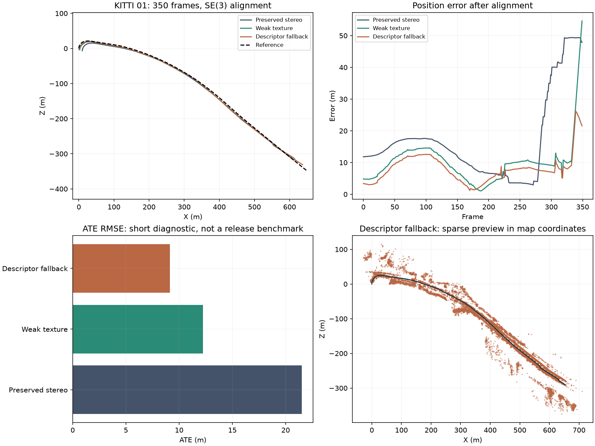

# Stereo reliability development

The experimental snapshot is preserved on `codex/shared-slam-reconstruction`.
Reliability work continues on `codex/stereo-reliability-rework`. The original paired
benchmark and its scheduler remain paused while diagnostic gates are established.

## Current evidence

These matched comparisons use the preserved stereo VO and the new shared tracker,
with loops disabled. ATE uses SE(3) alignment with scale fixed to one. Reference
poses are loaded after tracking; learned depth is excluded from tracking.

| KITTI | Coverage | Estimator | ATE RMSE (m) | Translation drift (%) | Lost frames |
| --- | --- | --- | ---: | ---: | ---: |
| 01 | First 350 frames | Preserved stereo VO | 21.510 | 8.357 | 18 |
| 01 | First 350 frames | Current shared stereo | 9.137 | 5.137 | 6 |
| 04 | All 271 frames | Preserved stereo VO | 1.763 | 1.683 | 0 |
| 04 | All 271 frames | Current shared stereo | 0.879 | 0.908 | 0 |

The current 01 run recovers after both loss intervals: frame 307 and frames
334–338. Rotation drift worsens from 0.01086 to 0.01377 degrees/m. Some local BA
camera changes remain large and require investigation before wider acceptance.
The 350-frame result does not establish reliability for the complete sequence.




The full 04 runs use no feature cache: the shared estimator takes 210.8 seconds
and peaks at 321.7 MiB, versus 148.9 seconds and 231.4 MiB for the baseline.
The 01 shared replay uses cached extraction and takes 226 seconds under its
supervisor; that timing is a diagnostic, not an official performance comparison.
The complete backend suite passes 112 tests. Dashboard socket tests, type checking
and the production build pass.

[Curated results and source fingerprints](benchmark/STEREO_REWORK_DIAGNOSTICS.json)
retain configurations, coverage, input identity, runtime and memory alongside the
older experiments. Finite trajectories and sparse exports were verified. The
saved dashboard gallery preserves earlier failures under separate labels.

## Tracking and mapping fixes

Local bundle adjustment now includes all affected multiview camera observations
in its acceptance objective. Excluded multiview landmarks retain their world
coordinates; single-view stereo landmarks preserve their measured camera
coordinates when their anchor moves. Camera and explicit landmark updates are
validated and applied atomically. Synthetic checks cover disconnected gauges and
reject updates that improve selected observations while worsening the affected
map.

Stereo map PnP also checks current right-image reprojection when enough spatially
distributed disparity observations exist. Rectified principal-point offsets are
handled consistently in tracking and BA. Missing depth support is reported rather
than presented as stereo verification. Wrong-depth maps that fit the left image
are rejected by synthetic checks.

The first depth-check revision failed stereo 01 at frame 275: 53.034 m ATE and
75 unresolved lost frames. Disabling BA produced the same interval. An image-only
probe found too few useful matches under the default SIFT contrast setting.
Detecting weaker texture supplied 33 independent PnP inliers across five spatial
cells on the failing pair. Stereo now uses one fixed SIFT contrast threshold of
0.02 across inputs, with the existing feature cap; monocular extraction remains
unchanged. Pose acceptance thresholds are unchanged. Synthetic weak-texture
images initialize and track; blank images still cannot initialize.


The tracker additionally retries mutual descriptor matches when flow-augmented
PnP is rejected. A synthetic scene reproduces coherent flow outliers in two
spatial cells dominating RANSAC despite 70 correct descriptor matches. The retry
recovers the known camera pose with the existing geometric acceptance checks.
It does not accept the rejected flow hypothesis or fill held poses.

The feature-support revision alone scored 12.249 m ATE, 6.121% drift and 18 lost
frames on 01. Adding the descriptor retry improves that separate frozen replay
to the current table. Earlier BA, bidirectional-refinement and motion-prior
experiments remain available in the result JSON and gallery.

Disabling BA on the current source scores 105.055 m ATE, 37.172% drift and 127
unresolved lost frames starting at frame 223. The corresponding BA-enabled run
scores 9.137 m, 5.137% and six recovered lost frames. This ablation supports
keeping local BA enabled for the current stereo configuration; it does not
demonstrate live loop correction, which is disabled in both runs.


## Budgeted checks

Run from the repository root with the project environment. `$data` contains
`sequences/<id>/calib.txt` and synchronized `image_0`/`image_1` streams. `$poses`
contains evaluator-only reference trajectories.

```powershell
.\.venv\Scripts\python scripts/run_development_tests.py --profile quick --data-root $data --poses-root $poses
.\.venv\Scripts\python scripts/run_development_tests.py --profile focused --variants baseline map-only bundle live offline --data-root $data --poses-root $poses
```

Quick cycles target five minutes and replay 80 stereo 04 frames. Focused cycles
have a 60-minute total budget and add the first 350 stereo 01 frames. Preparation,
checks, replay and reporting count toward that budget. Estimate cost before the
next replay; defer work that does not fit. Stateful integration begins at frame
zero. Completed matching evidence can be reused without replacing history.

`--feature-cache .datasets/feature-cache` optionally caches deterministic SIFT and
disparity extraction for diagnostics. Identity includes image content, extraction
implementation and parameters, OpenCV build and calibration. Tracking-only edits
can reuse features; evaluation scores still require the complete estimator,
evaluator, configuration, input and coverage identities to match. Release profiles
reject cached performance measurements.

The evaluator supports `--max-wall-seconds`, `--stop-file`, `--disable-bundle` and
`--loop-mode off|live|offline`. Timeouts, input errors and requested stops retain
available partial exports and explicit status. Owned-process supervision enforces
the hard deadline. Original datasets and previous results are preserved.

## Wider acceptance

Full 01, 00 and 07 comparisons, monocular initialization/recovery and RGB-only TUM
validation remain required. Investigate rotation regressions and large BA changes;
passing a short ATE comparison alone is insufficient. Require finite consistent
exports, improved affected failures, no worse tracking-loss coverage and no
unexplained ATE or translation-drift regression above 5% against fresh matched
baselines before broader paired validation.

Keep map-only, BA, live and offline ablations separate. Inclusive stage timings
may overlap. Verify loop corrections on identical graphs and report actual applied
updates, stale rejection and recovery. Synthetic correction and anchored solver
checks cover 300 and 1,000 keyframes; the production 300-keyframe guard remains
until representative larger graphs are validated.

Release runs require a reviewed gate JSON containing the exact `revision` and
`passed`, supplied through `--profile release --release-ready`. Estimate complete
sequence cost before starting; improve performance or obtain a specific extended
budget for work expected to exceed an hour. The scheduler stays paused and main
remains unchanged until the agreed wider validation and review are complete.
