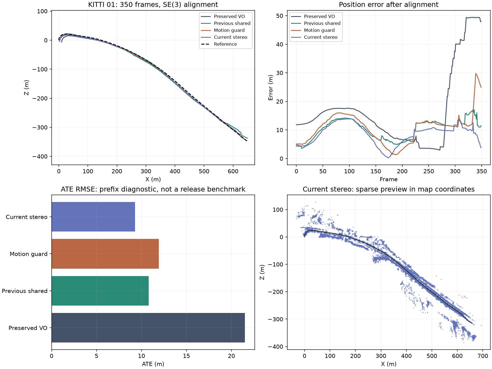
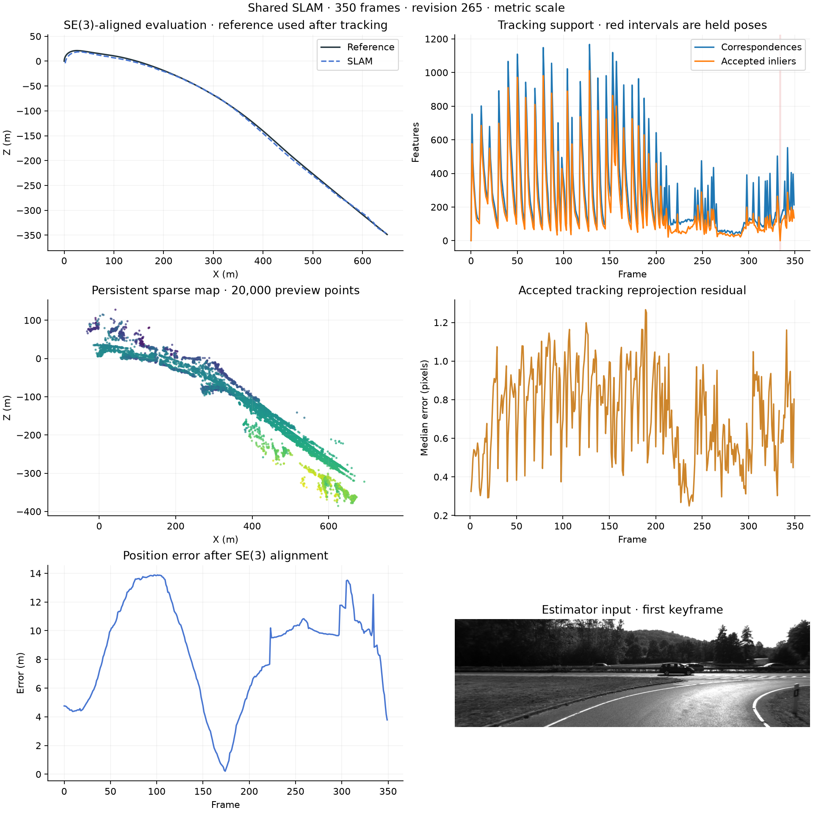
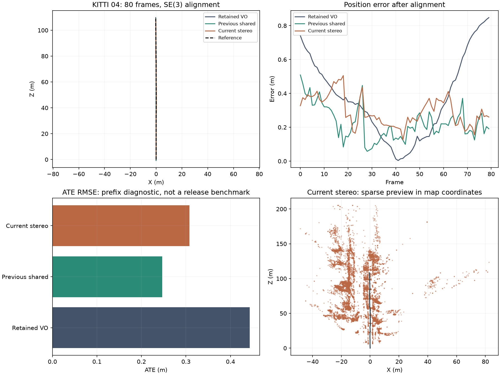
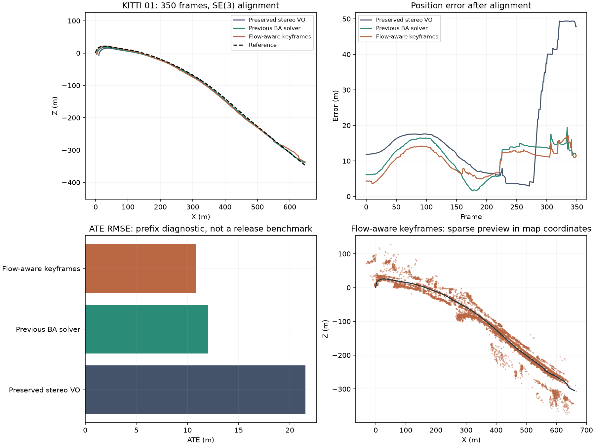

# Stereo reliability development

The experimental snapshot is preserved on `codex/shared-slam-reconstruction`.
Reliability and performance integration continues on `codex/stereo-reliability-integration`. The original paired
benchmark and its scheduler remain paused while diagnostic gates are established.

Current results and remaining regressions are documented in
[physical landmark identity validation](benchmark/physical-identity-validation.md).
[Raw stereo reference retry](benchmark/raw-stereo-reference-retry.md) is a separate
opt-in experiment. The checkpoints below retain their original source revisions;
their metrics do not validate later implementations.

## Retained paused progress checkpoint

Implementation and scheduled validation are paused at the user's request. The
current frozen source fingerprint is `db696b4f7393`. This revision adds independent
stereo-motion checks after local bundle adjustment and disparity sampling at the
actual subpixel feature coordinates. The branch remains experimental; main is
unchanged.

| KITTI | Coverage | Estimator | ATE RMSE (m) | Translation drift (%) | Rotation drift (degrees/m) | Lost frames |
| --- | --- | --- | ---: | ---: | ---: | ---: |
| 01 | First 350 of 1,101 | Fresh preserved stereo VO | 21.510 | 8.357 | 0.01086 | 18 |
| 01 | First 350 of 1,101 | Current shared stereo | 9.292 | 5.052 | 0.01059 | 1 |
| 04 | First 80 of 271 | Retained preserved stereo VO | 0.444 | 1.673 | 0.01241 | 0 |
| 04 | First 80 of 271 | Current shared stereo | 0.308 | 0.605 | 0.01510 | 0 |

All comparisons use stereo metric scale, SE(3) alignment without scale fitting,
loops off and estimation from images only. Reference poses are evaluator-only.
The fresh 01 baseline matches the current source archive and input fingerprint.
The 04 baseline is retained evidence on the same coverage, not a fresh run of the
current archive. Current rotation drift is 21.6% higher than that baseline.

Current 01 ATE improves 56.8% and translation drift 39.6% against preserved VO.
The isolated loss at frame 334 recovers. Compared with the previous shared
keyframe revision, ATE improves from 10.802 to 9.292 m and rotation drift from
0.01672 to 0.01059 degrees/m. Current 04 improves translation drift but worsens
ATE and rotation against the preceding shared revision. These prefixes do not
establish full-sequence reliability: the earlier full 01 regression below remains
an unresolved release hold until the current revision is evaluated in full.







A read-only replay observer found three applied BA proposals on the preceding
revision that broke existing independent stereo-motion agreement limits. Before
BA, translation disagreement at frames 58, 171 and 322 was 0.108, 0.175 and
0.146 m; afterward it was 0.563, 0.657 and 0.729 m. The observer preserved identical
estimator outputs and used no reference poses. Local BA now checks affected
relative motions before committing any geometry. It retains the existing 0.5 m
and 1.5 degree limits and permits consistent common rigid motion of both anchors.
The current exported 01 prefix passes all 340 saved independent motion checks.

Stereo depth previously combined rounded-pixel disparity with fractional feature
coordinates. Bilinear sampling now uses the actual feature location, rejects
invalid contributing neighbors and avoids interpolation across disparity jumps
larger than the existing two-pixel stereo residual budget. Integer pixel centers
remain valid even when a zero-weight neighbor is invalid. Synthetic tests cover
known depth surfaces and rectified principal-point offsets. Learned depth remains
outside tracking.

The current 01 estimator takes 348.8 seconds and peaks at 607.3 MiB; preserved VO
takes 141.3 seconds and peaks at 235.4 MiB. The current diagnostic enables a feature
cache with zero hits and 350 misses, including cache-write overhead. These are
observed diagnostic costs, not an official comparable performance benchmark.
The current 04 estimator takes 67.6 seconds and peaks at 252.7 MiB, also with zero
cache hits. The full backend suite passes 136 tests; dashboard tests, type checking
and build pass. The complete development cycle, including diagnosis, replays and
reporting, stays within its one-hour budget.

On resumption, investigate the 04 rotation regression and run matched current
full 01/04 only when their predicted cost fits the declared budget. Then validate
00/07 and wider coverage. Runtime, map growth, live correction, monocular recovery
and dense reconstruction remain separate acceptance tasks. No more replays or
feature work are scheduled at this checkpoint.

To inspect saved independent motion without reference poses:

```powershell
.\.venv\Scripts\python scripts/verify_saved_stereo_motion.py --run $savedRun --output $verificationJson
```

## Retained flow-aware keyframe diagnostic

The preceding revision counts verified flow tracks when deciding whether tracking
support requires an early keyframe. Both short stereo replays use frozen source,
loops off and evaluator-only reference poses. All frames are processed from zero.

| KITTI | Coverage | ATE RMSE (m) | Translation drift (%) | Rotation drift (degrees/m) | Lost frames |
| --- | --- | ---: | ---: | ---: | ---: |
| 04 | First 80 frames | 0.247 | 0.668 | 0.00548 | 0 |
| 01 | First 350 frames | 10.802 | 5.862 | 0.01672 | 2 |

On the 01 prefix, keyframes fall from 145 to 128 and landmarks from 128,230 to
111,439. ATE improves from 12.026 m and translation drift from 6.167%, while
rotation drift worsens from 0.01494 degrees/m. Both losses, at frames 307 and 341,
recover. Against preserved stereo VO on the same prefix, ATE and loss coverage
improve, but rotation remains worse than its 0.01086 degrees/m. This is still an
experimental revision; it has no new full-sequence validation or live-loop evidence.

The 350-frame worker finishes in 176 seconds under its supervisor and peaks at
617 MiB. Extraction is cached under matching input, calibration, implementation
and OpenCV fingerprints. These are diagnostic timings, not release performance
measurements. The quick replay, geometry tests, inspection and publication fit
within a single development cycle; no full replay is launched for this push.



## Retained BA solver evidence

These matched comparisons use the preserved stereo VO and the new shared tracker,
with loops disabled. ATE uses SE(3) alignment with scale fixed to one. Reference
poses are loaded after tracking; learned depth is excluded from tracking.

| KITTI | Coverage | Estimator | ATE RMSE (m) | Translation drift (%) | Lost frames |
| --- | --- | --- | ---: | ---: | ---: |
| 01 | All 1,101 frames | Preserved stereo VO | 72.293 | 9.574 | 23 |
| 01 | All 1,101 frames | BA solver shared stereo | 88.682 | 9.104 | 2 |
| 04 | First 80 frames | Preserved stereo VO | 0.444 | 1.673 | 0 |
| 04 | First 80 frames | BA solver shared stereo | 0.357 | 0.691 | 0 |

The full 01 comparison fails the release gate: shared ATE is 22.7% worse. Rotation
drift also worsens from 0.01337 to 0.01641 degrees/m. Translation drift improves by
4.9%; both isolated shared losses, frames 307 and 334, recover. These improvements
do not offset the unexplained trajectory regression.

The shared worker takes 1,400 seconds and peaks at 2,023 MiB, versus 450 seconds
and 238 MiB for preserved stereo. These uncached worker timings
include initialization, tracking, export and evaluation. Source snapshots, full
input fingerprints and reference identity match. An external baseline observer
records actual returned tracking decisions without changing estimator outputs;
its measured overhead is 0.006 seconds.


The 350-frame shared diagnostic scores 12.026 m ATE, 6.167% translation drift and
two lost frames, versus 21.510 m, 8.357% and 18 for preserved stereo. Its ATE is
worse than the preceding descriptor-retry revision's 9.137 m and 5.137%, despite
fewer losses. The short comparison did not predict complete-sequence behavior.


The retained full 04 comparison predates the solver fixes: shared stereo scores
0.879 m ATE and 0.908% drift, versus 1.763 m and 1.683% for preserved stereo.
Those scores do not validate later source revisions. Both runs use no feature cache:
the shared estimator takes 210.8 seconds
and peaks at 321.7 MiB, versus 148.9 seconds and 231.4 MiB for the baseline.
The BA solver 01 prefix uses cached extraction and takes 201 seconds under its
supervisor; that timing is a diagnostic, not an official performance comparison.
At that checkpoint the backend suite passed 123 tests. Dashboard socket tests, type checking
and the production build pass.


[Curated results and source fingerprints](benchmark/STEREO_REWORK_DIAGNOSTICS.json)
retain configurations, coverage, input identity, runtime and memory alongside the
older experiments. Finite trajectories and sparse exports were verified. The
saved dashboard gallery preserves earlier failures under separate labels.

Full 01 exports have consistent keyframe/trajectory poses and shared landmark
positions, no keyframes on lost frames, and no negative multiview observation
depths. Final multiview reprojection has a 0.339 px median, 1.015 px 95th percentile
and 0.054% above 2 px. Low internal reprojection error does not establish accurate
global motion. The largest applied BA translation change is 1.526 m. Loops are off,
so this experiment supplies no live pose-graph correction evidence.

## Tracking and mapping fixes

Local bundle adjustment now includes all affected multiview camera observations
in its acceptance objective. Excluded multiview landmarks retain their world
coordinates; single-view stereo landmarks preserve their measured camera
coordinates when their anchor moves. Camera and explicit landmark updates are
validated and applied atomically. Synthetic checks cover disconnected gauges and
reject updates that improve selected observations while worsening the affected
map.

Held-out residual rows now follow the observation order declared by the sparse
Jacobian. The previous implementation appended all right-image errors after all
left-image errors, declaring the wrong camera dependencies. Numeric derivative
checks reproduce the defect and cover mixed stereo and left-only observations.
Fixing the row order alone scores 13.423 m ATE and one recovered lost frame on
the 01 prefix; that intermediate result is retained separately.

Automatic scaling from the Huber-weighted Jacobian also stalled on a noiseless
synthetic scene despite reporting solver success. BA now uses radians for rotation
and a geometric baseline for translations and points. Stereo uses its calibrated
baseline; monocular uses positive local camera separation. Six stereo/monocular
checks across coordinate scales 0.01, 1 and 100 recover the known cameras and reduce
the complete affected objective. Pose acceptance and robust-loss thresholds remain
unchanged. The numerical fixes improve correctness without guaranteeing a lower
trajectory score for every noisy sequence.

Stereo map PnP also checks current right-image reprojection when enough spatially
distributed disparity observations exist. Rectified principal-point offsets are
handled consistently in tracking and BA. Missing depth support is reported rather
than presented as stereo verification. Wrong-depth maps that fit the left image
are rejected by synthetic checks.

The first depth-check revision failed stereo 01 at frame 275: 53.034 m ATE and
75 unresolved lost frames. Disabling BA produced the same interval. An image-only
probe found too few useful matches under the default SIFT contrast setting.
Detecting weaker texture supplied 33 independent PnP inliers across five spatial
cells on the failing pair. Stereo now uses one fixed SIFT contrast threshold of
0.02 across inputs, with the existing feature cap; monocular extraction remains
unchanged. Pose acceptance thresholds are unchanged. Synthetic weak-texture
images initialize and track; blank images still cannot initialize.


The tracker additionally retries mutual descriptor matches when flow-augmented
PnP is rejected. A synthetic scene reproduces coherent flow outliers in two
spatial cells dominating RANSAC despite 70 correct descriptor matches. The retry
recovers the known camera pose with the existing geometric acceptance checks.
It does not accept the rejected flow hypothesis or fill held poses.

The feature-support revision alone scored 12.249 m ATE, 6.121% drift and 18 lost
frames on 01. Adding the descriptor retry improves that separate frozen replay
to the preceding descriptor-retry revision. Earlier BA, bidirectional-refinement
and motion-prior
experiments remain available in the result JSON and gallery.

Disabling BA on the preceding descriptor-retry source scores 105.055 m ATE, 37.172% drift and 127
unresolved lost frames starting at frame 223. The corresponding BA-enabled run
scores 9.137 m, 5.137% and six recovered lost frames. This ablation supports
local BA in that revision; it does not validate the later solver revision or
demonstrate live loop correction, which is disabled in both runs.


## Budgeted checks

Run from the repository root with the project environment. `$data` contains
`sequences/<id>/calib.txt` and synchronized `image_0`/`image_1` streams. `$poses`
contains evaluator-only reference trajectories.

```powershell
.\.venv\Scripts\python scripts/run_development_tests.py --profile quick --data-root $data --poses-root $poses
.\.venv\Scripts\python scripts/run_development_tests.py --profile focused --variants baseline map-only bundle live offline --data-root $data --poses-root $poses
```

Quick cycles target five minutes and replay 80 stereo 04 frames. Focused cycles
have a 60-minute total budget and add the first 350 stereo 01 frames. Preparation,
checks, replay and reporting count toward that budget. Estimate cost before the
next replay; defer work that does not fit. Stateful integration begins at frame
zero. Completed matching evidence can be reused without replacing history.

`--feature-cache .datasets/feature-cache` optionally caches deterministic SIFT and
disparity extraction for diagnostics. Identity includes image content, extraction
implementation and parameters, OpenCV build and calibration. Tracking-only edits
can reuse features; evaluation scores still require the complete estimator,
evaluator, configuration, input and coverage identities to match. Release profiles
reject cached performance measurements.

The evaluator supports `--max-wall-seconds`, `--stop-file`, `--disable-bundle` and
`--loop-mode off|live|offline`. Timeouts, input errors and requested stops retain
available partial exports and explicit status. Owned-process supervision enforces
the hard deadline. Original datasets and previous results are preserved.

## Wider acceptance

Repair and reevaluate the full 01 regression before expansion. Fresh current-source
full 04, 00 and 07 comparisons, monocular initialization/recovery and RGB-only TUM
validation remain required. Investigate rotation regressions and resource use;
passing a short ATE comparison alone is insufficient. Require finite consistent
exports, improved affected failures, no worse tracking-loss coverage and no
unexplained ATE or translation-drift regression above 5% against fresh matched
baselines before broader paired validation.

Keep map-only, BA, live and offline ablations separate. Inclusive stage timings
may overlap. Verify loop corrections on identical graphs and report actual applied
updates, stale rejection and recovery. Synthetic correction and anchored solver
checks cover 300 and 1,000 keyframes; the production 300-keyframe guard remains
until representative larger graphs are validated.

A posthoc 350-frame audit finds 49 early keyframes with at least 80 existing
landmark observations. At frame 29, 122 accepted inliers coexist with only 45
descriptor candidates. The insertion policy counts detector associations and
omitted additional verified flow support. The corrected policy counts unique live
landmarks across detector associations and geometrically accepted flow tracks.
Synthetic geometry tests cover the unchanged 80-landmark threshold and overlapping
descriptor/flow support; they fail under the previous policy. Pose acceptance
thresholds, the regular keyframe interval and forced stereo-reference keyframes
remain unchanged. This correction is not yet a validated explanation for the full
trajectory error. The failed solver revision remains available separately.

Release runs require a reviewed gate JSON containing the exact `revision` and
`passed`, supplied through `--profile release --release-ready`. Estimate complete
sequence cost before starting; improve performance or obtain a specific extended
budget for work expected to exceed an hour. The scheduler stays paused and main
remains unchanged until the agreed wider validation and review are complete.
