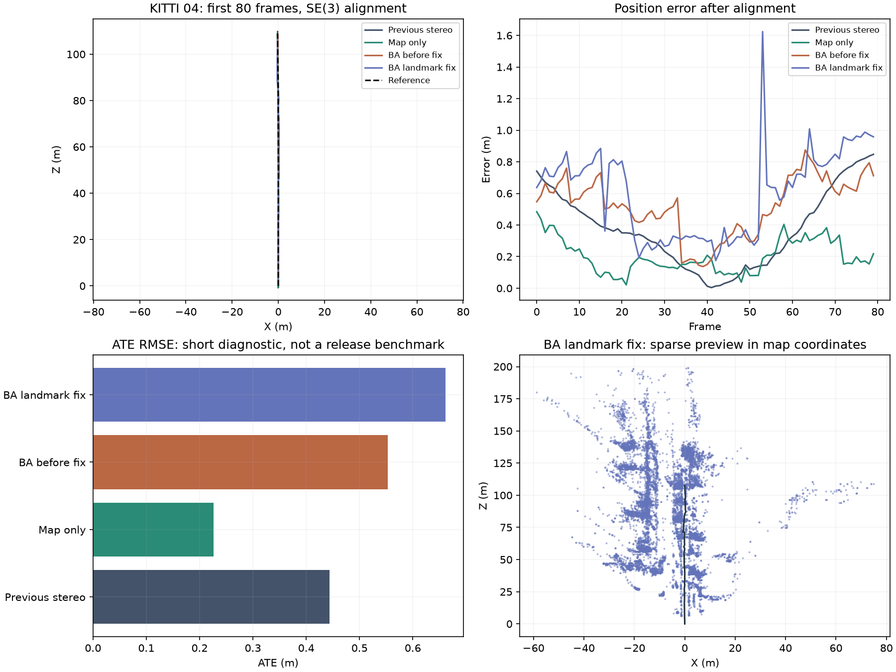

# Stereo reliability development

The shared mapping snapshot is preserved on `codex/shared-slam-reconstruction`.
Reliability changes are developed on `codex/stereo-reliability-rework`; the old
paired benchmark and its scheduler are paused. Completed results are retained,
including regressions and interrupted inputs. Neither branch is a release approval.

## Budgeted checks

Run from the repository root with the project environment. `$data` must contain
`sequences/<id>/calib.txt` and synchronized `image_0`/`image_1` streams. `$poses`
contains evaluator-only reference trajectories.

```powershell
.\.venv\Scripts\python scripts/run_development_tests.py --profile quick --data-root $data --poses-root $poses
.\.venv\Scripts\python scripts/run_development_tests.py --profile focused --variants baseline map-only bundle live offline --data-root $data --poses-root $poses
```

Quick cycles target five minutes and replay 80 stereo 04 frames. Focused cycles
default to a 60-minute total budget, adding the first 350 stereo 01 frames. The
budget includes synthetic checks, input decoding/fingerprinting, replay and plots.
A conservative estimate can defer the next case; run the same command again to
reuse exact matching completed evidence and continue. An interruption is not a
pass. Stateful replays always start at frame zero.

`--feature-cache .datasets/feature-cache` optionally reuses SIFT/depth extraction
in diagnostics. Entries are keyed by image contents, extraction implementation,
OpenCV version and calibration. The cache is bounded; reports identify hits and
misses. Cached timings must not be presented as official estimator performance.
Release profiles reject this cache option.

The evaluator also supports `--max-wall-seconds`, `--stop-file`,
`--disable-bundle` and `--loop-mode off|live|offline`. Reference poses are opened
after estimation. Interrupted runs retain checkpoint trajectories and available
finite exports; reconstruction images may be absent from partial runs.

## Evidence and release gates

Compare the preserved stereo tracker, map-only tracking, local bundle adjustment,
live correction and offline correction independently. Inclusive stage timings
overlap; do not add nested stages together. Keep source/configuration/input
fingerprints and frame coverage with every result.

Recovery uses descriptor sketches to shortlist candidates, followed by geometric
verification. A loop solve can cross appended keyframes only when the snapshot
geometry is unchanged. Geometry changes reject the result; updates to the map and
trajectory are atomic. Synthetic correction application and anchored solver checks
cover 300 and 1,000 keyframes. The production 300-keyframe guard remains enabled
pending representative larger-graph validation.

Passing short tests does not establish full-sequence reliability. Before full
paired validation, require finite consistent exports, improved affected failures,
no worse tracking-loss coverage and no unexplained accuracy regression above 5%
against fresh matched baseline runs on 01, 04, then 00 and 07. Review the exact
revision before creating a release gate JSON containing `revision` and `passed`.
The runner requires that assessment for `--profile release --release-ready`.
Estimate cost first; improve performance or obtain a specific extended budget
before starting work expected to exceed an hour. GPU acceleration remains deferred.

## First diagnostic findings

Local bundle adjustment reused global pose-graph propagation and moved landmarks
excluded from its solve. A synthetic regression reproduced a 0.166 m displacement
of an unoptimized world point. Local BA now preserves excluded world coordinates;
global SE(3)/Sim(3) corrections still propagate landmarks through their anchors.

That invariant fix does not resolve the accuracy regression. On KITTI 04's first
80 frames, all variants tracked every frame, but BA still worsened trajectory
accuracy. The before-fix run is retained as a separate source revision.

| Stereo variant | SE(3) ATE RMSE (m) | Translation drift (%) | Lost frames |
| --- | ---: | ---: | ---: |
| Preserved stereo VO | 0.444 | 1.673 | 0 |
| Persistent map, BA and loops off | 0.226 | 0.776 | 0 |
| Local BA before landmark fix | 0.553 | 1.267 | 0 |
| Local BA with landmark fix, loops off | 0.662 | 1.599 | 0 |

These are short diagnostic results with limited segment coverage. Shared runs use
cached feature extraction, so their runtimes are not official performance results.
Ground truth is used only after tracking. No live-loop improvement is established
by this short straight-driving replay.



[Saved diagnostic metrics and exact source fingerprints](benchmark/STEREO_REWORK_DIAGNOSTICS.json)
record the evidence. Local checks passed 97 backend tests, four dashboard socket
tests, type checking and the production build. Anchored synthetic solver checks
passed at 300 and 1,000 keyframes; representative larger loop graphs remain pending.

The release gate remains closed. Next, examine BA pose changes at keyframe
boundaries, evaluate the objective over excluded observations and compare stereo
depth constraints with fixed-landmark camera refinement. Reproduce each change
on this prefix before expanding to stereo 01. Broader input, recovery, monocular
and full-sequence validation are still required. The scheduler stays paused and
main is unchanged.
