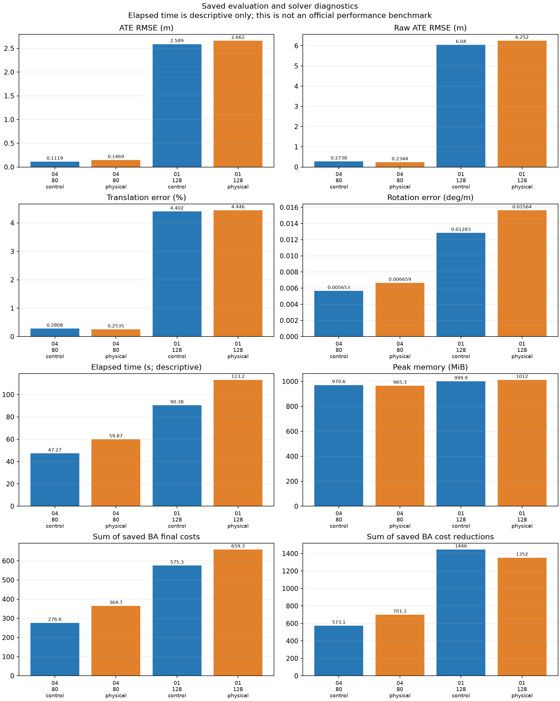
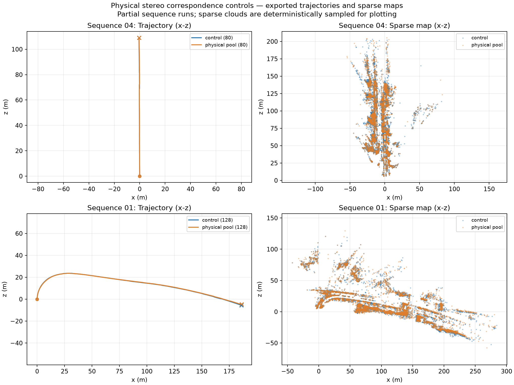
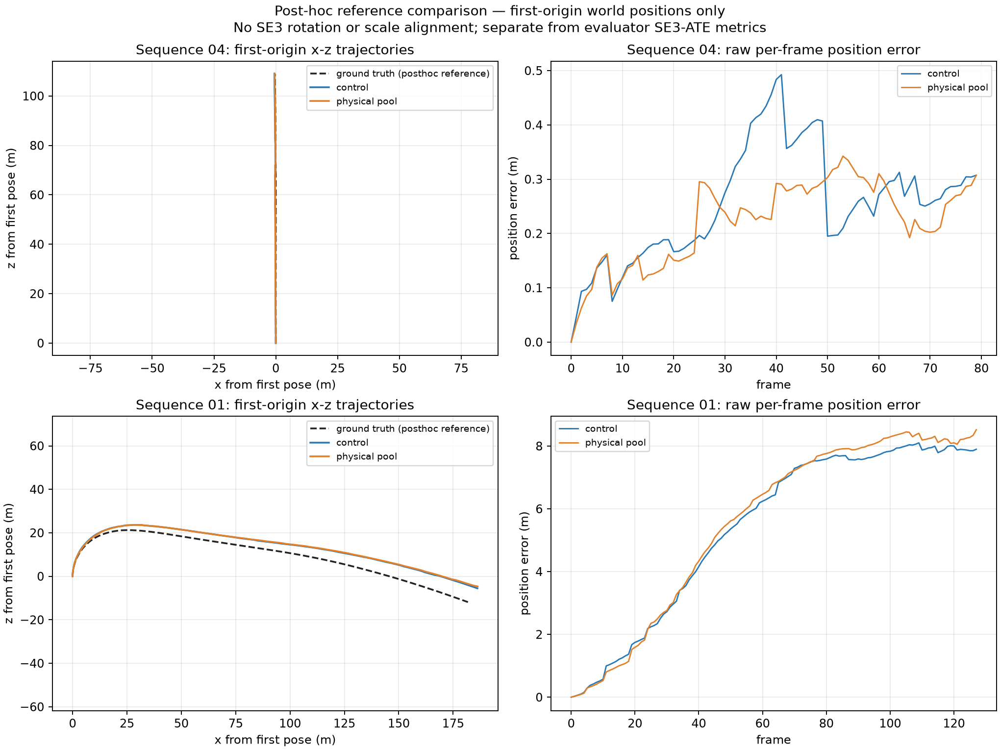

# Physical stereo correspondence experiment

The physical match-pool policy is **experimental and disabled by default**. It failed the accuracy gate and is not recommended for deployment. The existing shared-SLAM policy remains the control; these runs do not establish improvement over the original stereo VO on main.

SIFT can produce several orientation descriptors at the same pixel. The experiment retains one original descriptor match for each unambiguous physical edge, validates every alias's stereo geometry and landmark claims, and reserves physically disjoint fitting and evaluation observations. Conflicting or invalid aliases are rejected. Pose acceptance thresholds are unchanged.

## Matched short replays

Both modes ran from the same frozen estimator commit `4e78030916c59098ee4bab910385eb831d7bd4c0`, with identical input hashes, calibration, configuration and runtime. The only configuration difference is `stereo_physical_match_pool`. Each replay starts at frame zero. Ground truth is evaluator-only.

| Sequence / frames | Policy | SE(3) ATE m | Translation % | Rotation deg/m | Lost frames | Processing s | FPS | Peak RAM MiB |
|---|---|---:|---:|---:|---:|---:|---:|---:|
| 04 / 80 | control | 0.111884 | 0.280753 | 0.005653 | 0 | 47.27 | 1.69 | 970.60 |
| 04 / 80 | physical pool | 0.146945 | 0.253492 | 0.006659 | 0 | 59.87 | 1.34 | 965.28 |
| 01 / 128 | control | 2.588752 | 4.402350 | 0.012833 | 0 | 90.38 | 1.42 | 999.88 |
| 01 / 128 | physical pool | 2.661523 | 4.445992 | 0.015638 | 0 | 113.17 | 1.13 | 1012.13 |

On 04, ATE increases 31.3% and rotation drift increases 17.8%, despite a 9.7% translation-drift reduction. On 01, ATE increases 2.8% and rotation drift increases 21.9%. Processing takes approximately 25% longer in both cases. Lower median reprojection error does not imply lower trajectory error.

The candidate fails the declared 5% regression gate. No larger replay is justified by these results. The change also alters the physical fitting/holdout partition, so the comparison does not isolate alias retention alone.



The saved bundle-cost sums span different observations and optimization schedules. They are descriptive totals, not a comparison of one common objective or a certificate of pose accuracy.





The error curves subtract each trajectory's first translation only. They do not apply the SE(3) alignment used for the ATE table. The physical policy improves raw position RMSE on 04 (0.27379 to 0.23444 m), but worsens it on 01 (6.04037 to 6.25158 m); the aligned ATE and rotation regressions still fail the gate.

These are short diagnostic prefixes with only one KITTI segment on 04 and eight on 01. They are not full-sequence benchmark scores. Timings are single observations on a shared machine, excluding setup/export/evaluation; streaming latency and dropped frames were not measured. All four runs initialized at frame zero, exported the requested pose counts and finite sparse maps, and reported zero lost frames. No loop corrections were tested (`loop_mode=off`).

## Reproduction

Use the same Python environment for both modes. The recorded runtime used Python 3.12.14, OpenCV 5.0.0, NumPy 2.5.3, SciPy 1.18.1 and PyTorch 2.7.1+cu126 on a GTX 1660 SUPER. OpenCV and BLAS used one worker. GPU matching was active in every run; no feature cache was used.

```sh
python scripts/evaluate_shared_slam.py --stereo \
  --data-root DATA_ROOT --poses-root POSES_ROOT --sequence 04 --max-frames 80 \
  --output CONTROL_OUTPUT --max-wall-seconds 160 --loop-mode off \
  --bundle-solver-accuracy default --matching-backend cuda --retrieval current \
  --opencv-threads 1 --stereo-depth-policy verified_fallback \
  --stereo-pose-arbitration --stereo-raw-reference-retry
```

Repeat into a separate output directory with `--stereo-physical-match-pool`. For the second pair, use sequence `01` and `--max-frames 128`. Set `OMP_NUM_THREADS`, `OPENBLAS_NUM_THREADS` and `MKL_NUM_THREADS` to `1` before each command. Run sequentially with a supervising deadline; preserve incomplete outputs rather than treating timeouts as valid scores.

The exact source/runtime fingerprint is `3d6075338d8a6e73ff9751f5769d7f2fb440cb6ea90392cdf09f5ec22afdba11`. Backend validation passed 579 tests; the focused subset passed 82 tests. Coverage includes alias conflicts, invalid competing topology, stable physical sample ordering and real nonplanar forward/reverse stereo PnP. Synthetic checks do not establish dataset accuracy.

Saved controls reproduce the earlier control trajectories, sparse maps and independent motion ledgers exactly. Completed outputs and failed experiments remain preserved locally. The validation scheduler remains paused; this experiment has not been merged into main.
