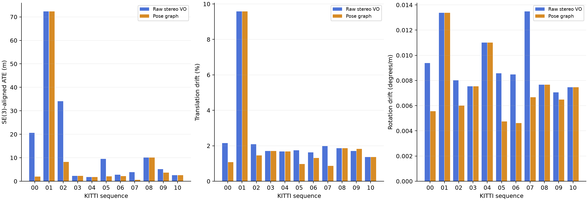
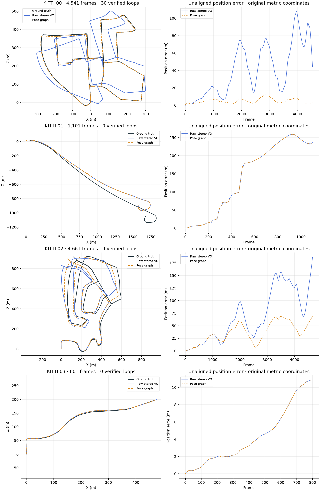
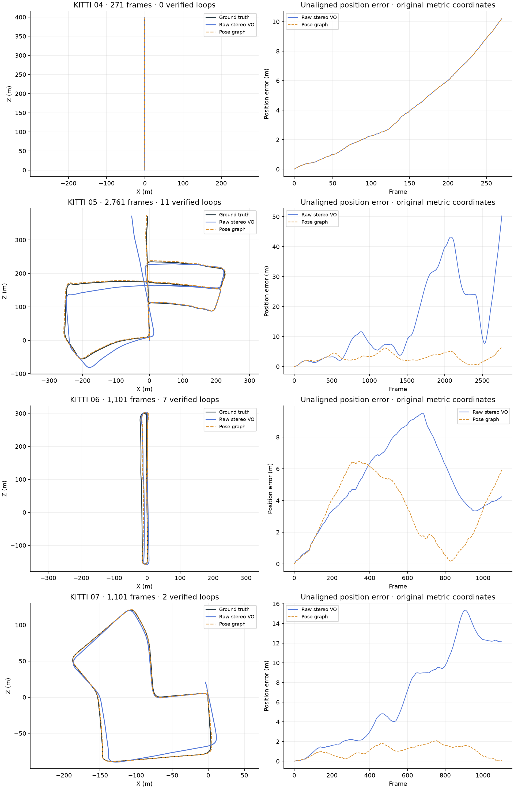
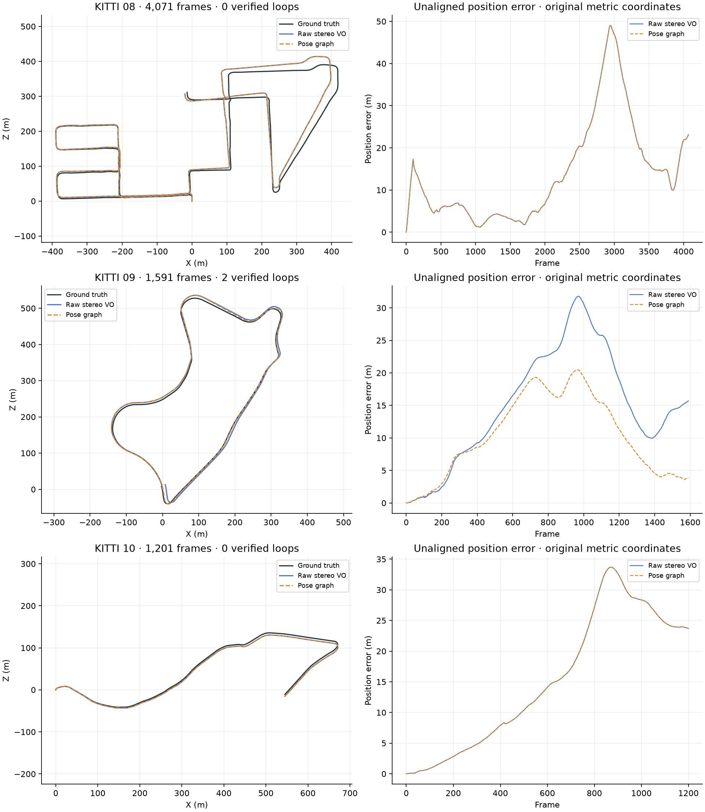

# KITTI 00–10 benchmark

Each arrow compares raw stereo VO with offline pose graph correction. ATE uses SE(3) alignment; drift and plots retain metric scale. Ground truth is used only for evaluation. Live map/tracking feedback remains unfinished.

Coverage: 11/11 full stereo runs, 11/11 graph runs; 23,201 frames; 23 lost tracking pairs.

Segment-weighted translation drift: 2.287% → 1.773%. Segment-weighted rotation drift: 0.00863 → 0.00648 degrees/m.

| Sequence | Frames | ATE m, raw → graph | Translation %, raw → graph | Rotation °/m, raw → graph | Verified loops | Lost pairs | Coverage |
|---|---:|---:|---:|---:|---:|---:|---:|
| 00 | 4,541 | 20.610 → 1.935 | 2.147 → 1.079 | 0.00938 → 0.00556 | 30 | 0 | complete |
| 01 | 1,101 | 72.293 → 72.293 | 9.574 → 9.574 | 0.01337 → 0.01337 | 0 | 23 | complete |
| 02 | 4,661 | 34.113 → 8.181 | 2.081 → 1.458 | 0.00801 → 0.00600 | 9 | 0 | complete |
| 03 | 801 | 2.327 → 2.327 | 1.705 → 1.705 | 0.00754 → 0.00754 | 0 | 0 | complete |
| 04 | 271 | 1.763 → 1.763 | 1.683 → 1.683 | 0.01100 → 0.01100 | 0 | 0 | complete |
| 05 | 2,761 | 9.555 → 2.038 | 1.751 → 0.973 | 0.00858 → 0.00475 | 11 | 0 | complete |
| 06 | 1,101 | 2.815 → 2.152 | 1.622 → 1.313 | 0.00848 → 0.00462 | 7 | 0 | complete |
| 07 | 1,101 | 3.913 → 0.610 | 1.976 → 0.868 | 0.01347 → 0.00667 | 2 | 0 | complete |
| 08 | 4,071 | 10.120 → 10.120 | 1.861 → 1.861 | 0.00766 → 0.00766 | 0 | 0 | complete |
| 09 | 1,591 | 5.133 → 3.630 | 1.705 → 1.825 | 0.00705 → 0.00649 | 2 | 0 | complete |
| 10 | 1,201 | 2.564 → 2.564 | 1.368 → 1.368 | 0.00747 → 0.00747 | 0 | 0 | complete |

All trajectory and position-error graphs:

## What changed

Graph vertex IDs now agree with keyframes. Camera-to-world edge measurements use `Z_ij = inverse(T_wi) @ T_wj`; the first pose is fixed. Loop constraints come from independent stereo image geometry rather than the estimated trajectory. Weighted rigid residuals use a Huber loss. Small graphs use a bounded dense SVD solve after the approximate sparse solver failed to converge on the real seven-loop sequence 06 graph. Solver status and objective diagnostics are saved; a failed solve cannot silently export a successful result.

The stereo frontend rejects invalid depth and insufficient PnP inliers, handles calibration baseline/principal-point offsets correctly, and uses Hamming matching for ORB descriptors. Dashboard trajectories use equal axis scales and distinguish raw position error from aligned ATE.

## Methodology

The frontend is SIFT / SGBM / PnP. Graph retrieval samples keyframes every 20 frames, excludes candidate pairs less than 150 frames apart, and retains at most 1,500 features per keyframe. Loop verification requires mutual descriptor matches and bidirectional metric stereo PnP, at least 30 inliers, an inlier ratio of 0.35, reprojection and image-coverage checks, and reverse-transform agreement. Information weights are fixed experimental parameters, not measured covariances. Ground truth is used only for evaluation and never provides motion scale or loop constraints.

ATE is the root-mean-square position error after SE(3) alignment, with no scale fitting. KITTI translation and rotation drift use the official 100–800 m segments in original metric scale. Aggregate drift is weighted by segment count: 14,567 segments. Plot position errors are unaligned, so their values differ from aligned ATE. The orange trajectory is after offline optimization and correction propagation to every frame; zero-loop graphs leave the raw trajectory unchanged. These are public training-set results, not hidden test-set leaderboard results.

## Verification and repeatability

- All 11 raw and corrected trajectories have the full expected frame count, finite rigid poses, and a fixed initial graph pose.
- All 11 reference pose files are byte-for-byte identical to the official public KITTI pose archive.
- Every raw and corrected sequence matches the official devkit's segment keys and metrics within 0.0001 percentage points and 0.0001 degrees/m. Float32 distance arithmetic follows the official evaluator.
- Full independent raw reruns of 01, 04 and 07 reproduce every saved pose element exactly. Sequence 01 reproduces all 23 lost pairs. Other raw sequences were not each independently rerun twice.
- All 11 graphs were replayed from the same saved image measurements with the current solver. The largest position difference from the retained solver reference was 0.16 mm.
- Local validation passed: 45 Python tests, 3 dashboard socket tests, and the production build including TypeScript checking. Windows/Linux CI is configured; see the repository workflow for current remote results.

## Remaining limitations and next work

Sequence 01 has repeatable frontend failures: one retained failure pair has 211 feature matches but only 34 valid stereo points and 12 PnP inliers, below the required 15. It needs stronger tracking and recovery. Sequence 09 improves aligned ATE while translation drift worsens; both measurements are retained rather than selecting outputs using ground truth. No loops were verified in 01, 03, 04, 08 or 10.

Live integration of the geometric loop verifier, corrected tracking poses and map landmarks remains unfinished. Persistent landmarks, local bundle adjustment and relocalization are the next implementation priorities. The sparse branch above 300 graph poses remains unvalidated by this batch; the largest tested graph has 234 keyframes. Monocular motion has arbitrary scale and would need appropriate scale-aware loop handling.

Input images were downloaded from the official KITTI archive with ZIP CRC verification. Owned temporary image and geometry caches were deleted after processing. Saved trajectories and measured constraints remain local under `results/benchmark-batch`, which is excluded from Git. This repository includes the compact metric snapshot, graphs and verification evidence without redistributing dataset images.

## Reproduction and artifacts

See [the README](../../README.md#benchmark-and-tests) for setup, full batch, deliberate retest, metric recomputation and graph replay commands, and [the development roadmap](../ROADMAP.md) for acceptance criteria. A fresh checkout needs KITTI poses and images or network access to the official image archive. The compiled official evaluator wrapper is a local validation dependency, not a shipped executable.

[Machine-readable results](results.json) contain full per-sequence aggregate metrics. The accompanying verification JSON files record pose provenance, official evaluator parity and graph replay differences. Individual plots are also available as `plots/00.png` through `plots/10.png`.
