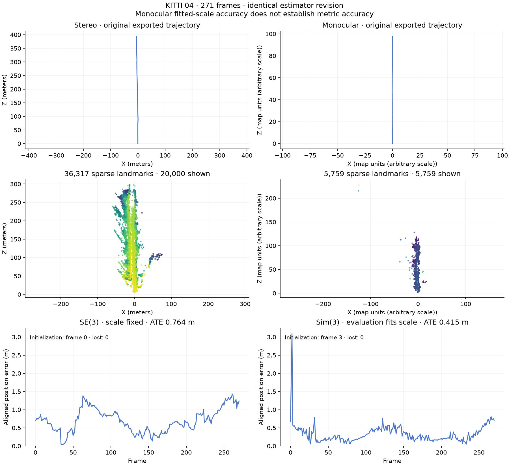
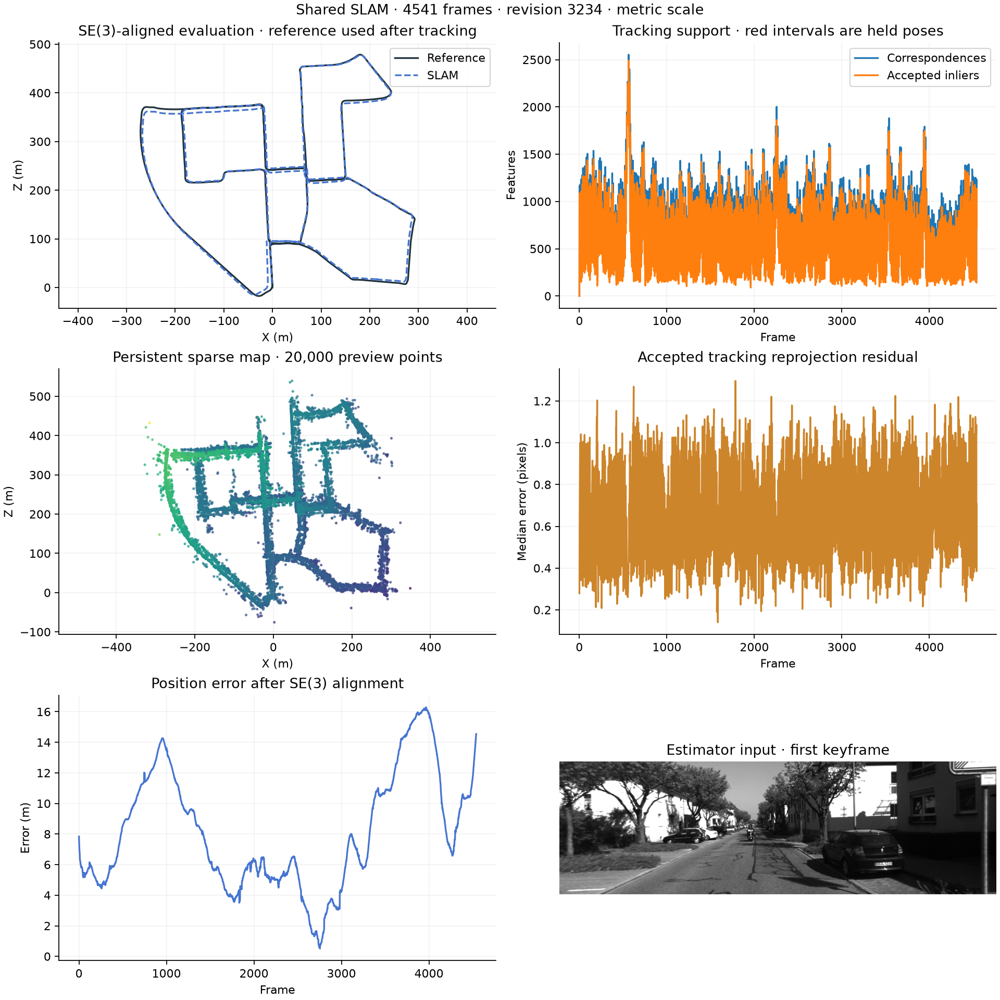
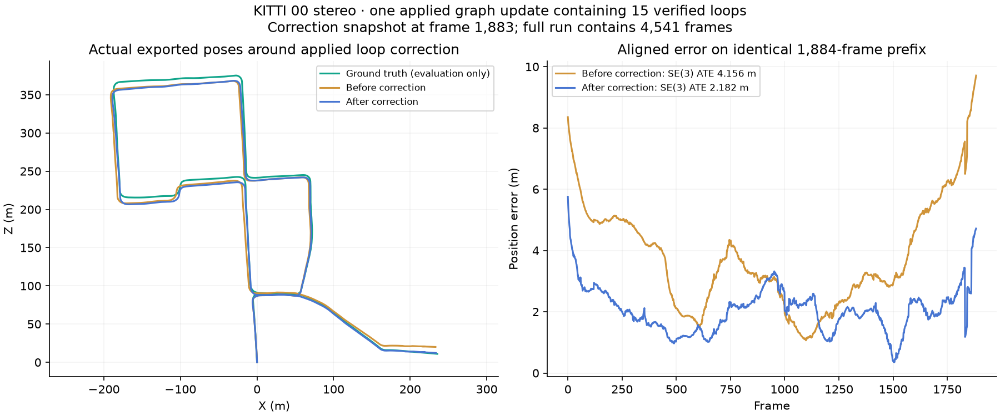
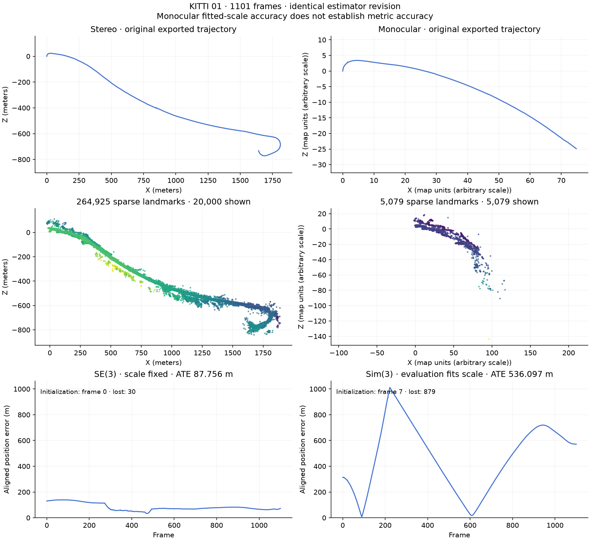
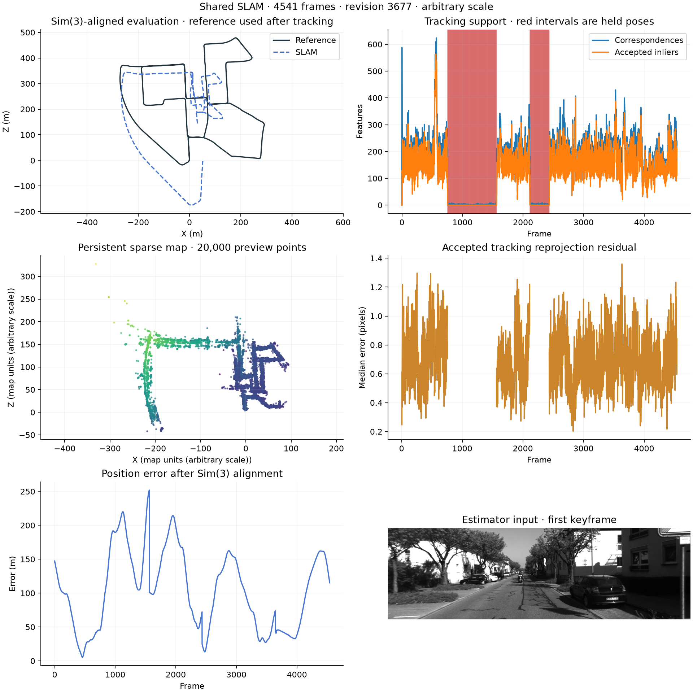

# Stereo and monocular KITTI coverage

This retained shared SLAM revision has complete paired results for KITTI 01 and 04.
Its full 00–10 batch requested 22 sensor runs and is paused. Missing
results are not zeros. The older all-sequence benchmark covers stereo VO with
offline pose graph correction; it is a separate implementation and comparison
baseline, not evidence that the new shared pipeline has completed those runs.

[Current paired coverage CSV](kitti-shared-paired-status.csv) and
[JSON snapshot](kitti-shared-paired-status.json) distinguish completed and pending
results. These are historical results, not validation of the reliability integration
branch; see [integration status](../SLAM_INTEGRATION.md). The retained CSV/JSON
coverage snapshot was written with 7 of 22 sensor runs completed.

| Sequence | Expected frames | Current stereo | Current monocular |
| --- | ---: | --- | --- |
| 00 | 4,541 | Complete | Complete |
| 01 | 1,101 | Complete | Complete |
| 02 | 4,661 | Input/run failure | Input/run failure |
| 03 | 801 | Complete | interrupted_user_pause |
| 04 | 271 | Complete | Complete |
| 05 | 2,761 | Queued | Queued |
| 06 | 1,101 | Queued | Queued |
| 07 | 1,101 | Input/run failure | Input/run failure |
| 08 | 4,071 | Queued | Queued |
| 09 | 1,591 | Queued | Queued |
| 10 | 1,201 | Queued | Queued |

## Complete current paired result: KITTI 04

Both KITTI 04 runs use identical estimator source fingerprints and the fixed
mapping configuration. Ground truth is opened after estimator shutdown.

| Metric | Stereo | Monocular |
| --- | ---: | ---: |
| Frames | 271 | 271 |
| Initialization frame | 0 | 3 |
| Lost frames | 0 | 0 |
| Sparse landmarks | 36,317 | 5,759 |
| Map scale | Metric | Arbitrary |
| Standard aligned ATE (m) | 0.764, SE(3) | 0.415, Sim(3) |
| Segment translation error (%) | 1.005 | Not reported |
| ATE when both use Sim(3) (m) | 0.679 | 0.415 |
| Sim(3) evaluation scale | 0.996911 | 4.032602 |

SE(3) alignment permits a global rotation and translation; Sim(3) also fits one
global scale. The monocular scale is fitted during evaluation, not supplied to
tracking or applied independently to each frame. Its 0.415 m result measures
trajectory shape after alignment and does not establish metric scale recovery.
Allowing both modes a fitted scale still gives lower monocular shape error on
this sequence. This is a measured sequence-specific result, not evidence of
general monocular superiority. The cause of the remaining difference has not
been isolated experimentally.

Monocular tracking uses two-view initialization with a normalized initial
baseline, persistent triangulated landmarks, image-to-landmark PnP and local
bundle adjustment. It no longer assigns unit translation to every frame.
Stereo additionally uses disparity-derived metric depth and independent stereo
motion checks. Learned depth is reserved for offline reconstruction. The modes
use one declared configuration rather than sequence-specific settings.

## Current KITTI 00 stereo: full coverage and limited live correction

Stereo processed all 4,541 frames with no lost frames, 8.954 m SE(3)-aligned ATE, 1.531% translation error and 0.005739 degrees/m rotation error. It retained 519 keyframes and 592,741 landmarks. Runtime was 14,578.42 s (0.3115 fps), including 211.27 s of recorded display observer work and OneDrive I/O; peak memory was 2,675.98 MiB. This is not real-time processing.

There are 15 geometrically verified loops, **one applied graph update**, 54 stale-result discards and 219 graph-size skips. On the saved 1,884-frame correction snapshot, applying the verified constraints reduced SE(3) ATE from 4.156 to 2.182 m and translation error from 1.415% to 1.234%. These are prefix measurements around that correction, not full-sequence before/after scores. Further optimization was disabled after the graph exceeded the current 300-keyframe validation limit. Large-graph validation and the high rate of stale result rejection remain open requirements.

Against the separate historical stereo VO baseline, the current full-run ATE/drift improve on raw VO (20.610 m, 2.147%) but remain worse than its offline graph result (1.935 m, 1.079%). The pipelines and optimization schedules differ; these are retained references, not one paired revision. KITTI 00 monocular is still running. Checkpoints show a prolonged lost interval through frame 1,550 (zero-based), tracking resumed by frame 1,600, and the live snapshot at frame 2,146 was lost again with only two image-to-map matches. These are provisional checkpoint observations, not exact final loss/recovery boundaries; no final monocular score is available yet.

## Current KITTI 01: release-blocking failures

Both sensor runs processed all 1,101 frames using the same frozen estimator revision. Full processing coverage includes held poses during tracking loss and does not imply successful tracking.

| Metric | Stereo | Monocular |
| --- | ---: | ---: |
| Aligned ATE (m) | 87.756, SE(3) | 536.097, Sim(3) |
| Translation error (%) | 10.901 | Unavailable, arbitrary scale |
| Initialization frame (zero-based) | 0 | 7 |
| Lost frames | 30 | 879 |
| Unresolved final lost interval | 1,073–1,100 | 223–1,100 |
| Verified loops | 0 | 0 |
| Sparse landmarks | 264,925 | 5,079 |
| Runtime (s) | 4,248.47 | 3,001.56 |
| Peak memory (MiB) | 1,461.88 | 340.13 |

Monocular fitted scale is 21.619; it is an evaluation alignment, not estimated metric scale. Its apparent path stops after frame 222 because later poses are held. At frame 223, PnP finds 50 candidate inliers with a 0.439 px median reprojection error, but those inliers cover only two image cells. Both seeded and independent candidates fail spatial support. This is a measured rejection trigger; the underlying correspondence/map failure still needs diagnosis. Acceptance thresholds remain unchanged.

Stereo reproduces the retained component-gauge result and remains worse than the historical stereo VO baseline on 01 (72.293 m ATE, 9.574% translation error). Monocular loses most of this sequence. These results do not satisfy release readiness; low reprojection error among accepted poses does not establish overall accuracy. Neither run verifies a loop on this sequence, so they provide no loop-correction evidence.

Runtime includes OneDrive I/O and other concurrent work. Monocular also includes 17.53 s of recorded dashboard observer overhead; stereo started before that observer was enabled. These measurements are not isolated speed comparisons.

KITTI 07 failed before initialization because OneDrive denied access to its calibration file. These are input failures, not scored estimator runs. A retained local cache has all 1,101 left/right image pairs and readable calibration; retry both sensor modes after the active sequential batch stops, preserving the failed logs. Validation is paused for stereo reliability rework. Both 00 runs and stereo 03 completed; monocular 03 was interrupted. Both 02 runs failed on an unreadable input image at frame 601.

## Retained all-sequence stereo baseline

These are complete historical stereo VO runs followed by offline graph
correction. They must not be ranked against current monocular results as if they
formed one paired revision. ATE uses SE(3) alignment without scale fitting.

| Sequence | Frames | ATE (m), raw → graph | Translation error (%), raw → graph | Lost pairs |
| --- | ---: | ---: | ---: | ---: |
| 00 | 4,541 | 20.610 → 1.935 | 2.147 → 1.079 | 0 |
| 01 | 1,101 | 72.293 → 72.293 | 9.574 → 9.574 | 23 |
| 02 | 4,661 | 34.113 → 8.181 | 2.081 → 1.458 | 0 |
| 03 | 801 | 2.327 → 2.327 | 1.705 → 1.705 | 0 |
| 04 | 271 | 1.763 → 1.763 | 1.683 → 1.683 | 0 |
| 05 | 2,761 | 9.555 → 2.038 | 1.751 → 0.973 | 0 |
| 06 | 1,101 | 2.815 → 2.152 | 1.622 → 1.313 | 0 |
| 07 | 1,101 | 3.913 → 0.610 | 1.976 → 0.868 | 0 |
| 08 | 4,071 | 10.120 → 10.120 | 1.861 → 1.861 | 0 |
| 09 | 1,591 | 5.133 → 3.630 | 1.705 → 1.825 | 0 |
| 10 | 1,201 | 2.564 → 2.564 | 1.368 → 1.368 | 0 |

[Baseline CSV](kitti-stereo-baseline.csv) includes rotation drift and verified
loop counts. See the [baseline report](REPORT.md) for its methodology and plots,
and the [tracking diagnosis](TRACKING_DIAGNOSIS.md) for retained shared-pipeline
experiments, rejected changes and unresolved failures.

### KITTI 00 monocular: full-run reliability failure

The current frozen monocular run processed all 4,541 frames. Sim(3)-aligned ATE is 119.227 m; the fitted scale is 1.3214. Tracking was lost on 1,131 frames (24.9%): frames 754–1564 and 2114–2433, both followed by recovery. Initialization completed at frame 4; 13 frames were labeled relocalized, and no loop was geometrically verified. Held poses remain included in the full-run evaluation.

Runtime was 23,816.4 s (6 h 37 min), with 2,370.9 MiB peak memory. The telemetry observer used 77.2 s (0.32% of runtime). The final map contains 91,802 landmarks; trajectory and sparse exports were checked for finite values and expected counts. Stereo on the same sequence had 8.954 m SE(3)-aligned ATE and no lost frames. These alignment methods differ; the monocular result is a reliability failure rather than evidence of an acceptable release.

