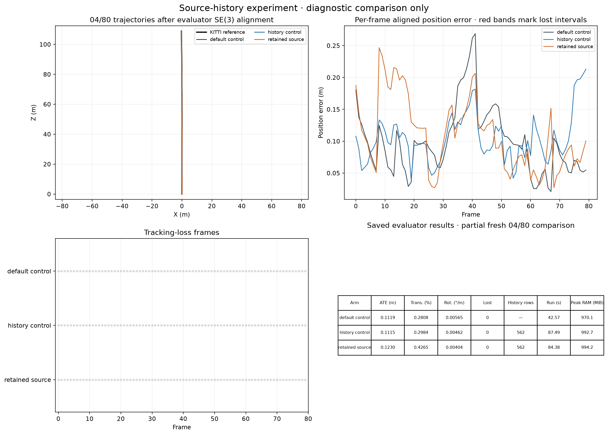
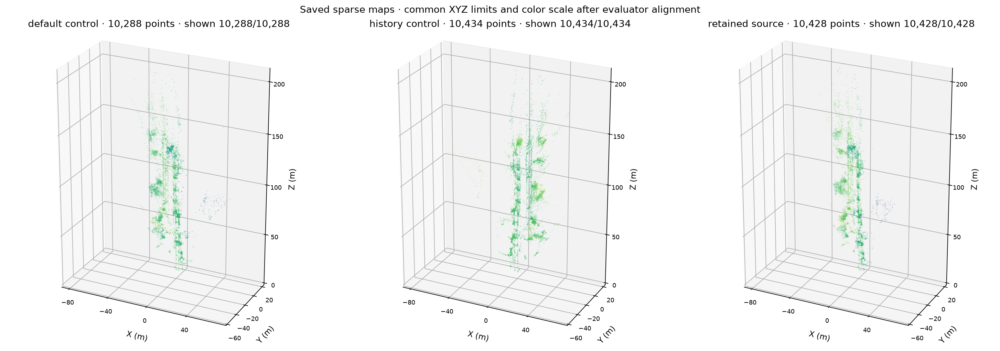
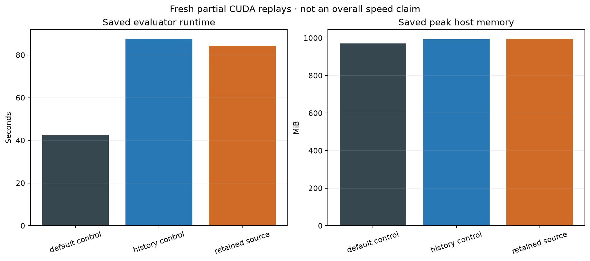

# Retained source observations: KITTI 04 diagnostic

The retained-observation experiment failed the accuracy gate. Keep it disabled
by default. On this short replay it reduced rotation drift but increased
position error and translation drift. No longer-sequence expansion was started.

All three configurations processed frames 0–79 with the same frozen estimator,
inputs, evaluator and runtime. Matching used CUDA, with 158 CUDA calls per run
and no backend fallback. Loops were off. Ground-truth poses were evaluator-only;
the estimator used stereo images and calibration.

The default control is the shared-SLAM configuration, not the original stereo
VO implementation. History and retention both use the same precise solver
policy; retention adds only the opt-in historical image constraints.

| Configuration | ATE RMSE (m) | Translation drift (%) | Rotation drift (deg/m) | Lost frames | Estimator time (s) |
|---|---:|---:|---:|---:|---:|
| Default shared-SLAM control | 0.111884 | 0.280753 | 0.005653 | 0 | 42.57 |
| Source-history control | 0.111450 | 0.298385 | 0.004622 | 0 | 87.49 |
| Retained source observations | 0.122984 | 0.426476 | 0.004040 | 0 | 84.38 |

Compared with the matched history control, retention increased ATE by 10.35%
and translation drift by 42.93%, exceeding the unchanged 5% regression gate.
Rotation drift decreased by 12.58%. Retention actually participated in eight
accepted solves, with 1,124 older image rows cumulatively installed. The first
solve only registered rows and is excluded from that count.

The full backend suite passed: 553 tests in 93.85 seconds. These correctness
checks cover two successive solves, camera/landmark dependencies, stale state,
atomic rejection, registry bounds, ownership and fallback behavior. Test success
does not establish trajectory accuracy.

The [JSON](source-retention-04-80/summary.json) and
[CSV](source-retention-04-80/summary.csv) contain the complete comparison and
failed gates. Source fingerprint:
`164d1ce104edbb4b3ccc792e71d20dcd02019728aa6383277b65addb47b1ec94`.

These are uncached diagnostic timings. No controlled CPU-only whole-pipeline
comparison was performed. The short prefix contains only one eligible 100 m
drift segment, and no loop correction; it cannot establish full KITTI or live
pose-graph performance. Sparse views show exported geometry, not ground-truth
map accuracy.

The first changed solve is at frame 20: it adds 48 retained rows whose own
cost increases from 0.81666 to 1.46442 despite a lower total objective. All nine
solves in both history configurations reach the 30-evaluation limit and report
solver non-convergence. Saved scalar reports cannot separate the effect of
that limit from bias in the fixed historical camera model. Accepted updates
pass the existing objective, depth and motion guards; they do not guarantee
that every observation cohort improves.

To reproduce, run `scripts/evaluate_shared_slam.py` with `--stereo`, KITTI data
and evaluator-only pose roots, `--sequence 04 --max-frames 80`,
`--loop-mode off --matching-backend cuda --retrieval current --opencv-threads 1`,
and `--stereo-depth-policy verified_fallback --stereo-pose-arbitration
--stereo-raw-reference-retry`. Give each run a separate output directory.
The measured runtime used CPython 3.12.14, PyTorch 2.7.1 with CUDA 12.6 and a
GTX 1660 SUPER. BLAS and OpenMP threads were limited to one.
The default control uses `--bundle-solver-accuracy default`. The history control
adds `--bundle-solver-accuracy precise --stereo-owned-image-bundle
--stereo-source-history-bundle`. The retention case adds
`--stereo-retained-source-observations` to the history command. Keep source,
runtime and input fingerprints fixed across all three runs.

Next, inspect how the fixed historical camera-to-anchor approximation changes
landmark updates and later translation estimates. Lower training reprojection
cost alone is insufficient evidence of a better estimator. Any revised model
needs new synthetic checks and a fresh matched result group before wider tests.
