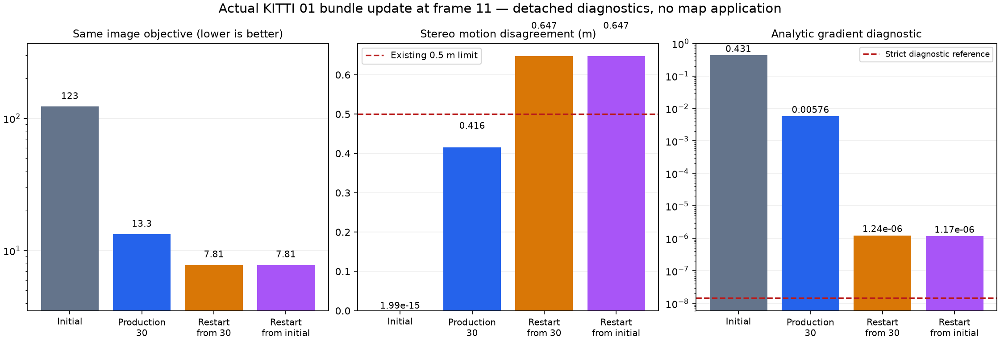

# Stereo bundle update: solver-boundary diagnosis

Increasing solver work is not an admissible fix for this update. Both detached restarts lower the image objective while violating the existing 0.5 m stereo-motion limit. The estimator remains unchanged and the mapping-retention option remains disabled.

The frozen KITTI 01 frame-11 capsule contains 136 points, two free camera poses, 303 stereo observations and 909 scalar residuals. Plain replay and diagnostic capture export identical poses and sparse geometry. Independent per-row and source-kernel audits reproduce the costs and candidate geometry. All 420 analytic Jacobian columns agree with centered differences at both archived endpoints (maximum normalized discrepancy below 3e-9). Ground truth is absent from these diagnostics.

| Candidate | Image cost | Maximum motion error (m) | Maximum camera change (m) | Analytic gradient diagnostic | Motion gate |
|---|---:|---:|---:|---:|---|
| Initial | 122.616768 | 0.000000 | 0.000000 | 0.431 | Pass |
| Production 30 | 13.285577 | 0.415906 | 0.408140 | 0.00576 | Pass |
| Restart from 30 | 7.813465 | 0.647348 | 0.730249 | 1.24e-06 | Fail |
| Restart from initial | 7.813465 | 0.647373 | 0.730278 | 1.17e-06 | Fail |

The restarts use identical measurements, component Huber loss with scale 2, variable scaling and sparsity. They change only solver policy: the existing precise LSMR inner options and a diagnostic allowance of 120 evaluations. They return on `ftol` after 42 and 48 evaluations, respectively; neither passes the stricter analytic gradient reference. Their final target-camera positions differ by approximately 32 micrometers. This is evidence against material start-path dependence in these two local solves, not proof of a global optimum. No candidate is applied to a live map.

The archived production candidate passes both the motion guard and the existing reserved stereo support predicate. Reserved inliers drop from 129 to 54 out of 132, but support still passes the unchanged count, ratio, spatial and pixel limits. These rows were already consumed in pose selection; they are not independent unused validation. No additional score-selected cutoff is justified by this result.

The next investigation binds installed right-image observations to their acquisition paths and checks their image consistency before proposing a general noise model. Calibration/projection and camera-propagation audits found no concrete programming discrepancy in this capsule. The original accuracy regression remains unresolved. These diagnostics are not additional full-sequence benchmarks, GPU speed tests or real-time evidence.

## Native image-measurement check

All 303 archived observations are numerically compatible with the original supported bilinear SGBM sampler. The source kernels, calibration, all 24 input image files and captured runtime match. Of these observations, 286 have an implied measured depth between 30 and 100 m; none are below 10 m. These are measurement-derived depths, not reference depths.

The existing full-range patch matcher accepts 45/79, 88/134 and 83/90 comparisons at frames 0, 5 and 11. Median alternative-minus-stored right-image coordinates are -0.0754, +0.0488 and +0.1011 pixels, respectively. This matcher consumes the same images and is not ground truth. Numerical compatibility does not uniquely prove historical acquisition provenance. These differences do not establish bias or a calibrated covariance.

Next: record acquisition paths when observations are installed, test a declared correlated-noise model on synthetic zero/slanted-disparity and independent-right-image controls, and assess map-only subpixel depth refinement separately from tracking. Any estimator change needs a frozen revision, the smallest matched accuracy replay and the previous-VO comparison before wider testing. No new weighting or acceptance threshold is selected from this sequence's score.
