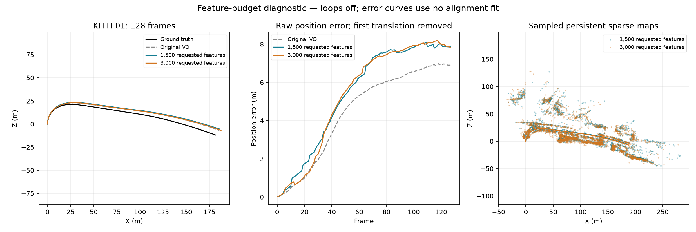
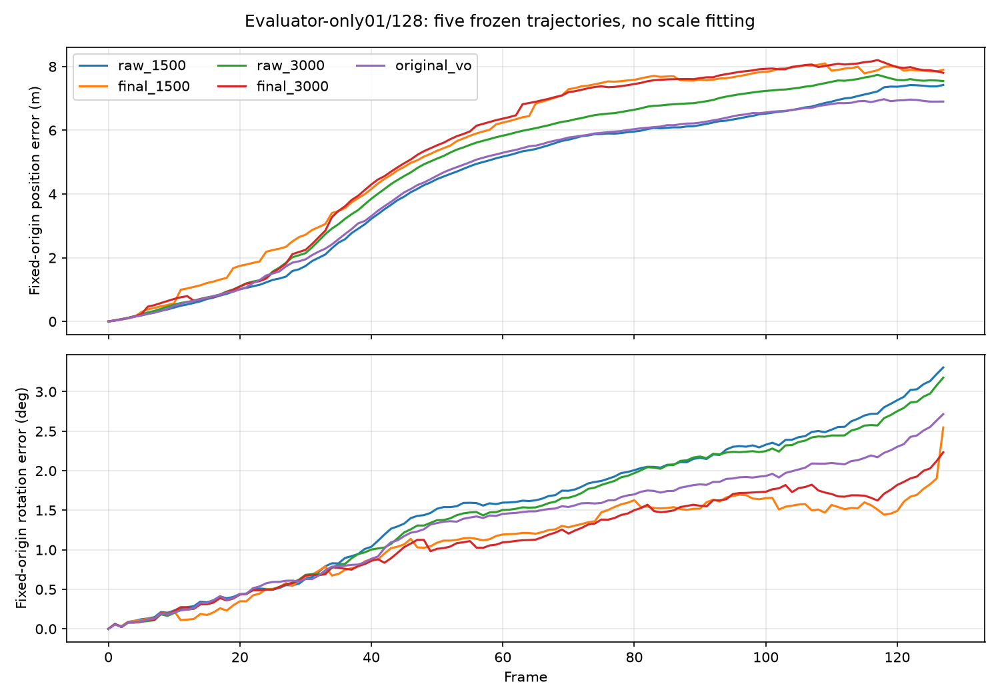
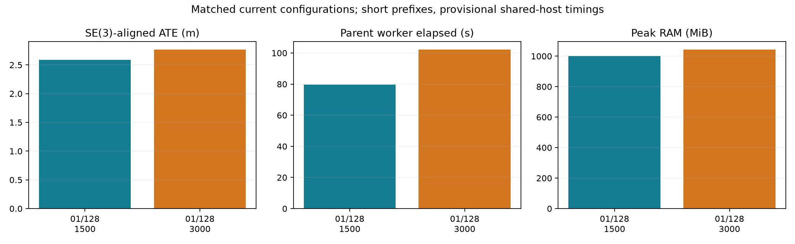

# Stereo feature-budget experiment

Increasing the requested SIFT budget from 1,500 to 3,000 failed the accuracy gate on KITTI 01's first 128 frames. The default remains **1,500**. Sequence 04 was not launched after this failure.

Both runs used the same frozen source, images, calibration and settings: stereo contrast 0.02, verified-fallback depth, pose arbitration, raw-reference retry, default local bundle adjustment, CUDA matching, one OpenCV worker and loops off. Ground truth entered only evaluation after tracking.

| Requested features | SE(3) ATE m | Translation % | Rotation deg/m | Lost frames | Processing FPS | Parent elapsed s | Peak RAM MiB |
|---:|---:|---:|---:|---:|---:|---:|---:|
| 1,500 | 2.588752 | 4.402350 | 0.012833 | 0 | 1.733 | 79.547 | 1001.03 |
| 3,000 | 2.766082 | 4.415463 | 0.014370 | 0 | 1.334 | 102.156 | 1042.67 |

ATE increased 6.9%, rotation drift 12.0% and parent elapsed time 28.4%. Both runs exported 128 finite poses and finite sparse maps. Each has eight evaluable KITTI segments; these diagnostic prefixes do not establish full-sequence performance or streaming latency. Timings are single shared-host observations. Processing FPS excludes setup, export and reference evaluation; parent elapsed includes them.

The median fitting pool grew from 122 to 201 correspondences, while median tracking reprojection error worsened from 0.44355 to 0.45022 pixels. More observations did not improve this estimate. Acquisition, matching, pose selection and mapping remain separate possible causes; this experiment does not justify further feature-count tuning.



The curves remove each trajectory's initial translation without fitting rotation or scale. They differ from the SE(3)-aligned ATE table. The original VO curve comes from a separate preserved run on the same images; the current 1,500 control reproduces its earlier shared-SLAM trajectory and sparse map byte for byte.

## Verified motion versus final trajectory

Post-run evaluation also scores the immutable, independently verified stereo motion measurements chained from the origin. Both arms contain all 127 consecutive frame increments, with accepted endpoints and bidirectional geometric verification. These are **diagnostic chains**: 16 measurements in each arm accompany a map-selected pose, so they do not reproduce the tracker's selected trajectory. The saved edge schema does not independently establish every measurement's geometry revision.

| Trajectory | SE(3) ATE m | Translation % | Rotation deg/m |
|---|---:|---:|---:|
| Original stereo VO | 2.102676 | 3.617194 | 0.016696 |
| Verified motion chain, 1,500 | 2.067811 | 3.503520 | 0.020051 |
| Final shared SLAM, 1,500 | 2.588752 | 4.402350 | 0.012833 |
| Verified motion chain, 3,000 | 2.339661 | 3.796033 | 0.019010 |
| Final shared SLAM, 3,000 | 2.766082 | 4.415463 | 0.014370 |

The 1,500-feature final trajectory has 25.2% higher ATE than its diagnostic motion chain, while rotation drift is 36.0% lower. Map pose selection and local bundle adjustment have a combined translation/rotation tradeoff; this comparison does not isolate either operation. Loops were off, so global loop optimization cannot explain these differences. Disabling map correction would discard the observed orientation benefit and is not established as a general repair.

All five candidates were frozen before reference evaluation. Evaluation uses the same calibration and input coverage, SE(3) alignment with scale fixed to one, and eight overlapping KITTI segments. The curves below use each trajectory's initial camera frame without fitting alignment; their values therefore differ from the aligned ATE table.

The [five-trajectory metrics](FEATURE_BUDGET_MOTION_METRICS.csv) come from a separate post-run evaluator, rather than the two-run feature-budget comparison. Its retained report SHA-256 is `5098126599e2f6d10a3affada1a5207d082599bcf8eb07f950210a11dd626ab2`.





## Reproduction

Use Python 3.12.14, OpenCV 5.0.0 and the optional CUDA matcher dependencies. Run the configurations sequentially, with a supervising deadline, and preserve incomplete output.

```sh
python scripts/evaluate_shared_slam.py --stereo \
  --data-root DATA_ROOT --poses-root POSES_ROOT --sequence 01 --max-frames 128 \
  --features 1500 --output CONTROL_OUTPUT --max-wall-seconds 160 \
  --loop-mode off --matching-backend cuda --retrieval current --opencv-threads 1 \
  --stereo-depth-policy verified_fallback --stereo-pose-arbitration \
  --stereo-raw-reference-retry
```

Repeat with `--features 3000`, a separate output directory and a declared time budget. Set OpenBLAS, OMP and MKL worker counts to one. SIFT can retain additional features tied at the response cutoff; the argument is a requested budget.

Estimator/test commit: `999f1cb6fd1197092487a0cba5fcb617dbb1ebf9`. Source/runtime fingerprint: `923af4b0a3b668eff886786f4db0e3875fa2e6681bb21fef2970952601df3009`. The complete backend suite passed 594 tests. An earlier test incorrectly required exactly 1,500 rows and failed when SIFT returned 1,501; its outcome was preserved, the assertion corrected, and the complete suite rerun. Software correctness does not establish accuracy.
