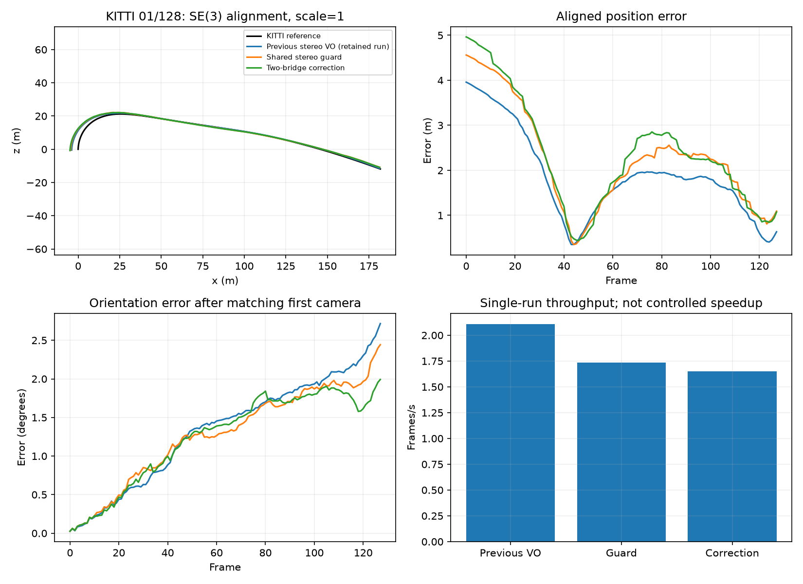
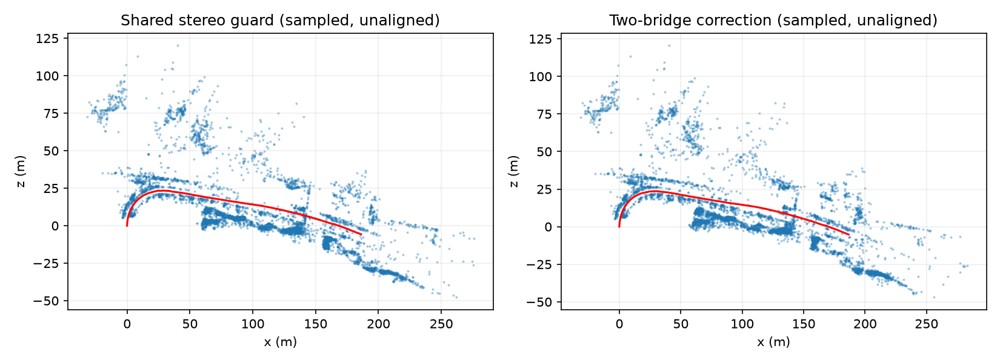

# Experimental stereo gauge correction

The correction fails the KITTI 01 accuracy gate: position and translation error worsen against both the guard and previous stereo VO. Keep it disabled and retain this branch as a rejected accuracy experiment. No broader validation or main merge is approved by these results.

This opt-in experiment removes only a certified two-point rotational ambiguity after the existing solve. It preserves the complete image residual, adds no measurement or ground-truth prior, and leaves unsupported graphs rejected. It is a gauge convention, not a new convergence algorithm. The default remains `veto`.

The fresh guard/correction pairs use identical frozen source, inputs, calibration, dependencies and configuration except the declared gauge mode: 1,500 features, CUDA matching, verified stereo depth, pose arbitration, raw-reference retry and loops off. Previous VO results are retained same-day baseline runs with matched input/reference/runtime identities and the same metric code; they retain original feature defaults and CPU processing. No learned depth or reference pose enters tracking.

These are frame-zero diagnostic prefixes, not full-sequence or streaming benchmarks. ATE uses SE(3) alignment with scale fixed to one; drift uses unscaled poses. Throughput and peak memory are single-run development observations.

| Sequence/frames | Variant | ATE (m) | Translation (%) | Rotation (deg/m) | Lost | FPS | Peak MB |
|---|---|---:|---:|---:|---:|---:|---:|
| 01/128 | Previous stereo VO (retained run) | 2.102676 | 3.617194 | 0.01669564 | 0 | 2.108 | 238.1 |
| 01/128 | Shared stereo guard | 2.505653 | 4.162300 | 0.01533316 | 0 | 1.733 | 1008.8 |
| 01/128 | Two-bridge correction | 2.645960 | 4.442546 | 0.01430830 | 0 | 1.651 | 1009.7 |

## KITTI 01

Correction change against guard: ate_rmse_m: +5.60%, translation_percent: +6.73%, rotation_deg_per_m: -6.68%. Against previous VO: ate_rmse_m: +25.84%, translation_percent: +22.82%, rotation_deg_per_m: -14.30%. Baseline position/loss prefix gate: failed. Full release readiness remains unproven.

Backend checks passed 619 tests (100.55 seconds). After removing a trailing blank line from a test file, the 11 focused tests passed again; estimator and evaluator bytes remained unchanged. The combined source fingerprint includes tests, so these snapshots retain distinct fingerprints. Tests validate numerical and state invariants, not dataset accuracy.

The 01 correction run applied gauge-corrected updates at frames 24 and 29. Frame 19 was canonicalized but rejected by the independent stereo-motion check. The complete image residual was preserved to floating-point precision, and the default guard reproduced its earlier geometry. This validates the correction mechanics while rejecting its accuracy benefit on this case.

Both accepted candidates still reached the existing 30-evaluation limit. The next diagnostic will optimize only the observable degrees of freedom on the same captured graph, retaining all image rows and landmark variables. It must establish convergence before a known-truth noise test can assess the objective's accuracy. No new prior, ground-truth input or per-sequence threshold change is proposed.

The [earlier 04 no-regression check](https://github.com/achitaan/Visual-SLAM/blob/6edca515eec487696b2cd6e58e9740c051dad379/docs/benchmark/STEREO_GAUGE_CORRECTION.md) used the pre-formatting fingerprint. All nine graphs were full rank and the correction was inactive; identical poses/maps did not demonstrate a new accuracy benefit. Those results remain separate.

Trajectory plots use equal axis scaling. Orientation curves match the first camera orientation rather than the trajectory-derived rotation, whose roll is poorly determined on nearly straight motion. This plot is separate from KITTI segment rotation drift.

Run selection: `--slam --stereo --stereo-bundle-gauge-mode canonical_two_bridge` (or the same gauge flag with the stereo evaluator). Synthetic checks cover complete residual invariance, candidate-axis and ambiguity rejection, default/full-rank behavior, a real improving solve, and rank/stale/motion veto atomicity. Distinct single-view/non-keyframe propagation and canonical depth-rejection fixtures were not added by this experiment. Broader accuracy, CPU/GPU throughput and live streaming acceptance remain incomplete; the scheduler stays paused. [Measurements and source identities](STEREO_GAUGE_CORRECTION.csv).
