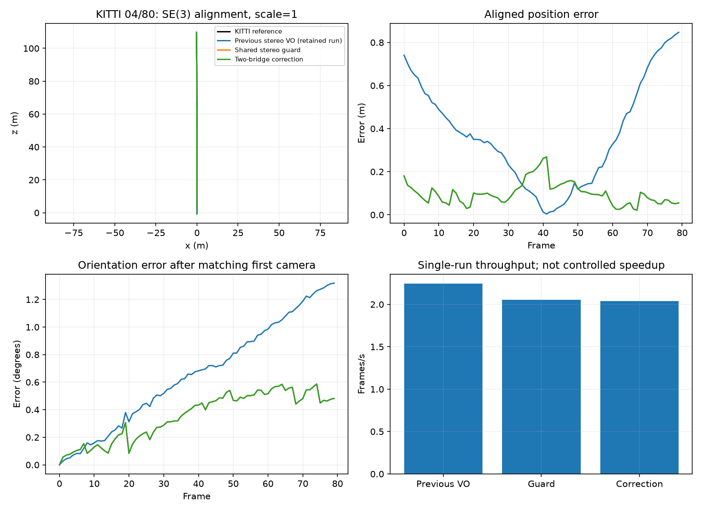
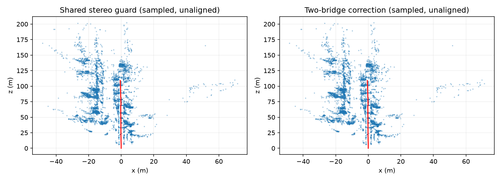

# Experimental stereo gauge correction

This opt-in experiment removes only a certified two-point rotational ambiguity after the existing solve. It preserves the complete image residual, adds no measurement or ground-truth prior, and leaves unsupported graphs rejected. It is a gauge convention, not a new convergence algorithm. The default remains `veto`.

The fresh guard/correction pairs use identical frozen source, inputs, calibration, dependencies and configuration except the declared gauge mode: 1,500 features, CUDA matching, verified stereo depth, pose arbitration, raw-reference retry and loops off. Previous VO results are retained same-day baseline runs with matched input/reference/runtime identities and the same metric code; they retain original feature defaults and CPU processing. No learned depth or reference pose enters tracking.

These are frame-zero diagnostic prefixes, not full-sequence or streaming benchmarks. ATE uses SE(3) alignment with scale fixed to one; drift uses unscaled poses. Throughput and peak memory are single-run development observations.

| Sequence/frames | Variant | ATE (m) | Translation (%) | Rotation (deg/m) | Lost | FPS | Peak MB |
|---|---|---:|---:|---:|---:|---:|---:|
| 04/80 | Previous stereo VO (retained run) | 0.443515 | 1.672844 | 0.01241175 | 0 | 2.246 | 233.1 |
| 04/80 | Shared stereo guard | 0.111884 | 0.280753 | 0.00565278 | 0 | 2.055 | 971.7 |
| 04/80 | Two-bridge correction | 0.111884 | 0.280753 | 0.00565278 | 0 | 2.040 | 971.4 |

## KITTI 04

Correction change against guard: ate_rmse_m: +0.00%, translation_percent: +0.00%, rotation_deg_per_m: +0.00%. Against previous VO: ate_rmse_m: -74.77%, translation_percent: -83.22%, rotation_deg_per_m: -54.46%. Baseline position/loss prefix gate: passed. Full release readiness remains unproven.

All 619 backend tests passed on this frozen source (100.55 seconds); the focused gauge suite passed 11 tests. Tests validate numerical and state invariants, not dataset accuracy. KITTI 04 has no certified gauge events: the correction was inactive and exported identical poses and sparse-map bytes to the guard. Its improvement over previous VO predates this experiment. KITTI 01 was not launched because its complete pair and reporting reserve did not fit the remaining cycle budget. That is the next accuracy gate; the previously reported 01 regression remains unresolved.

Trajectory plots use equal axis scaling. Orientation curves match the first camera orientation rather than the trajectory-derived rotation, whose roll is poorly determined on nearly straight motion. This plot is separate from KITTI segment rotation drift.

Run selection: `--slam --stereo --stereo-bundle-gauge-mode canonical_two_bridge` (or the same gauge flag with the stereo evaluator). Synthetic checks cover complete residual invariance, candidate-axis and ambiguity rejection, default/full-rank behavior, a real improving solve, and rank/stale/motion veto atomicity. Distinct single-view/non-keyframe propagation and canonical depth-rejection fixtures were not added by this experiment. Broader accuracy, CPU/GPU throughput and live streaming acceptance remain incomplete; the scheduler stays paused. [Measurements and source identities](STEREO_GAUGE_CORRECTION.csv).
