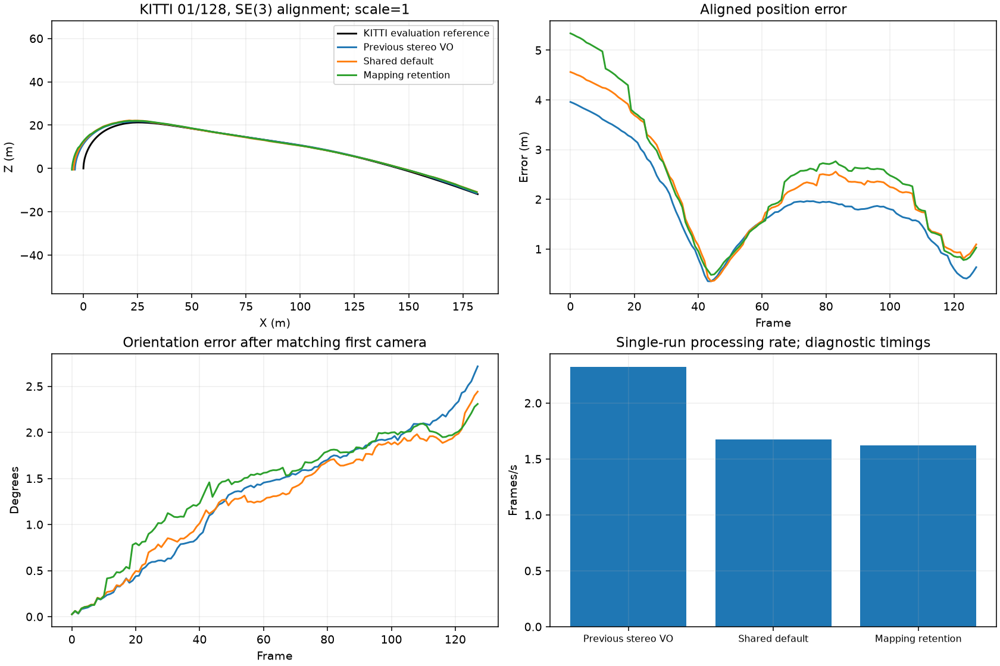
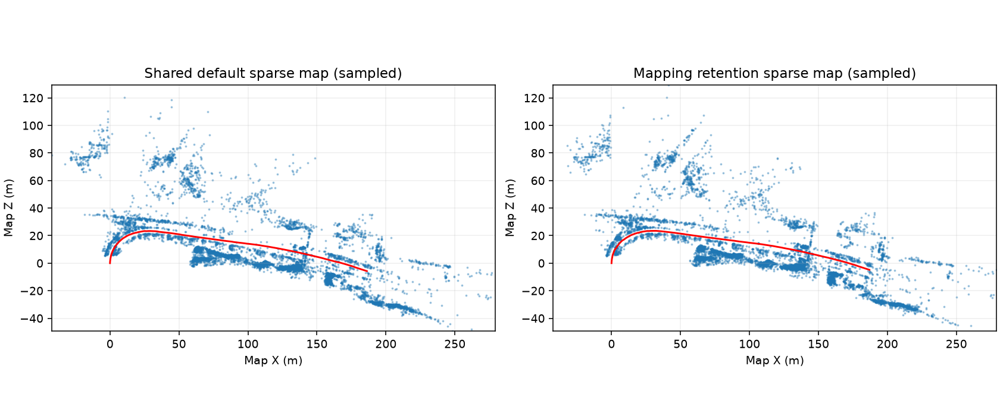

# Experimental stereo mapping-observation retention

**Rejected accuracy experiment; disabled by default.** KITTI 01 position and translation errors worsen against both controls. No 04 expansion or release approval.

These frame-zero diagnostic prefixes use frozen source and input contents. The mapping option preserves individually verified observations only after an independent stereo pose is accepted; the aggregate pose-support spatial threshold stays unchanged. All other aggregate and per-row retention checks, physical ownership and stale-state guards remain active. The option defaults off.

| Variant | ATE (m) | Translation (%) | Rotation (deg/m) | Lost | FPS | Peak MB |
|---|---:|---:|---:|---:|---:|---:|
| Previous stereo VO | 2.102676 | 3.617194 | 0.01669564 | 0 | 2.323 | 238.1 |
| Shared default | 2.505653 | 4.162300 | 0.01533316 | 0 | 1.674 | 1080.8 |
| Mapping retention | 2.729371 | 4.575921 | 0.01300414 | 0 | 1.624 | 1072.9 |

Focused accuracy/loss gate: failed. This is not full-sequence, general-reliability or release approval.

previous_vo: ate_rmse_m +29.80%, translation_percent +26.50%, rotation_deg_per_m -22.11%.

guard: ate_rmse_m +8.93%, translation_percent +9.94%, rotation_deg_per_m -15.19%.

Previous VO retains its original features and CPU processing. The paired shared modes use 1,500 features, CUDA matching, verified stereo fallback, arbitration and raw-reference retry; loops and gauge correction are off. Both shared runs have the same bounded diagnostic capture. Processing times and memory are single-run development observations, not a controlled GPU or real-time benchmark. Ground truth is evaluator-only.

Backend validation: the initial full run passed 651 tests and failed two older CLI argument-object cases. Only two forwarding expressions were repaired; 100 affected checks then passed. The estimator and the 34 new retention tests were unchanged by that repair. A second full-suite pass is not claimed.

Retention-only exceptions exercised: 1. The 90 retained observations restored cross-keyframe connections and enabled additional bundle updates. These lowered image residuals while trajectory accuracy worsened; the mechanism alone does not establish the cause. Full frame-level diagnostics remain in the locally retained run exports. Source fingerprint: 483ec9ee6733682359b0b409681c18b4b319474a401a84238bd782825b12e9a2.
