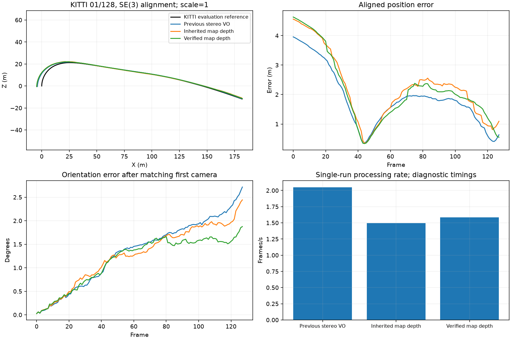
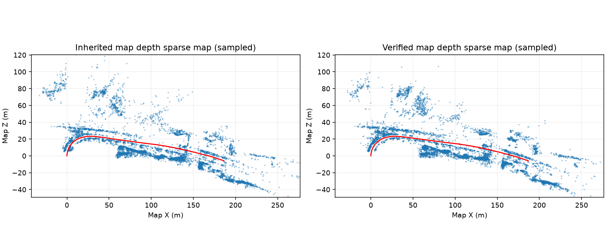

# Experimental stereo map-depth verification

**Partial improvement against the shared control; rejected for release because position and translation error still regress against previous VO. Default remains `inherit`.**

Fresh frame-zero prefixes compare the previous VO, the inherited map-depth control, and opt-in right-image verification for persistent landmarks. Frontend depth and keyframe reference geometry, tracking acceptance thresholds, bundle objective and gauge remain unchanged. Rejected matches cannot create landmarks; existing tracks retain a left observation without a fabricated right coordinate. The default remains `inherit`.

| Variant | ATE (m) | Translation (%) | Rotation (deg/m) | Lost | FPS | Peak MB |
|---|---:|---:|---:|---:|---:|---:|
| Previous stereo VO | 2.102676 | 3.617194 | 0.01669564 | 0 | 2.048 | 238.3 |
| Inherited map depth | 2.505653 | 4.162300 | 0.01533316 | 0 | 1.497 | 1080.3 |
| Verified map depth | 2.435419 | 3.987348 | 0.01165129 | 0 | 1.584 | 1059.8 |

Focused accuracy/loss gate: failed. Prefix evidence cannot approve full-sequence reliability or release.

previous_vo: ate_rmse_m +15.82%, translation_percent +10.23%, rotation_deg_per_m -30.21%.

guard: ate_rmse_m -2.80%, translation_percent -4.20%, rotation_deg_per_m -24.01%.

Previous VO retains its original CPU/features. Shared controls both use 1,500 features, CUDA matching, verified frontend fallback, arbitration and raw-reference retry; loops and gauge correction are off. Diagnostic processing times and memory are single shared-host observations, not controlled speed or real-time benchmarks. Ground truth is evaluator-only. Right-image verification is a geometric acquisition method, not independent depth truth or a calibrated covariance.

Frozen source fingerprint: `e3ec51c41e7f36c2735341ce0b7d97a0d71f98a6db26b7d4bd96f1128b84a386`.

Backend checks: 669 full-suite tests and 16 targeted tests pass, with source unchanged. Default-control poses and sparse-map bytes match the retained control. No 04 expansion or full validation was admitted after the 01 gate failed.

The control process exited with a Windows error during the final atomic evaluation-report replacement, after all 128 frames and completed metrics were exported. Existing and pending report content agreed except total wall time. The original failed attempt remains retained; complete control artifacts were revalidated and reused in a separate comparison record. Control timing is retained diagnostic timing. A separate evaluator reliability fix remains necessary.

A separate bounded synthetic acquisition-noise control completed 70 fits. Linear GLS covariance checks passed, but only 16 of 24 matched groups met the declared stationarity gate; nonlinear pose results were mixed. This does not justify production covariance weighting or establish the accuracy of right-image verification.
