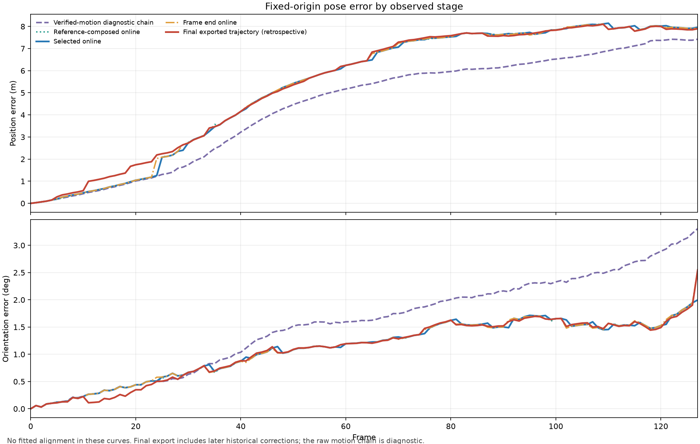

# Stereo pose-stage allocation (sequence 01, 128 frames)

This report separates the pose selected during tracking, the pose recorded in the map, the pose at frame end, and the later final export. It describes where poses differ in this captured run; it does not isolate bundle adjustment as a cause or establish an accuracy fix.

## Capture and validation

The run used the frozen stereo feature-budget source fingerprint `923af4b0a3b668eff886786f4db0e3875fa2e6681bb21fef2970952601df3009` (revision `9bc734f`). The evaluator-only reference was consulted after estimation. The capture completed all 128 frames and recorded 23 bundle-adjustment events with no observer errors. A separately validated plain run had exact parity for all eight checked artifacts. The capture run took 101.343 seconds; this is descriptive timing, not a speed comparison.

Trajectory scores below use the evaluator's SE(3) alignment with scale fixed to 1.0. The plot instead shows first-origin, fixed-origin per-frame errors without fitted alignment, so those values are not directly interchangeable with aligned ATE. Ground truth was posthoc-only and did not enter tracking, matching, stereo reconstruction, optimization, or stage selection.

## Stage metrics

| Stage | Aligned ATE RMSE (m) | Raw ATE RMSE (m) | KITTI translation (%) | KITTI rotation (deg/m) |
|---|---:|---:|---:|---:|
| Verified-motion diagnostic chain | 2.068 | 5.043 | 3.504% | 0.02005 |
| Reference-composed online | 2.631 | 6.033 | 4.394% | 0.01283 |
| Selected online | 2.631 | 6.031 | 4.393% | 0.01281 |
| Recorded online | 2.631 | 6.031 | 4.393% | 0.01281 |
| Frame end online | 2.628 | 6.033 | 4.463% | 0.01287 |
| Final exported trajectory (retrospective) | 2.589 | 6.040 | 4.402% | 0.01283 |

`selected_online` and `recorded_online` agree to numerical precision (maximum difference `3.6e-14 m`, rotation `0 deg`). The reference-composed online curve is a separate composition using the captured reference pose and verified motion. `frame_end_online` includes state after subsequent frame processing. `final_export` is retrospective and includes later historical corrections, so it is not the online estimate available at each frame.

The largest recorded-to-frame-end displacement was `0.862 m` at frame 24; the rotation difference peaked at `0.647 deg` at frame 127. These are stage-allocation observations, not proof that a particular BA call caused the difference. One accepted BA at frame 24 had a `0.862 m` world-pose change versus `0.297 m` for the adjacent guard diagnostic; this is diagnostic only. There were 22 accepted BA calls and one rejected call (frame 19); its captured map snapshot was unchanged.

The raw verified-motion chain has lower aligned ATE in this sequence, but it is diagnostic and includes verified edges on map-selected frames. It is not an independently established replacement trajectory or an accuracy claim. Source geometry epoch at original motion composition was not observed, so the report does not certify that epoch. Non-keyframe anchor transport agreed with the captured chain within `5.69e-14` in the checked numerical comparison.

## Figure and data

The [CSV](STEREO_POSE_STAGE_ALLOCATION_01.csv) contains the stage metrics and final-frame fixed-origin errors. Posthoc scoring used saved poses without invoking tracking, matching, depth reconstruction or optimization. Source, group, packet, reader, and reference hashes remain in the retained audit; dataset and helper paths are omitted here.
