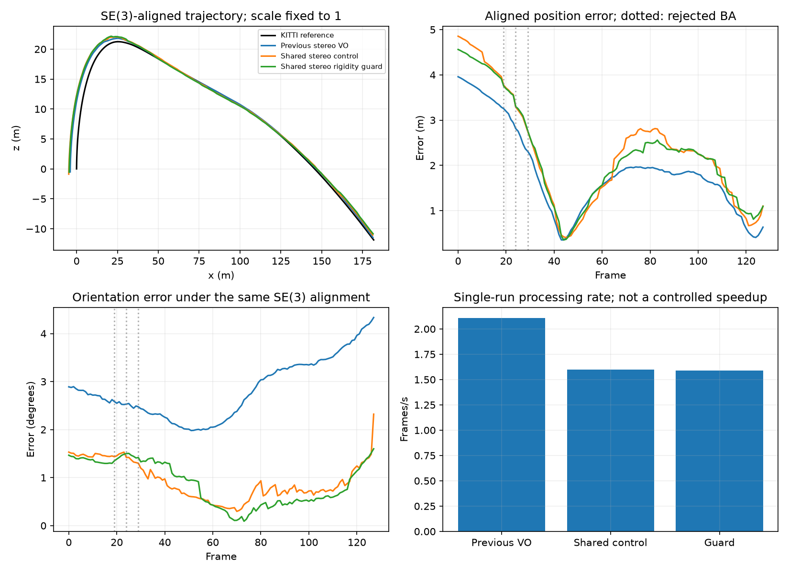
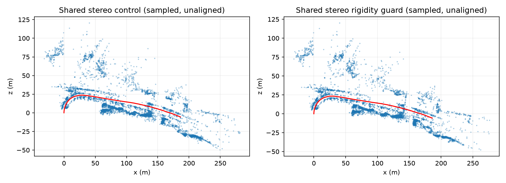

# Stereo rigidity guard: KITTI 01 acceptance result

The guard does not pass the previous-VO accuracy gate on this 128-frame diagnostic prefix. It improves shared-stereo position metrics but worsens shared-stereo rotation drift. Preserve it as an experimental correctness safeguard; these results do not approve it for main or wider validation.

## Matched evidence

All three fresh replays began at frame zero, processed 128 frames, exported finite poses, and reported zero lost frames. Image/calibration, reference and dependency identities match. Shared control and guard configurations match; both use 1,500 features and CUDA matching with loops off. Previous VO retains its original CPU implementation and feature defaults. All wrappers use the same trajectory metric implementation. Reference poses are evaluator-only; no learned depth was used.

ATE uses SE(3) alignment with scale fixed to 1. KITTI drift uses unscaled poses. These prefix scores are not full-sequence results. Processing rate and memory are single-run development observations, not a controlled CPU/GPU comparison.

| Variant | ATE (m) | Translation (%) | Rotation (deg/m) | Lost frames | FPS | Peak memory (MB) |
|---|---:|---:|---:|---:|---:|---:|
| Previous stereo VO | 2.102676 | 3.617194 | 0.01669564 | 0 | 2.108 | 238.1 |
| Shared stereo control | 2.588752 | 4.402350 | 0.01283318 | 0 | 1.598 | 1000.4 |
| Shared stereo rigidity guard | 2.505653 | 4.162300 | 0.01533316 | 0 | 1.591 | 1008.7 |

Against previous VO, guard ATE worsens **19.16%** and translation drift worsens **15.07%**, exceeding the agreed 5% regression gate. Rotation drift improves **8.16%**. Against shared control, guard ATE improves **3.21%** and translation drift improves **5.45%**, while rotation drift worsens **19.48%**. No aggregate score hides this tradeoff.

The guard rejects frames 19, 24 and 29, each with one unresolved camera degree of freedom. Frame 19 was already rejected by the control's motion gate. The guard applies 19 BA updates versus 22 in the control; its executed solves still reach the existing 30-evaluation limit. Rejected frame markers in the plot locate events, not proof that one event caused all later trajectory error.

[Measurements and source fingerprints](STEREO_RIGIDITY_01.csv). [Earlier 04 no-regression check](STEREO_RIGIDITY_GUARD.md). Full artifacts and attempt history remain local.

## Next diagnosis

Whole-solve rejection can discard useful observable corrections along with an unsafe degree of freedom. The next experiment is a gauge-coordinate solve that removes only the demonstrated ambiguity while retaining supported corrections. It inherits the unmeasured coordinate from tracking and supplies no new information; complete-objective tests must verify coherent camera and landmark updates.

Increasing the landmark cap is not a demonstrated remedy. Excluded fixed-world observations already contribute to the objective, so an available off-axis multiview bridge should already constrain the cluster. A same-epoch observation-pool audit can verify this accounting but must not be presented as proof of missing support. Only actual independent image support can measure the missing rotation. Do not fix an entire camera or add a ground-truth prior to mask the ambiguity.

Keep acceptance thresholds and the declared configuration. Reproduce and fix one demonstrated cause, rerun the smallest matched case, and require accuracy/loss gates before expansion. Monocular, broader datasets, live-loop performance and streaming acceptance remain incomplete. The scheduler remains paused.
