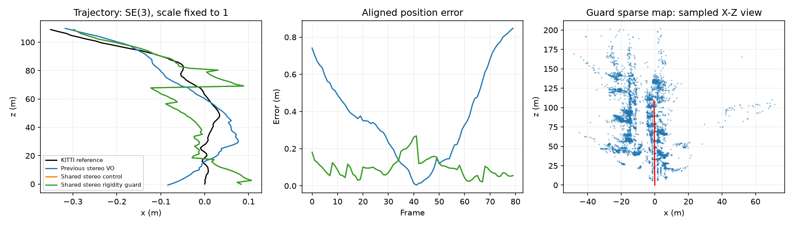

# Stereo rigidity guard: bounded validation

The experimental guard rejects original stereo bundle-adjustment graphs with an unresolved camera-motion gauge before solving or changing map state. It eliminates landmark Jacobian columns and checks the remaining camera rank at machine precision. It does not estimate uncertainty or reject merely weak geometry. Monocular and augmented experimental models are outside its validated scope.

An archived KITTI 01 frame-24 graph demonstrated a remaining rotational degree of freedom: rotating a camera/landmark cluster about its two bridge points preserved the complete selected and excluded image residuals to numerical precision. This establishes an underconstrained objective, not a measured trajectory-accuracy improvement from the guard.

## Checks and replay

The focused regression file passed 14 tests; the complete backend suite passed 608 tests. Static numerical review covered the production projection chart, landmark elimination, excluded fixed-point observations, gauge controls, and unchanged solver settings on observable graphs.

Fresh KITTI 04 replays processed frames 0–79 sequentially using retained calibrated images. Shared controls used 1,500 features, CUDA matching, the existing verified stereo configuration and loops off. The previous stereo VO control uses its preserved CPU implementation. Reference poses were used only after estimation. ATE uses SE(3) alignment with scale fixed to 1; drift uses unscaled poses. These short-prefix metrics are diagnostic, not full-sequence benchmark scores.

| Variant | ATE (m) | Translation (%) | Rotation (deg/m) | Lost frames | Processing (s) | FPS |
|---|---:|---:|---:|---:|---:|---:|
| Previous stereo VO | 0.443515 | 1.672844 | 0.01241175 | 0 | 35.626 | 2.246 |
| Shared stereo control | 0.111884 | 0.280753 | 0.00565278 | 0 | 38.888 | 2.057 |
| Shared stereo rigidity guard | 0.111884 | 0.280753 | 0.00565278 | 0 | 38.848 | 2.059 |

All nine evaluated guard graphs were observable. Shared-control and guarded trajectory files were numerically identical, and sparse PLY files had identical hashes. This is a no-regression smoke result; it does not demonstrate an accuracy gain. Timing is a single-run development observation with uncontrolled background load. It does not establish a performance change or real-time operation.

[Saved measurements and source fingerprints](STEREO_RIGIDITY_04.csv). Dataset paths, full maps and machine logs remain local.

## Remaining gates

Replay KITTI 01 from frame zero with fresh, matched previous-VO and shared-control runs, checking guard rejections, accuracy, tracking loss and per-stage cost. The three conservative worker caps plus reporting reserve did not fit the remaining 40-minute cycle, so that comparison was deferred rather than launched without a budget. Only expand coverage after that correctness gate passes. Broader monocular, live-loop, CPU/GPU throughput and streaming latency validation remain outstanding. The scheduler remains paused; this branch is not approved for main.
