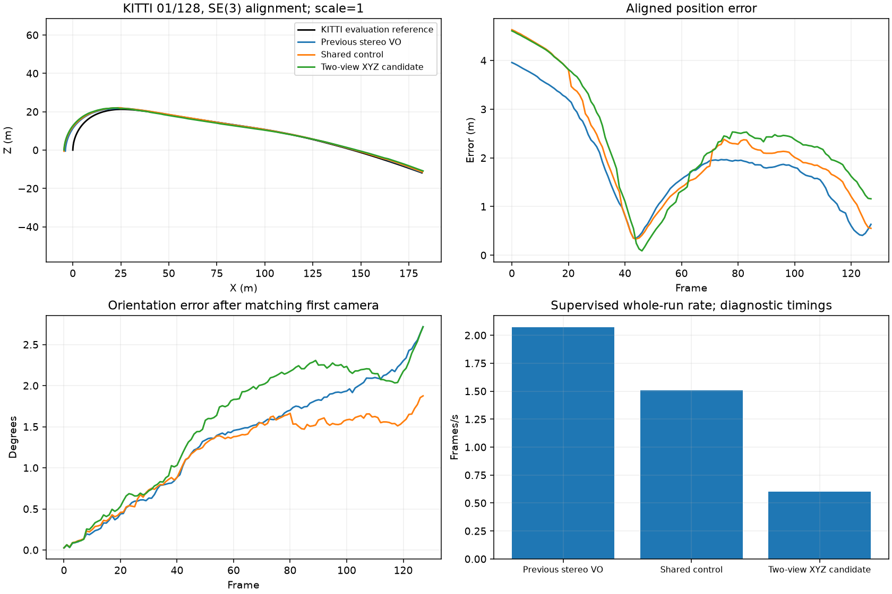
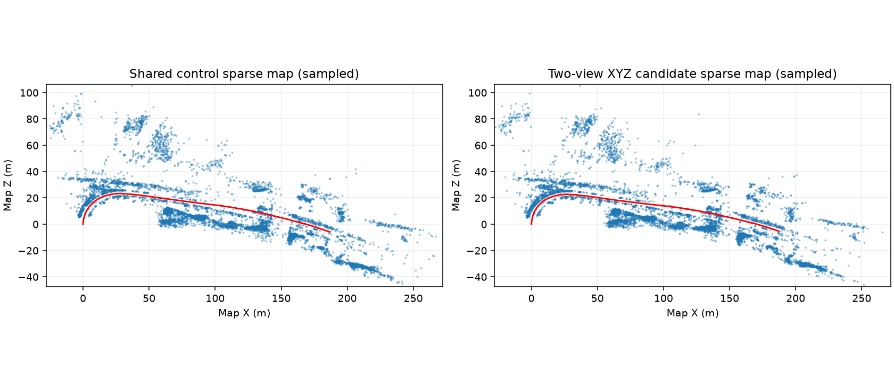

# Stereo two-view refinement: failed accuracy gate

Fresh frame-zero KITTI 01 prefixes use the same 128 stereo image pairs and evaluator, with ground truth restricted to evaluation. The previous VO retains its original feature and CPU matching settings. Both shared controls use 1,500 features, CUDA matching, verified frontend fallback and map depth, raw-reference retry, stereo pose arbitration, default local bundle adjustment and loops off. The candidate enables the experimental sparse-LSMR full-XYZ two-view refinement.

| Variant | ATE (m) | Translation (%) | Rotation (deg/m) | Lost | Whole-run FPS |
|---|---:|---:|---:|---:|---:|
| Previous stereo VO | 2.102676 | 3.617194 | 0.01669564 | 0 | 2.071 |
| Shared control | 2.435419 | 3.987348 | 0.01165129 | 0 | 1.508 |
| Two-view XYZ candidate | 2.593461 | 4.338466 | 0.01740946 | 0 | 0.600 |
| Shared control, local BA off | 1.999356 | 3.456755 | 0.01774614 | 0 | 1.635 |

The candidate regresses against the shared control and previous VO; it remains disabled and rejected for release. There are eight valid drift segments per run. These prefixes do not establish full-sequence robustness.

The separate local-BA-off diagnostic changes only that configuration switch. Position ATE improves 4.91% and translation drift improves 4.44% against previous VO, but rotation drift worsens 6.29%, exceeding the declared 5% regression tolerance. Turning BA off also changes subsequent map associations and keyframe decisions; this is not an additive decomposition or a general repair.

The candidate accepts 124 refinements; 122 solves reach the 15-evaluation cap and two terminate on step tolerance. None meets the recorded raw gradient bound. Accepted capped iterates are not stationary solutions. Final arbitration chooses the independent hypothesis on 112 frames. Local BA applies 23 updates in the shared control and 27 in the candidate. Loops are off, so this regression is not evidence of a pose-graph loop optimizer failure.

Whole-run FPS uses the common supervisor window: process startup, initialization, estimation, export and evaluation. Native evaluator timers have different windows and are retained separately. These are single shared-host diagnostic observations with instrumentation, not controlled performance or streaming measurements.

All 128 poses in every run and the available sparse PLY exports are finite; no frames are marked lost. The shared control poses and sparse PLY match the retained control byte-for-byte. Source, worker scripts, failed experiments and logs remain preserved locally. The frozen revision passed 727 backend tests; those checks did not establish accuracy.

Estimator snapshot: `f43a8109cdad932b8129dad4a16648bbb27071d2`; source/runtime/test fingerprint: `24efc4a13ab41fad6620e4002f06e3b6e215ffcdfd56e2938612c0ab7a623b2a`. Main remains unchanged.
