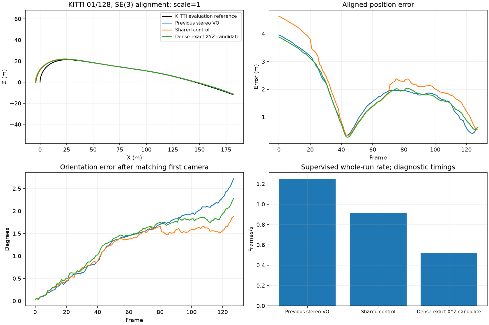
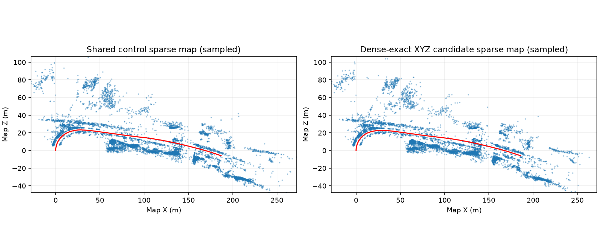

# Dense-exact two-view stereo comparison

The optional solver changes the same analytic Jacobian from sparse LSMR to dense exact TRF. It preserves the measured endpoints, objective, physical scales, 15-evaluation cap, heldout arbitration and production geometry checks. Refinement defaults off; the original sparse solver remains the default when refinement is enabled. A guard refuses more than 8 million dense Jacobian entries; its workspace estimate is not a process memory guarantee.

Fresh frame-zero KITTI 01 prefixes compare previous VO, the shared control and dense candidate on the same 128 stereo image pairs. The shared control retains refinement off and sparse solver selection; the candidate enables refinement and selects dense exact. All other declared shared settings match. Ground truth enters evaluation after estimation.

| Variant | ATE (m) | Translation (%) | Rotation (deg/m) | Lost | Whole-run FPS | Peak MB |
|---|---:|---:|---:|---:|---:|---:|
| Previous stereo VO | 2.102676 | 3.617194 | 0.01669564 | 0 | 1.247 | 237.4 |
| Shared control | 2.435419 | 3.987348 | 0.01165129 | 0 | 0.914 | 1047.6 |
| Dense-exact XYZ candidate | 2.077285 | 3.630080 | 0.01462020 | 0 | 0.521 | 1023.4 |

Against previous VO, ATE improves 1.21% and rotation drift improves 12.43%, while translation drift worsens 0.36%, with zero tracking losses. Against the shared control, position and translation improve, but rotation regresses. This is a measured accuracy tradeoff on one prefix, not a general reliability claim.

Combined regression gate against both controls: failed. Baseline-only 5% accuracy/loss tolerance: passed. No worse than previous VO on all three reported accuracy metrics: no. The original combined criterion remains unchanged; the candidate is not approved for release. This prefix has eight valid drift segments and cannot establish full-sequence robustness.

previous_vo: ate_rmse_m -1.21%, translation_percent +0.36%, rotation_deg_per_m -12.43%.

guard: ate_rmse_m -14.71%, translation_percent -8.96%, rotation_deg_per_m +25.48%.

Actual refinement activity: 57 accepted out of 128 frame reports; solver statuses {'None': 71, '0': 47, '2': 10}. Termination on step/cost tolerance is not a stationary-gradient certificate, and capped iterates remain reported as not converged. Applied local BA updates: control 23, candidate 26. Loops are off.

Seventy dense attempts reject a depth-domain violation and preserve the original seed. The measured trajectory therefore combines accepted dense refinements with seed fallbacks; none of the accepted fits meets the recorded raw gradient bound. The next diagnostic must distinguish an invalid initial state from an optimizer trial crossing the unchanged 0.1-100 m domain.

The preceding native-pair diagnostic used 138 points, 420 variables and 828 image residuals. At the same 15-evaluation cap, dense exact reduced cost from 42.109844 to 12.129671 versus 41.494269 with sparse LSMR. Scaled gradient infinity norms were 24.844 and 556.252; both remained nonstationary. Sparse rerun matched the captured production result exactly. No ground truth entered either fit and neither diagnostic correction was applied to the map. Numerical progress alone was not an accuracy claim.

745 backend and 243 focused checks pass on the frozen revision. Whole-run rates use a common supervisor window; native evaluator windows differ and are saved separately. Host timing variation was observed even for identical baseline poses, so these single-run instrumented durations are not controlled speed or real-time results. CPU numerical optimization runs alongside CUDA descriptor matching.

The [earlier sparse candidate](STEREO_TWO_VIEW_128.md), its failed gate and the BA-off position/rotation tradeoff remain separate evidence. Datasets and previous results are retained. Scheduler remains paused and main is unchanged.

Frozen source/runtime/test fingerprint: `9d9eb31269a6e84621d65d9d11faddcd75cef7d8775539b91db2c871b35ae152`.

Reproduction uses the evaluator configuration stored in the accompanying JSON. Enable the candidate with --stereo-two-view-refinement --stereo-two-view-solver dense_exact; omit both flags for the shared control. Supply dataset and evaluator-only pose folders through --data-root and --poses-root, keep loops off, and start at frame zero.
