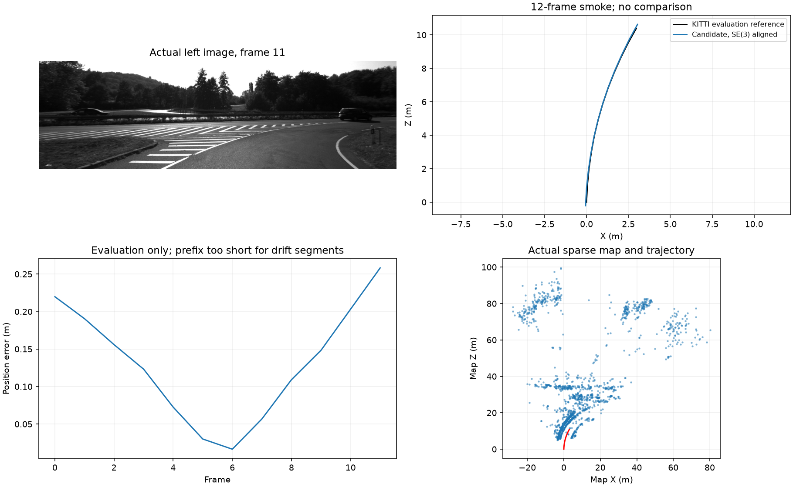

# Experimental two-view stereo refinement

The opt-in stage jointly refines a relative camera pose and full XYZ training points from six original stereo image components. The source camera and calibrated baseline fix the gauges. It preserves original forward/reverse verification, held arbitration observations and rejection behavior; optimized training XYZ never enters the map. Default is off.

Use `--stereo-two-view-refinement` with `--slam --stereo --stereo-pose-arbitration` in `src/main.py`, or with `--stereo --stereo-pose-arbitration` in `scripts/evaluate_shared_slam.py`. No learned depth or reference poses enter this stage.

Sparse analytic TRF/LSMR uses Huber 1.5 and a fixed 15-evaluation cap. Finite capped iterates can pass geometric checks; they are explicitly reported as not converged. Solver termination and raw scaled gradients are recorded separately.

Validation: 225 focused checks and all 727 backend tests pass. The first focused attempt had three inconsistent reverse-pose fixtures; the first full-suite snapshot omitted bundled input fixtures. Both failures and their repairs are retained locally. Estimator bytes were unchanged during these repairs.

A fresh KITTI 01 frame-zero smoke completed 12 frames with finite poses and sparse map, no lost frames, 11 accepted refinements, and 0.612 diagnostic FPS. Refinement consumed 12.31 seconds across 11 calls. This is CPU numerical refinement alongside CUDA matching, not real-time operation.

There is no new matched accuracy verdict. This prefix has no valid drift segments, and earlier scores are not reused as validation of the new estimator. The next required run is a fresh frozen previous-VO/shared-control/candidate comparison on the retained 128-frame failure reproduction, followed by wider data only if the gates pass.

Source fingerprint: `24efc4a13ab41fad6620e4002f06e3b6e215ffcdfd56e2938612c0ab7a623b2a`. Main remains unchanged; this is an experimental branch.
