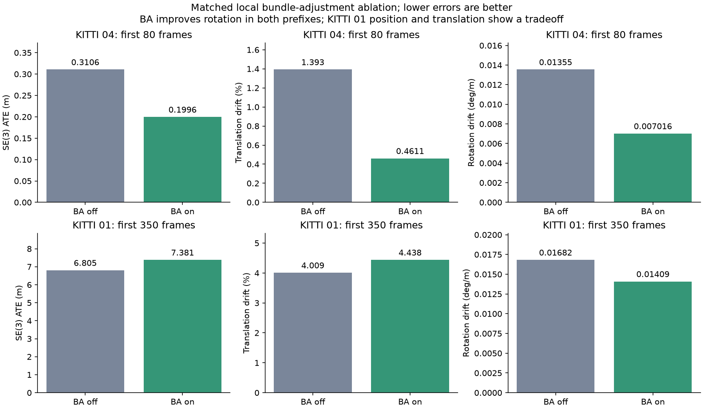
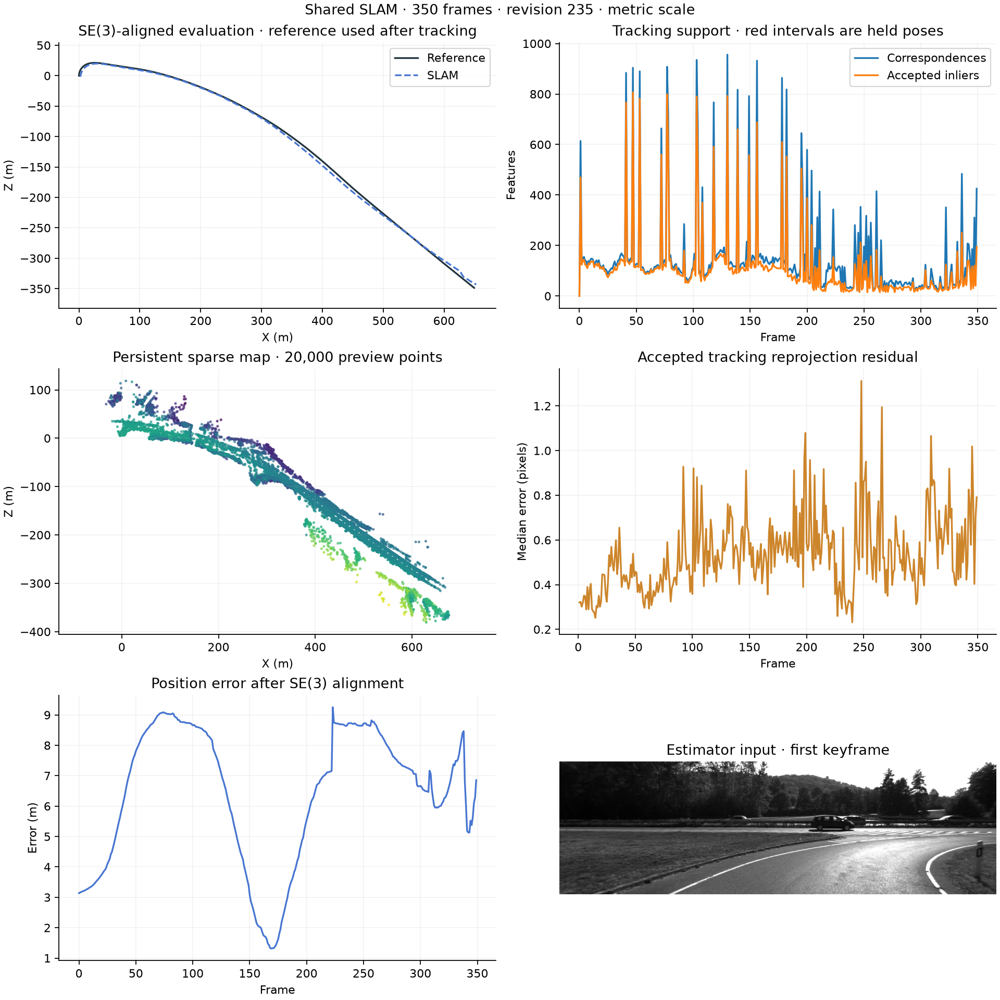

# Local bundle adjustment: matched stereo diagnostics

Disabling local bundle adjustment does not resolve the current rotation regression. Both modes use the same estimator source, dependencies, calibration, images, reference poses, CPU settings and feature configuration; only `bundle_enabled` differs. Loops are off. These are diagnostic prefixes, not full-sequence benchmarks.

| Sequence / frames | Local BA | SE(3) ATE (m) | Translation drift (%) | Rotation drift (deg/m) | Lost frames |
|---|---|---:|---:|---:|---:|
| 04 / 80 | Off | 0.310616 | 1.392656 | 0.013549 | 0 |
| 04 / 80 | On | 0.199626 | 0.461061 | 0.007016 | 0 |
| 01 / 350 | Off | 6.805132 | 4.009219 | 0.016817 | 0 |
| 01 / 350 | On | 7.380790 | 4.437592 | 0.014086 | 0 |

BA reduces rotation drift by approximately 48% on 04 and 16% on 01. On 04 it improves all three metrics. On 01 it increases ATE and translation drift by approximately 8.5% and 10.7%, so retaining BA has a measured tradeoff. Neither mode satisfies the retained supported-mapping rotation gate on 01.

The BA-off cycle passed 238 focused tests with four optional GPU skips, completed the two replays and plots in 375.77 seconds, and produced validated finite exports. Timings are single observations on a shared host and do not establish a controlled speed comparison. The exact four reports and identity checks are recorded in [the result manifest](BUNDLE_ABLATION_RESULTS.json).

An evaluator-only audit also localizes a large 01 rotation error to the selected raw stereo reference at frame 308: 1.552 degrees, unchanged in the final trajectory. The retained supported-mapping reference at the same interval has 0.183 degrees of error. This precedes correction and motivates testing full supported-pool fitting for hard conflicts, rather than rolling back BA. Reference poses remain outside estimator interfaces; these observations guide diagnosis, not per-frame or per-sequence parameters.

The frozen source is `6b3cd2bbf0297061ca4583d4a3e66c893c6b6ca9`, with diagnostic fingerprint `9730849a8d3b5f6074cb05ca40e797c8d48739add8a166b7909767423d1e1f69`. Older groups and previous failed experiments remain separate. Main and scheduled full validation remain on hold.

