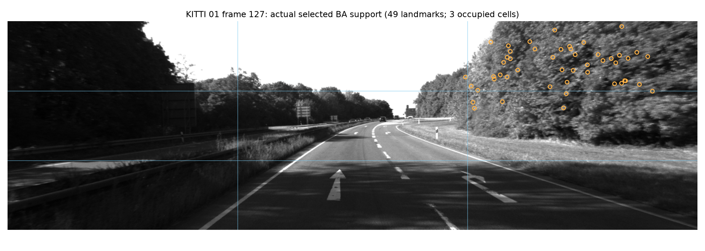
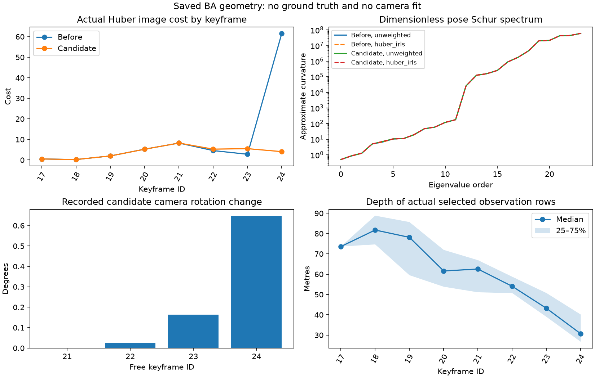

# Stereo bundle-adjustment diagnosis

The experimental snapshot records bundle-adjustment inputs without changing
the estimator. The KITTI 01 rotation regression is reproduced in a stateful
129-frame replay. A fresh replay with capture disabled produces byte-identical
camera trajectories and sparse maps, identical tracking states and identical
bundle reports. These runs diagnose a failure; they do not demonstrate an
accuracy improvement or establish release readiness.

Source commit: `1197031c5ea1c734275ca05520d425a3392c463c`.
Source fingerprint: `034b2550a0ff78868b3de11c815800c24f10a630e3f7cc443e7a3045067f5d51`.
All runs use stereo, verified depth fallback, pose arbitration, raw-reference
retry, CPU matching, one OpenCV thread and loop closure disabled. No feature
cache is used. Ground truth is opened only by evaluation and subsequent scoring.

| Run | Frames | SE(3) ATE, m | Translation drift, % | Rotation drift, deg/m | Lost frames |
| --- | ---: | ---: | ---: | ---: | ---: |
| KITTI 04 capture | 80 | 0.111884 | 0.280753 | 0.005653 | 0 |
| KITTI 01 capture | 129 | 2.580982 | 4.330329 | 0.013057 | 0 |
| KITTI 01 fresh control | 129 | 2.580982 | 4.330329 | 0.013057 | 0 |

These are partial runs. KITTI 04 supplies only one distance segment; KITTI 01
supplies nine. Scores cannot be substituted for full-sequence validation or
compared directly with the retained 350-frame results. Capture workers took
61.3 seconds and 121.8 seconds, respectively; the control took 128.3 seconds.
Those wall times include preparation inside the evaluator and export work and
are not an official performance comparison. The backend suite passed 373 tests
with four optional GPU skips in 54.52 seconds. The source remained frozen during
checks and replay, and every export passed finite/provenance validation.

## The reproduced correction

The frame-127 solve used all 200 eligible landmarks, with no excluded fixed-point
residuals and no duplicate physical observation rows. The landmark cap,
excluded-point domination and duplicate weighting therefore do not explain this
particular event. All recorded residuals lie inside the Huber transition.

The newest keyframe has 49 observed landmarks concentrated in three image cells
on the right side. All 49 connect to the previous keyframe; 37 have only two
camera observations, and only two connect to the fixed window origin. The
recorded image cost decreases from 85.218154 to 31.101435, principally at this
newest camera. The rotation error of the already chosen frame-126 to frame-127
edge increases from 0.098498 degrees before the solve to 0.851597 degrees after
application. The candidate and applied edge agree to numerical precision.
Ground truth is used only to score that fixed edge after the image-only audit.

Eliminating point, translation and other-camera nuisance variables gives a weak
rotation direction predominantly corresponding to roll. The recorded camera
correction aligns with that direction. The geometry audit reconstructs the
solver costs and passes finite-difference and world-gauge invariance checks.
Its Gauss–Newton/IRLS curvature is a diagnostic approximation, not a calibrated
covariance. Neither a condition-number cutoff nor a sequence-specific threshold
is justified by these two examples. The optimizer reaches its existing
30-evaluation limit in both the failing window and the useful KITTI 04 control;
this alone does not identify the cause.

## Next experiment

Add missing, independently verified short-baseline stereo **image observations**
to the measurement graph using training tracks, with one nuisance point per
physical track and one row per camera observation. Reuse observations already
in the map. A non-keyframe source camera must follow its recorded pose's live
anchor correction; treating it as a fixed absolute camera would introduce an
incorrect constraint. Reserved validation tracks must remain excluded from
fitting. This is an unvalidated experiment, and the earlier failed raw-motion
regularizer remains separate.

Start with synthetic narrow-support and broad-support scenes, correspondence
ownership and correction-propagation tests. Then repeat the same short KITTI
01 and 04 controls on a new frozen revision. Expand only after correctness and
accuracy gates pass and the estimated replay cost fits the declared budget.
Full validation remains paused and main is unchanged.

See [capture instructions](bundle-diagnostic-capture.md) and
[machine-readable results](BUNDLE_DIAGNOSTIC_RESULTS.json).
