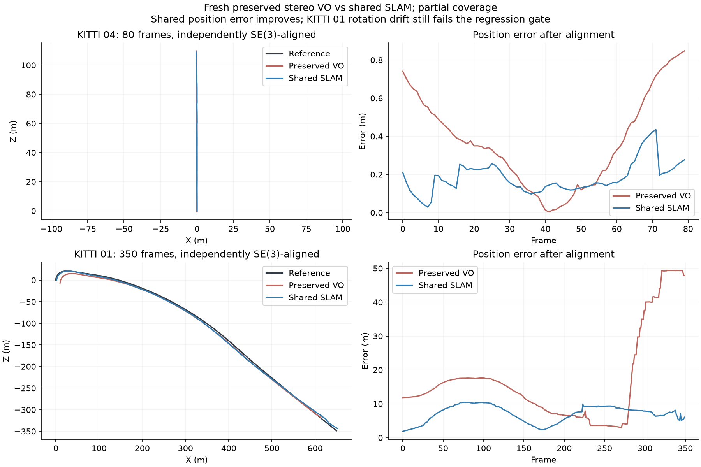

# Fresh preserved-stereo comparison

A fresh replay confirms the retained baseline scores on identical calibrated images and timestamps. The original stereo VO source is unchanged from main. Both estimators use the same Python/OpenCV environment, no feature cache, and the common trajectory metrics implementation. Reference trajectories enter only after estimation. These prefixes start at frame zero and do not establish full-sequence reliability.

| Sequence / frames | Estimator | SE(3) ATE m | Translation % | Rotation deg/m | Lost | Estimator s | Peak MiB |
|---|---|---:|---:|---:|---:|---:|---:|
| 04 / 80 | Preserved VO | 0.443515 | 1.672844 | 0.012412 | 0 | 45.30 | 231.14 |
| 04 / 80 | Shared SLAM | 0.199626 | 0.461061 | 0.007016 | 0 | 39.32 | 261.30 |
| 01 / 350 | Preserved VO | 21.509820 | 8.357439 | 0.010861 | 18 | 186.80 | 235.76 |
| 01 / 350 | Shared SLAM | 7.484202 | 4.557726 | 0.012066 | 1 | 234.20 | 701.99 |

Shared SLAM improves all three accuracy metrics on 04. On 01, ATE decreases approximately 65% and translation drift 45%; lost frames fall from 18 to one, which recovers. Rotation drift remains approximately 11% higher, exceeding the agreed 5% unexplained-regression gate. It also requires more time and memory on 01. The objective is not yet achieved.

The fresh baseline cycle completes in 266.94 seconds, including 249 focused checks with four optional GPU skips. Source archives, runtime, input/reference identities and finite pose counts pass exact-export reuse checks. Small read-only pair diagnostics overlapped the baseline run; timings are single shared-host observations and cannot establish controlled speed gains. Baseline and shared evaluators use different wrappers, and their exact hashes are retained. Both call the same unchanged metrics implementation.

[Result identities](FRESH_STEREO_BASELINE_RESULTS.json) retain all four actual reports. [The full-pool diagnostic](full-supported-stereo-results.md) and [matched BA ablation](bundle-ablation-results.md) retain earlier changes and regressions separately. Full validation and merging remain on hold.

