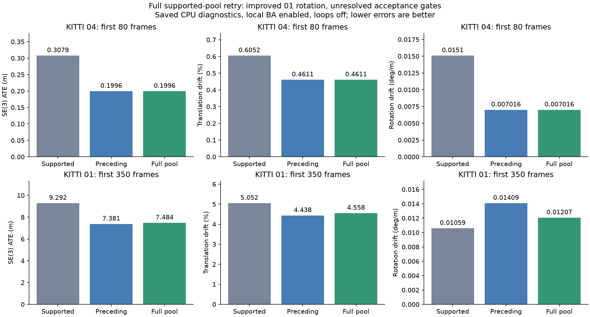
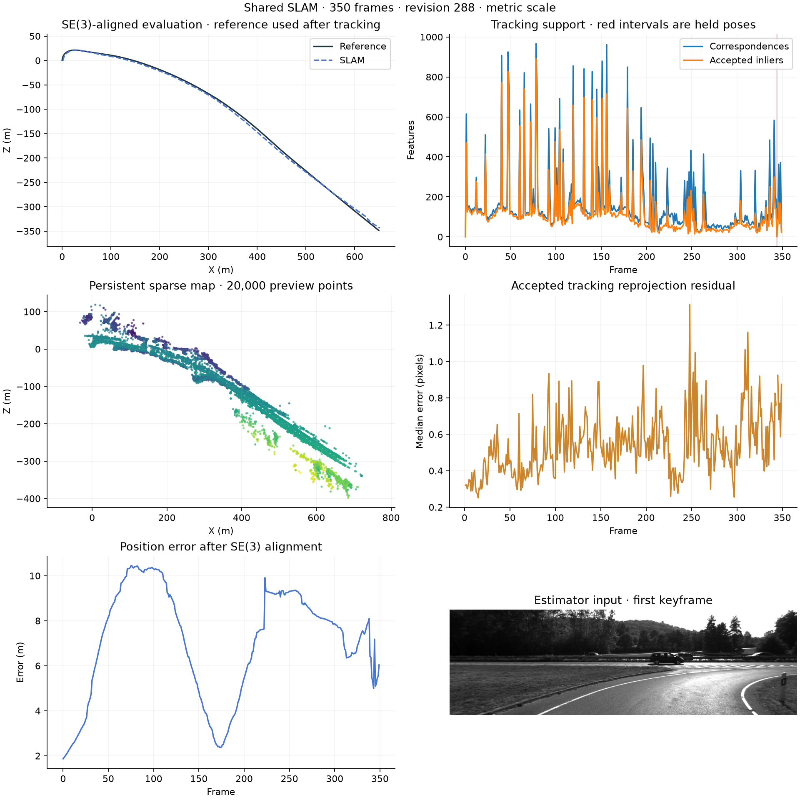

# Full supported-pool stereo retry

The opt-in hard-conflict path retries an unstable reserved-subset reference on the full raw-supported feature pool before selecting a pose. Physical feature duplicates are removed, both temporal directions must verify, and acceptance thresholds remain unchanged. Consumed holdout observations are explicitly excluded from held-out diagnostics. Ground truth remains evaluator-only.

| Sequence / frames | Frozen variant | SE(3) ATE m | Translation % | Rotation deg/m | Lost | Total wall s | Peak MiB |
|---|---|---:|---:|---:|---:|---:|---:|
| 04 / 80 | Supported | 0.307855 | 0.605204 | 0.015096 | 0 | 45.39 | 260.38 |
| 04 / 80 | Preceding | 0.199626 | 0.461061 | 0.007016 | 0 | 47.81 | 261.59 |
| 04 / 80 | Full pool | 0.199626 | 0.461061 | 0.007016 | 0 | 40.04 | 261.30 |
| 01 / 350 | Supported | 9.291663 | 5.051622 | 0.010592 | 1 | 246.49 | 672.42 |
| 01 / 350 | Preceding | 7.380790 | 4.437592 | 0.014086 | 0 | 252.05 | 708.22 |
| 01 / 350 | Full pool | 7.484202 | 4.557726 | 0.012066 | 1 | 240.22 | 701.99 |

On 01, rotation drift decreases 14.34% versus the preceding revision, but ATE increases 1.40% and translation drift increases 2.71%. Rotation remains 13.91% worse than the supported-mapping reference. One frame is lost at 344 and geometrically recovered at 345; the preceding revision had no loss. The focused regression and coverage gates therefore fail. 04 is unchanged. No full-sequence expansion or merge is approved.

The fresh 310.70-second cycle includes 249 focused tests, both uncached CPU replays and their plots. The full backend suite passes 325 tests; four optional GPU checks skip in this environment. Export audits verify current source/runtime/input identities, exact 80/350 pose counts, finite SO(3) rows and finite sparse maps (10,488 and 123,048 points). Tests and finite exports do not establish accuracy.

The new path tries 57 full-pool fits: two agree with the map, 52 still conflict, and three fail verification. Failed fits publish no provisional half-pool motion edge. Two failures recover immediately; frame 344 holds the preceding accepted pose and creates no geometry. Its recovery edge correctly spans 343 to 345. All 342 saved independent motion edges satisfy the existing final-motion guards.

The demonstrated frame-308 subset error improves from 1.552 degrees to 0.203 degrees in both the raw reference and final trajectory. The largest remaining raw rotation error, 340 to 341, is 0.940 degrees and already exists in earlier revisions. A separate image-only pair audit finds 403 mutual descriptor rows but only 262 physical correspondences. Removing duplicates changes the fit substantially, but those alternatives fail reverse verification; lower post-hoc ground-truth error cannot justify accepting them. Raw-supported depth alone retains a verified 0.840-degree error. Next diagnosis must isolate physical multiplicity, spatial/moving-object support and forward/reverse rejection without weakening gates.

[Matched BA ablation](bundle-ablation-results.md) shows BA improves rotation in both prefixes while worsening 01 position error. This does not justify a blanket BA rollback. These loops-off replays provide no evidence of live pose-graph correction.

The tested estimator commit is `c043759bb0005d985e0599c628f08d876b371de0`; its fingerprint is `e7e476f8cd27615282965b129745d97228cf519bd35cb6064b71cfca0671cd67`. [Machine-readable results](FULL_SUPPORTED_STEREO_RESULTS.json) preserve exact identities and all six actual reports. The older supported group predates runtime-identity capture and cannot satisfy the current reuse contract. Older experiments remain separate. Scheduled full validation remains paused.

