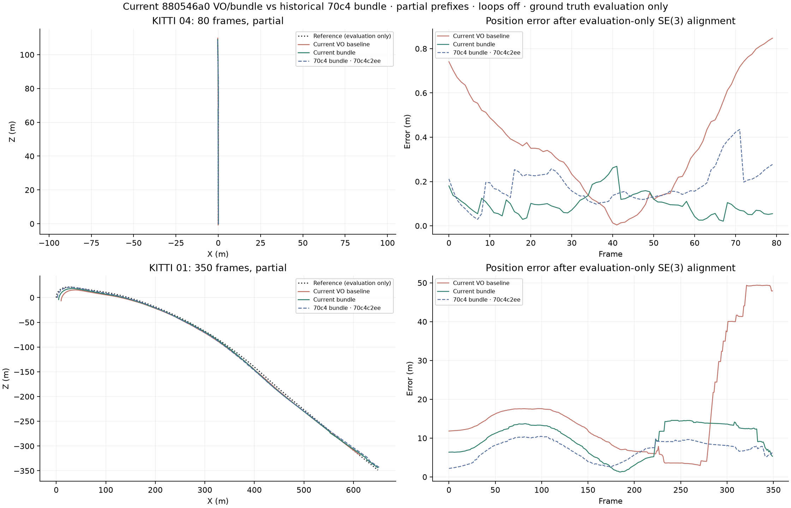
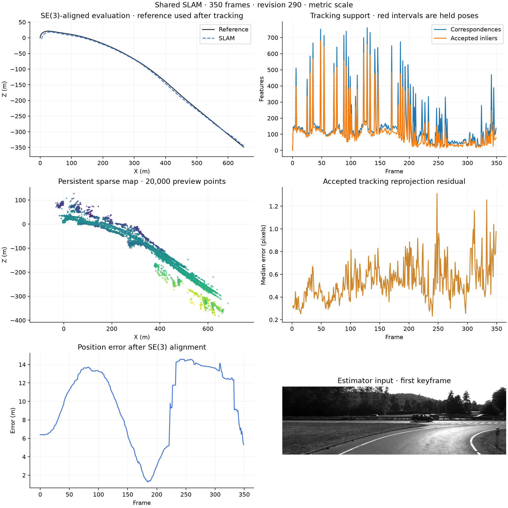

# Physical landmark identity validation

Exact image-pixel aliases now share a persistent landmark identity while retaining all SIFT orientation descriptors. Pose fitting counts physical observations once. Distinct optical-flow rays retain their actual measured pixels; ambiguous nearby detector labels are cleared. Shared stereo-reference and recovery fitting match appearances before filtering physical geometry. Acceptance thresholds remain unchanged.

The four fresh uncached runs start at frame zero with one stereo configuration and loops off. They cover partial prefixes; reference poses enter only during evaluation. Earlier shared results remain a separately identified source revision.

| Sequence / frames | Pipeline | ATE m | Translation % | Rotation deg/m | Lost | Estimator s | Peak MiB |
|---|---|---:|---:|---:|---:|---:|---:|
| 04 / 80 | Preserved VO | 0.443515 | 1.672844 | 0.012412 | 0 | 39.18 | 230.94 |
| 04 / 80 | Previous shared | 0.199626 | 0.461061 | 0.007016 | 0 | 42.54 | 261.83 |
| 04 / 80 | Physical identity repair | 0.111884 | 0.280753 | 0.005653 | 0 | 67.41 | 262.90 |
| 01 / 350 | Preserved VO | 21.509820 | 8.357439 | 0.010861 | 18 | 174.61 | 235.75 |
| 01 / 350 | Previous shared | 7.479312 | 4.475548 | 0.013116 | 0 | 237.38 | 713.00 |
| 01 / 350 | Physical identity repair | 10.650785 | 5.447436 | 0.011487 | 0 | 436.57 | 657.41 |

The new maps contain zero exact-pixel groups linked to multiple landmark IDs, versus 1,701 on 04 and 18,657 on 01 previously. The repair improves all three accuracy metrics on 04. On 01, rotation improves over the previous shared revision, but ATE and translation worsen. Rotation remains 5.76% worse than preserved VO, exceeding the 5% diagnostic limit. Zero lost frames do not establish sufficient accuracy.

The source is retained as an experimental correctness repair, not approved as an overall benchmark improvement. Longer validation and merging remain on hold. Replays also take longer; shared-host timing does not isolate every cause, so correspondence, identity-check and optimization costs need profiling before increasing coverage.

The cycle completes in 767.16 seconds including preparation, 270 focused tests, replay and plots. The backend passes 348 tests with four optional GPU skips; frontend tests, type checking and build pass. Export/source/input checks pass. These loops-off runs provide no new live pose-graph correction evidence. The standalone default loop matcher is outside this evaluated repair; its follow-up remains separate.

Next: reproduce reference-verification failures at frames 222, 227 and 233. Three accepted map steps of 0.06–0.08 m replace preceding independently verified stereo steps of 2.67–2.69 m; no local BA is accepted in frames 216–242. Compare configured and independently supported depth through the same physical correspondence checks, preserving unique identities and acceptance gates. Remove repeated full-map identity scans and measure stage costs. Reevaluate short prefixes before full 01/04 and then 00/07; monocular/TUM and dense reconstruction evidence remain pending.

Tested estimator commit: `d3871825a842f8a76218ba44fdb82b4faaa8f26d`. Fingerprint: `880546a01e9d80a776f3b645c9f1d0d268f49c7707911426d54a9a3514227bdf`. [Machine-readable results](PHYSICAL_IDENTITY_RESULTS.json). [Previous shared comparison](reserved-stereo-validation.md). [Same-source BA diagnostic](same-source-bundle-ablation.md).

