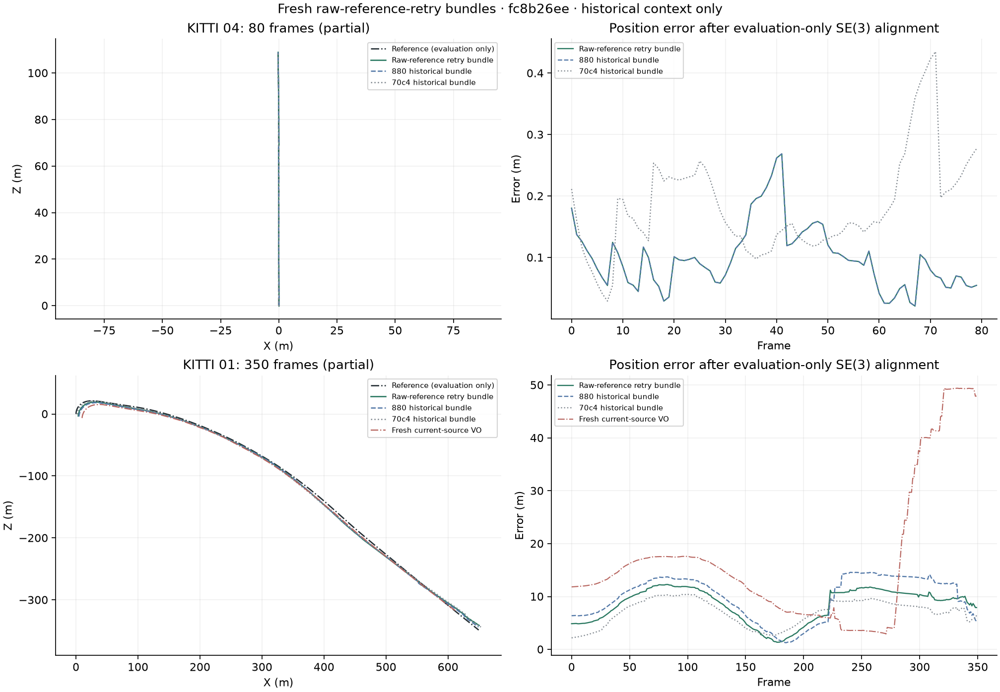
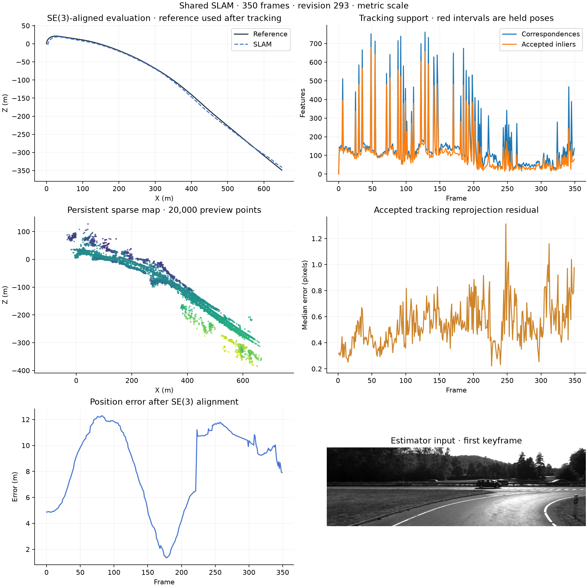

# Raw stereo reference retry

When a configured stereo reference fails, persistent-map tracking can accept a
small motion that disagrees with the independently supported stereo geometry.
The retained KITTI 01 diagnostic contains this behavior at frames 222, 227 and
233. No local bundle adjustment was accepted between frames 216 and 242, so
those immediate stalls cannot be attributed to an applied BA correction.

`--stereo-raw-reference-retry` enables a separate experiment in the shared stereo
pipeline. After an actual configured-reference failure, it fits against immutable
supported stereo observations, matches appearance descriptors and counts exact
pixel aliases as one physical correspondence. It requires an independently
verified reverse fit, existing spatial support and reprojection gates, and the
existing 0.5 m / 1.5 degree round-trip limits. A valid configured reference is
preserved. Full-pool fits do not claim held-out validation.

The retry remains off by default. It requires `--slam --stereo` in the VO command;
the shared evaluator accepts the same retry flag with `--stereo`. For a diagnostic:

```powershell
.\.venv\Scripts\python scripts/evaluate_shared_slam.py --data-root $data --poses-root $poses --sequence 01 --stereo --loop-mode off --stereo-depth-policy verified_fallback --stereo-pose-arbitration --stereo-raw-reference-retry --max-frames 350 --max-wall-seconds 720 --output results/raw-retry01
```

Estimator inputs contain images and calibration only. Reference trajectories
remain evaluator-only; learned depth remains outside tracking. The evaluator
records the retry mode in configuration and provenance. Enabled and disabled
results cannot satisfy each other's resume identities.

The reviewed implementation is retained in commit
`54bf9003798c843a25300021e1c2a186d23bc57c`. Its backend suite passes 356 tests with
four optional GPU skips. Synthetic tests exercise real bidirectional PnP with
finite but inconsistent configured depths, duplicate appearance rows and
rejection after geometry changes. The synthetic recovered translation is 0.5 m;
this is a correctness check, not a KITTI accuracy result.

## KITTI 04 regression check

A fresh uncached replay processes frames 0–79 with stereo, local BA, arbitration
and raw retry enabled, loops off, and one OpenCV worker. All 80 frames are
processed with zero lost frames. ATE is 0.111884 m, translation drift 0.280753%
and rotation drift 0.005653 degrees/m, identical to the preceding physical-identity
revision on the same prefix. This run does not need the new retry; it checks that
ordinary reference tracking remains stable. It does not validate the affected
KITTI 01 cases.

The evaluator takes 64.50 seconds including export and evaluation; the worker
takes 65.81 seconds and the supervised cycle 69.1 seconds. Peak memory is
264.77 MiB. These are diagnostic measurements. Its finite-export and exact
source/input checks pass. The saved source fingerprint is
`fc8b26eed37b87dce49f9ed01dab1ff84514169ca84ede50d3e98570d3ddd11b`.


## KITTI 01 targeted comparison

Two fresh uncached runs process frames 0–349 from the same frozen source and
input/calibration fingerprints. The shared tracker uses the same declared stereo
configuration as the 04 check. The preserved VO control keeps its original
configuration. Both use evaluation-only reference poses and SE(3) alignment
without fitting scale.

| Pipeline | ATE m | Translation % | Rotation deg/m | Lost | Estimator s | Peak MiB |
|---|---:|---:|---:|---:|---:|---:|
| Fresh preserved VO | 21.509820 | 8.357439 | 0.010861 | 18 | 143.11 | 237.21 |
| Raw reference retry | 9.017336 | 4.806658 | 0.013120 | 0 | 384.92 | 661.98 |

[Machine-readable results and identities](RAW_STEREO_REFERENCE_RESULTS.json).



Against the preceding physical-identity revision, ATE improves 15.34% and
translation drift improves 11.76%, while rotation drift worsens 14.22%. That
revision is retained historical evidence, not reused as a fresh control. Against
the fresh VO control, ATE improves 58.08% and translation drift improves 42.49%,
but rotation drift is 20.80% worse. This exceeds the 5% regression limit, so the
release gate remains failed. Short-prefix improvement does not establish full
sequence reliability.

Six retries are attempted. Two are installed, at frames 227 and 233, restoring
2.6872 m and 2.6992 m steps after independent reverse verification. Their source
guards and final motion-ledger entries agree; neither claims held-out validation.
Four retries fail geometric verification. The stalled step at 222 remains
unresolved. No local BA is accepted between frames 216 and 242.

The map contains 151 keyframes, 110,999 landmarks and 114,345 observations, with
zero exact-pixel groups assigned different landmark IDs. All 350 frames are
exported: 348 tracking, two relocalized and zero lost. Finite poses, PLY/preview,
keyframe consistency, source archives and recomputed metrics pass independent
saved-artifact checks. Text-export rounding is checked with a declared 1e-7
metric tolerance.

The biased comparison at 308 remains: a reserved candidate can win against a
deteriorated map while its own support cost is unchanged. Investigate that
selection separately from BA-induced changes to verified rotations. Saved-edge
analysis also finds post-tracking corrections increasing otherwise good stereo
rotation errors: 126–127 changes from 0.0985 to 0.8415 degrees, and later
corrections affect 322–323 and 325–326. These evaluator-only diagnostics motivate
preserving independently verified motion during BA; they are not estimator
selection criteria or sequence-specific thresholds. Runtime is
also a blocker: the shared tracker remains about 2.7 times slower than VO in this
diagnostic. Inclusive stage timings do not isolate individual causes.



Full paired validation, live-loop evidence, monocular/TUM checks and dense
reconstruction remain release prerequisites. Earlier results remain attached to
their original revisions. No estimator thresholds were lowered or tuned for
individual sequences.
