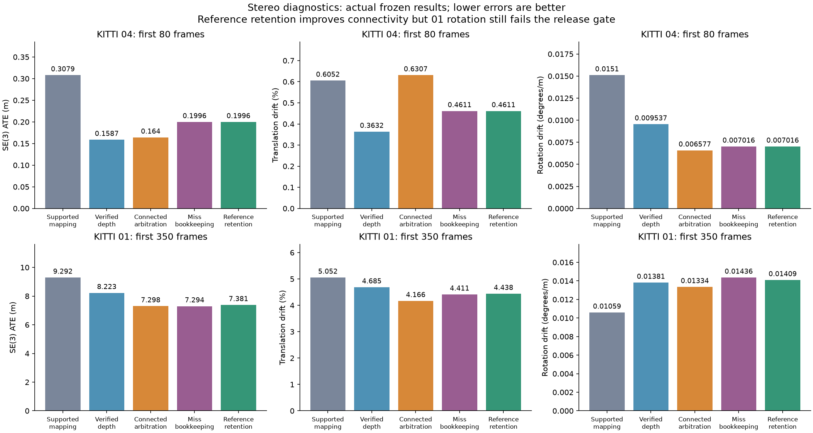
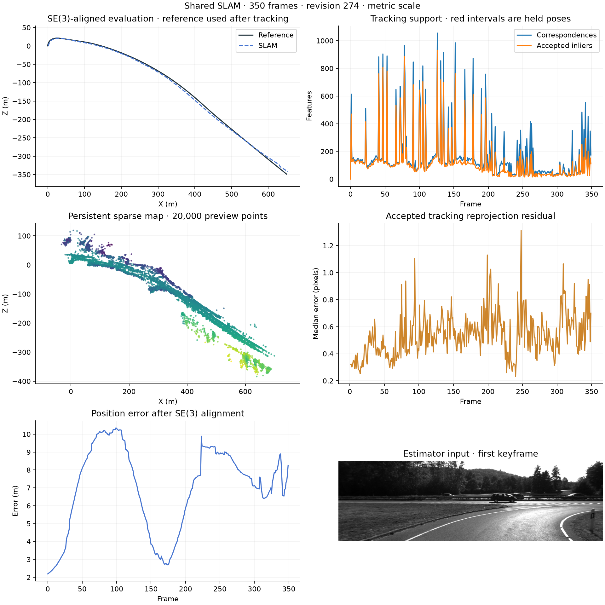

# Stereo reference retention: focused diagnostics

The latest experimental revision completes the first 80 frames of KITTI 04 and the first 350 frames of KITTI 01 without tracking loss. It does not pass the accuracy regression gate. These prefixes do not establish full-sequence or release readiness.

| Revision | Sequence / frames | SE(3) ATE (m) | Translation drift (%) | Rotation drift (deg/m) | Lost frames |
|---|---|---:|---:|---:|---:|
| Connected arbitration (`b01684a`) | 04 / 80 | 0.163960 | 0.630748 | 0.006577 | 0 |
| Miss bookkeeping (`21555bf`) | 04 / 80 | 0.199626 | 0.461061 | 0.007016 | 0 |
| Reference retention (`6b3cd2b`) | 04 / 80 | 0.199626 | 0.461061 | 0.007016 | 0 |
| Connected arbitration (`b01684a`) | 01 / 350 | 7.297773 | 4.165512 | 0.013341 | 0 |
| Miss bookkeeping (`21555bf`) | 01 / 350 | 7.294471 | 4.410981 | 0.014356 | 0 |
| Reference retention (`6b3cd2b`) | 01 / 350 | 7.380790 | 4.437592 | 0.014086 | 0 |

The reference-retention change preserves existing landmark links only after frame, calibration, map-revision, pose and fixed-pose reprojection checks pass. Acceptance thresholds remain unchanged. Landmark miss bookkeeping now reconciles rejected provisional associations exactly once. Runtime/dependency identities and finite export checks prevent incompatible results from being reused.

On 01, reference retention reduced keyframes from 154 to 147 and applied 49 local bundle adjustments. Rotation drift decreased 1.88% relative to the miss-bookkeeping revision, while ATE increased 1.18% and translation drift increased 0.60%. Against connected arbitration, translation and rotation drift increased 6.53% and 5.59%. Rotation drift remains approximately 33% above the retained supported-mapping reference (`7cc6191`). The revision therefore remains experimental.

The full backend suite passed 314 tests with four optional GPU skips. The frozen focused runner passed 238 tests with four skips and completed both replays and plots in 333.25 seconds. The latest 01 run took 252.05 seconds and peaked at 708.22 MiB. The previous miss-bookkeeping run took 303.05 seconds; extraction and matching also became faster, so shared-host timing variation prevents attributing this difference solely to reference retention. This is a CPU diagnostic measurement, not a controlled performance benchmark.

Both runs produced finite exports and passed artifact validation. The 01 motion audit checked 350 poses and 345 independent measurement edges; the largest checked optimization-induced changes were 0.4735 m and 0.5255 degrees, within the existing motion guard. Passing that guard does not waive the accuracy regression. Ground truth is used only for evaluation.

The next accuracy investigation should isolate rotation residuals and local bundle-adjustment effects using matched short replays. Full KITTI, monocular/TUM and live-loop acceptance remain outstanding. The scheduler remains paused; this work is not approved for main.

Exact source fingerprints, evaluation provenance and all ten retained comparison rows are in [the result manifest](REFERENCE_STEREO_FOCUSED_RESULTS.json). Each source revision retains its own result group.

