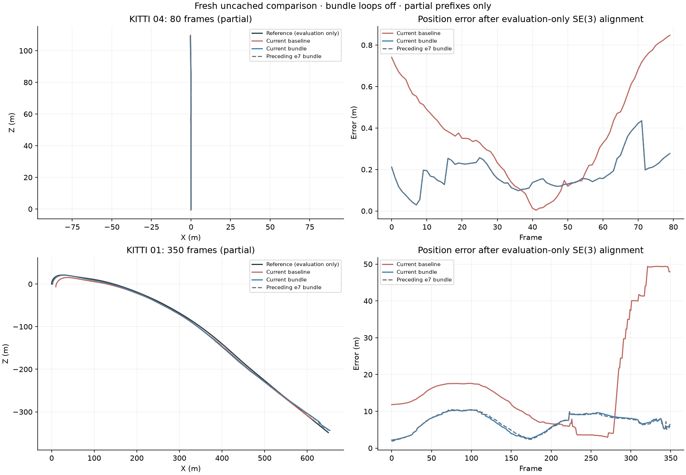
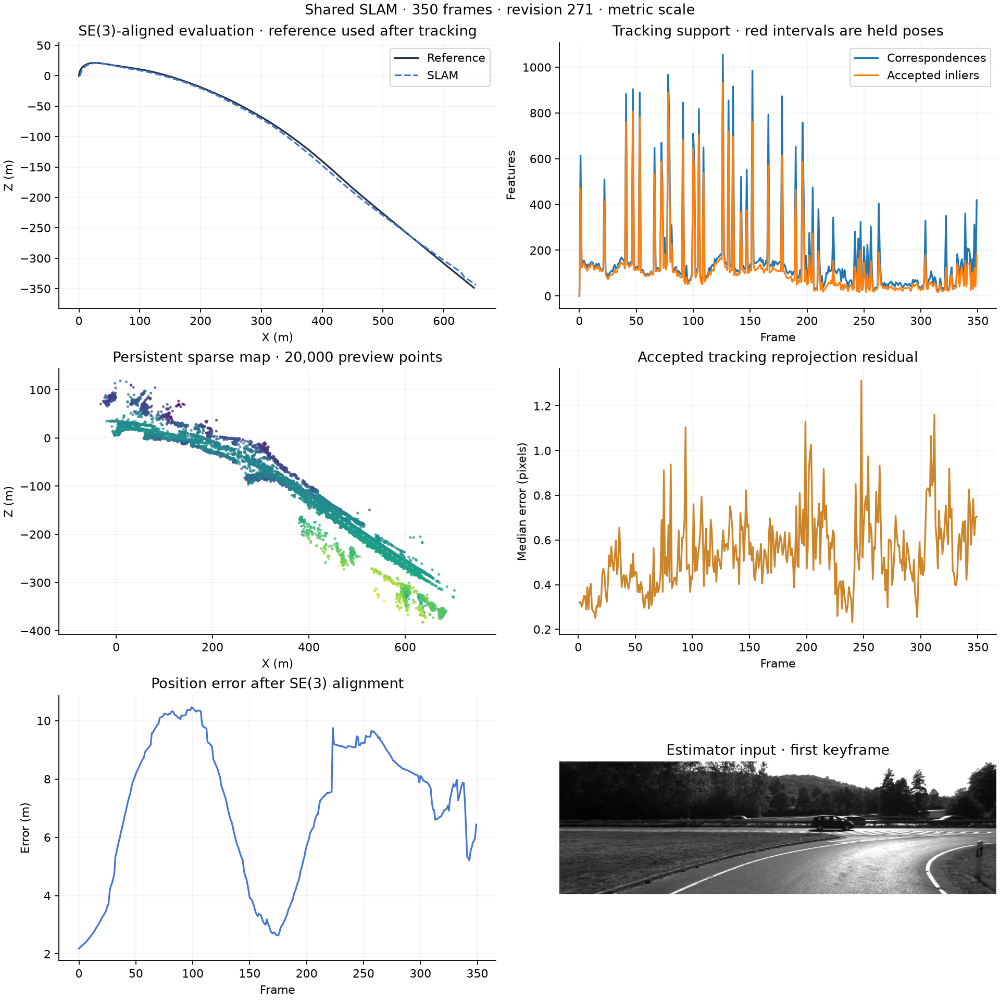

# Reserved stereo validation

The opt-in stereo selector checks untouched held-out observations before a full-pool retry. A strict winner must also satisfy the existing calibration, map-revision and endpoint checks. Other outcomes retain the full-pool retry and geometric recovery path. Acceptance thresholds and the default pipeline are unchanged.

Fresh uncached runs start at frame zero with one configuration for both sequences. These are partial prefixes with loop closure disabled. Ground truth enters only during evaluation; no pose-graph improvement can be inferred from this experiment.

| Sequence / frames | Pipeline | SE(3) ATE m | Translation % | Rotation deg/m | Lost | Estimator s | Peak MiB |
|---|---|---:|---:|---:|---:|---:|---:|
| 04 / 80 | Preserved stereo VO | 0.443515 | 1.672844 | 0.012412 | 0 | 36.63 | 230.72 |
| 04 / 80 | Shared SLAM | 0.199626 | 0.461061 | 0.007016 | 0 | 42.54 | 261.83 |
| 01 / 350 | Preserved stereo VO | 21.509820 | 8.357439 | 0.010861 | 18 | 138.31 | 235.73 |
| 01 / 350 | Shared SLAM | 7.479312 | 4.475548 | 0.013116 | 0 | 237.38 | 713.00 |

04 is unchanged from the preceding full-pool revision and improves all three accuracy metrics over preserved VO. On 01, ATE improves 65.23% and translation drift 46.45% versus preserved VO, with zero lost frames. Rotation drift is 20.76% worse, exceeding the agreed 5% regression limit. Versus the preceding revision, rotation worsens 8.70% while the one lost frame is eliminated. This experiment fails the accuracy gate; full validation and merging remain on hold.

Frame 308 retains the full-pool repair: the held-out half fit has higher cost than the map, so it cannot bypass the retry. Its evaluated raw and final rotation error remains 0.203 degrees. At frame 344, the half fit wins on held-out cost and spatial/inlier support, retains 127 existing map connections, and remains tracking. These localized repairs do not establish an overall improvement.

The 01 run selects 39 early hard-conflict winners; 18 retain sufficient existing connections and 21 use the established reference-keyframe path. It attempts 26 full-pool retries, including one failure recovered through geometric relocalization. Consumed holdout observations produce no held-out diagnostics. All 344 saved independent motion edges remain within the existing final guards.

The four-run cycle takes 494.50 seconds including preparation, 252 focused tests, replay and plots. The full backend suite passes 328 tests with four optional GPU skips; frontend tests, type checking and build pass. Exact source/runtime/input identities and finite exports pass. Timing and memory are single shared-host observations and do not establish controlled speed gains.

Tested estimator commit: `5795bc5269a29dfc6bd1452110f62a1f0ac838af`. Fingerprint: `70c4c2eeb8a711ba3e6fec3229b0b7cbb1b8b5d8b07c5d4e3c3f8d4294bdff05`. [Result identities and decision audit](RESERVED_STEREO_VALIDATION_RESULTS.json) preserve the fresh measurements. [Earlier full-pool results](full-supported-stereo-results.md) remain a separate source revision.

Next: isolate the remaining orientation errors and optimization-induced changes before increasing coverage. Full 01/04, then 00/07, live/offline graph comparisons, monocular recovery and RGB-only TUM validation remain pending. Dense reconstruction has not been evaluated in these runs.

