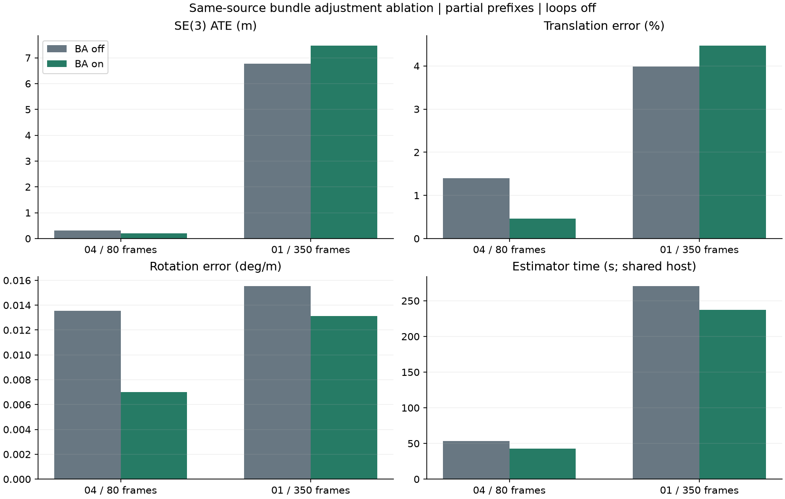

# Same-source bundle adjustment ablation

These uncached runs start at frame zero and differ only in `bundle_enabled`. Both variants use verified stereo depth, reserved pose arbitration and disabled loops. Source archives, runtime, image inputs and evaluator references match; exported poses and sparse maps are finite. Metrics were independently recomputed after estimation. Ground truth remains evaluator-only.

| Sequence / frames | Bundle adjustment | ATE m | Translation % | Rotation deg/m | Lost | Estimator s | Peak MiB |
|---|---|---:|---:|---:|---:|---:|---:|
| 04 / 80 | Off | 0.310616 | 1.392656 | 0.013549 | 0 | 53.66 | 261.15 |
| 04 / 80 | On | 0.199626 | 0.461061 | 0.007016 | 0 | 42.54 | 261.83 |
| 01 / 350 | Off | 6.772513 | 3.986610 | 0.015541 | 0 | 270.72 | 706.08 |
| 01 / 350 | On | 7.479312 | 4.475548 | 0.013116 | 0 | 237.38 | 713.00 |

On 04, bundle adjustment reduces ATE 35.7%, translation error 66.9% and rotation error 48.2%. On 01, it reduces rotation error 15.6%, but increases ATE 10.4% and translation error 12.3%. Both 01 variants retain zero lost frames and one geometrically verified recovery. Timing is measured on a shared host and is not a controlled speed comparison.

The saved bundle maps contain 1,701 exact-pixel groups with distinct landmark IDs on 04 and 18,657 on 01. Most also contain identical world points. This is a reproduced observation-identity defect; its repair requires fresh validation. Removing bundle adjustment would not address that defect and would worsen rotation in these prefixes.

This comparison does not pass a release gate. Full sequences, live/offline correction, monocular and TUM validation remain pending. The [previous VO comparison](reserved-stereo-validation.md) retains the separate rotation regression against preserved stereo VO.

Saved source fingerprint: `70c4c2eeb8a711ba3e6fec3229b0b7cbb1b8b5d8b07c5d4e3c3f8d4294bdff05`. [Metrics and evidence identities](SAME_SOURCE_BUNDLE_ABLATION_RESULTS.json).

