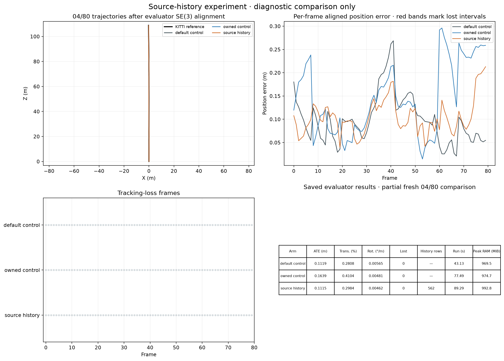
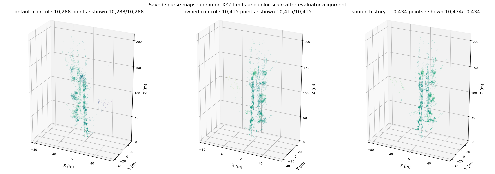

# Experimental source-camera image connectivity

Local bundle adjustment can optimize a non-keyframe source camera from its
stereo pair with a target keyframe. The previous experiment mostly added
single-view points, which constrain that relative pair without directly tying
the source camera to older multiview map geometry. This experiment adds the
source frame's accepted left-image map observations to existing selected
multiview landmark variables.

The saved KITTI 04 frame-26 audit found 81 accepted source-frame-25 tracks.
Sixty-three landmark IDs were already among the 200 selected multiview points;
reserved exclusions left 60 eligible rows. The existing bundle had no original
source-frame-25 image observations. Its owned stereo pool contained six shared
selected points and 125 singleton points. None of those six shared IDs overlapped
the 63 historical map tracks.

This is a measured graph-connectivity gap, not a proven cause of the accuracy
regression. The earlier candidate already reduced the omitted source-image
cost. Saved correction identities remained consistent. Incoming source-camera
motion changed more than its outgoing stereo-pair motion, within the existing
hard limits. Fresh accuracy comparisons are required.

## Measurement and optimization contract

`--stereo-source-history-bundle` is experimental and defaults off. It requires
calibrated stereo and `--stereo-owned-image-bundle`. Actual source-frame pixels
must be copied before target processing replaces the previous track cache.
They must retain the accepted image's frame and calibration binding; target-era
detector ownership claims are not source observations.

Each installed row contributes only two left-image reprojection components.
It uses an existing selected world-point variable and the existing source camera
chart, `S = T C`. The row's derivatives depend on the target camera, source-relative
camera and world point. There are no new point variables, pose priors, depth
measurements, samplers or descriptor matches.

Reserved landmark IDs and source pixels are excluded. A source-frame/landmark
observation already present in the original or owned bundle is not inserted
again, even if another pixel was proposed. Ambiguous physical ownership fails
closed. These measurements were consumed during tracking and are not independent
validation evidence.

The original affected objective and the complete augmented objective must
improve before application. Existing finite-depth, gauge, motion and atomic
revision guards remain in force. Empty eligible history reports no added
evidence and preserves the existing owned solver behavior.

## Focused comparison

Use fresh KITTI 04 frames 0–79, CUDA matching, current retrieval, one OpenCV
thread, verified-fallback depth, stereo pose arbitration, raw-reference retry
and loops off. Keep source, runtime, input and calibration identities fixed.

| Arm | Owned image factors | Source history | Requested solver policy |
| --- | --- | --- | --- |
| Default mapping control | Off | Off | default |
| Existing image-factor control | On | Off | precise |
| Source-history experiment | On | On | precise |

Compare the experiment with the matching image-factor control to isolate the
new rows, and with the default mapping control to check the accuracy regression
gate. Stop wider validation on failed correctness, tracking-coverage or accuracy
gates. One short distance segment is insufficient for release readiness. Ground
truth remains evaluator-only, and learned depth remains outside tracking.

Run the shared evaluator with separate output directories and explicit
wall-clock deadlines. Add `--stereo-source-history-bundle` only to the final arm;
use `--bundle-solver-accuracy precise` for the two image-factor arms. The saved
run configuration and benchmark identity must include this mode explicitly.

## Validation status

This flag is experimental and disabled by default. The frozen revision passed
486 backend tests, including source-pixel ownership, gauge, sparse Jacobian,
objective accounting and stale-result rejection checks. Three fresh runs used
identical inputs and one declared configuration, with the two switches and
solver policies listed above. None lost tracking.

| KITTI 04, first 80 frames | ATE, SE(3) (m) | Translation (%) | Rotation (degrees/m) | Runtime (s) |
| --- | ---: | ---: | ---: | ---: |
| Default mapping control | 0.111884 | 0.280753 | 0.005653 | 43.13 |
| Existing image-factor control | 0.163932 | 0.410376 | 0.004814 | 77.49 |
| Source-history experiment | 0.111450 | 0.298385 | 0.004622 | 89.29 |

The experiment installed 562 source-image observations across nine accepted
updates. It reduced ATE by 32.0% against the image-factor control. Against
default mapping, rotation error fell 18.2%, ATE was almost unchanged and
translation drift rose 6.28%. The latter exceeds the declared 5% regression
gate, so wider validation remains stopped. The runtime increase also needs
attention. These are short-prefix results with one eligible distance segment;
they do not establish full-sequence or release readiness.

[Exact results](SOURCE_HISTORY_04_80.json) retain the tested fingerprint and
comparison failures. The reference poses enter evaluation only. The next
diagnostic examines the source-camera update at frame 69, where improved image
fit still accompanies a larger camera correction.

Use explicit CUDA matching for each comparison arm on a compatible system.
Saved CUDA diagnostics confirm the backend ran without CPU fallback. The
measured 10–12 times descriptor-matching speedup excludes feature extraction,
tracking and bundle adjustment; it is not a whole-pipeline speedup. CPU matching
remains available for systems without compatible CUDA hardware.
