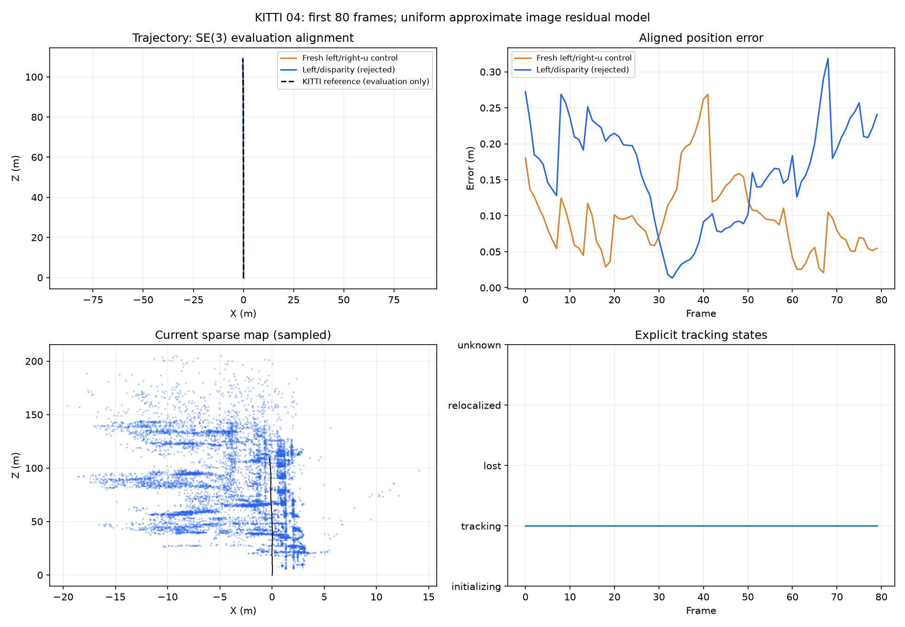

# Stereo bundle observation-model experiment

This branch tests a uniform approximate image-noise model inside the existing
persistent-landmark bundle adjustment. It adds no pairwise pose priors and remains
disabled by default. The rejected motion-regularizer branch is separate.

The default `left_right` mode keeps the existing left-u, left-v and right-u
residuals. Select `left_disparity` with `--stereo-bundle-residuals left_disparity`
alongside `--slam --stereo`, or `--stereo` in the shared evaluator. Its third row
is `fx * baseline / z + disparity_offset - (measured_left_u - measured_right_u)`.
The first two image residuals, row count, point variables and componentwise
two-pixel Huber loss remain the same.

This intentionally changes the objective by assuming independent equal one-pixel
errors in left-u, left-v and disparity. It is **not a calibrated covariance
correction**. Supported depth samples derive right-u from interpolated disparity;
verified fallback samples use a separate image search. Bilinear sampling and
fallback correlations are not modeled by this uniform assumption. Objective
values from the two modes therefore cannot be compared as the same likelihood.

Both selected landmarks and affected unoptimized observations use the declared
mode. The fixed origin, component scale gauges, positive depth, finite solution,
revision checks and existing stereo-motion agreement limits remain unchanged.
No ground-truth or reference-depth input reaches estimation. The default path
and sensor interfaces remain available for comparisons.

Run records declare the mode and approximate-noise provenance. Synthetic and
same-input replay evidence must establish behavior before wider validation. No
KITTI accuracy improvement is claimed by this implementation alone.

## Measured outcome

The full backend suite passes: 387 tests, with four optional GPU skips, in
56.39 seconds. The frozen source commit is
`d22c1368c34d61cc584628fd4476127f41f671fa`; its fingerprint is
`ce1156458a2ac7905b2cbb0f55cfc7fa6c1cacbd67108f6c77f17ffd42342917`.

Two fresh uncached KITTI 04 runs process frames 0–79 with identical source,
inputs, calibration and configuration except the residual mode. Loops are off.

| Mode | SE(3)-aligned ATE (m) | Translation drift (%) | Rotation drift (deg/m) | Lost frames | Estimator time (s) | Peak memory (MiB) |
| --- | ---: | ---: | ---: | ---: | ---: | ---: |
| Default left/right-u | 0.111884 | 0.280753 | 0.005653 | 0 | 56.03 | 264.27 |
| Approximate left/disparity | 0.176181 | 0.641288 | 0.008122 | 0 | 57.35 | 265.44 |

**The alternative fails the focused accuracy gate and stays disabled.** ATE
increases 57.5%, translation drift 128.4%, and rotation drift 43.7%. This short
prefix contains one eligible 100 m segment, so it is diagnostic evidence rather
than full-sequence validation. KITTI 01 was not started after this failed gate.

The default control's pose file is byte-identical to the retained raw-reference
implementation. Both runs have 79 identical saved raw motion edges, 11 keyframes,
zero lost frames and nine accepted bundle adjustments. Their source archives,
evaluator, runtime and inputs match; finite poses/maps and strict affected-cost
decreases pass independent audits. The lower trajectory accuracy therefore comes
from the changed bundle objective and its propagated corrections, without changed
raw motion fitting. Passing geometry checks and reducing that objective do not
establish accuracy.

The uniform residual model does not resolve the regression. Further work should
inspect joint landmark uncertainty, selection and physical observation ownership
before changing weights or acceptance rules. Both rejected experiments and their
original saved outputs remain separate from the integration branch and main.
