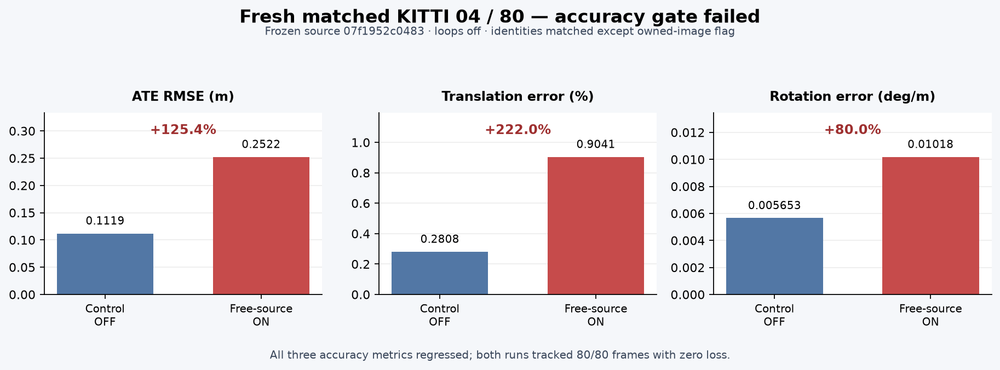
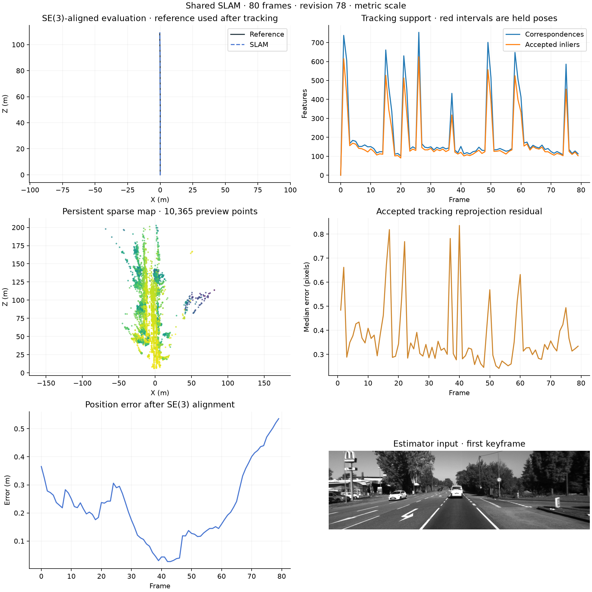
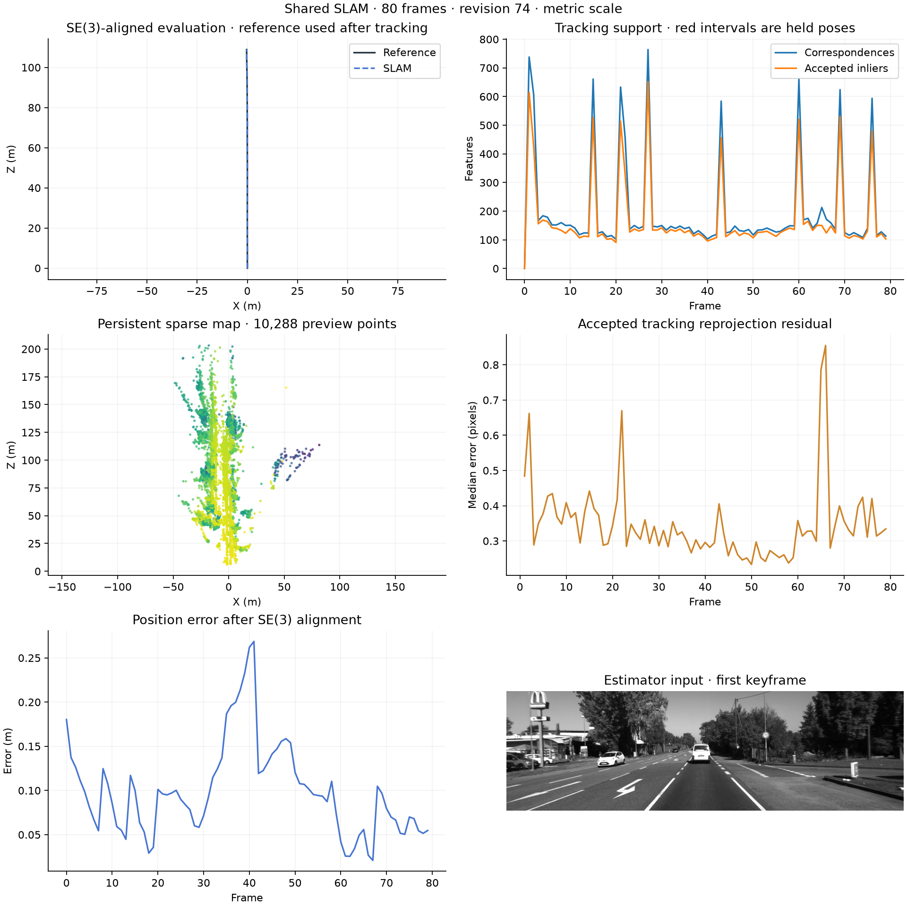

# Free intermediate cameras in stereo bundle adjustment

This experiment changes the camera state used by `--stereo-owned-image-bundle`.
It remains off by default. The earlier implementation and its failed accuracy
comparison are retained on `codex/stereo-owned-image-bundle` and in
[the previous report](stereo-owned-image-bundle.md).

Previously, an intermediate image pose was its keyframe pose multiplied by a
fixed recorded transform. That treats accumulated motion between the keyframe
and image as exact. The new model jointly optimizes one camera pose for each
actual intermediate image and reuses the existing camera variable for a
keyframe image. Shared landmarks remain shared point variables. There is no
source-to-anchor pose prior.

The original metric gauge, image residuals, robust loss, solver budget,
calibration and acceptance limits are unchanged. New camera/point components
must connect to the original visual graph. Both the original affected objective
and the augmented objective must decrease. All retained motion measurements
touching an optimized intermediate camera are checked, including measurements
whose endpoints share an anchor.

Validated camera and landmark updates are applied in one map transaction. The
intermediate pose overrides ordinary anchor propagation, and its relative pose
is recomputed against the corrected anchor. Stale snapshots, invalid cameras,
conflicting keyframe overrides and inconsistent frame arrays reject application.

Temporary source-image rows are not added to historical keyframe observations.
Their influence is therefore limited to the current transaction. This correction
does not address coherent disparity bias or establish a calibrated covariance.
The independent depth-acquisition experiment also
[failed its short comparison](stereo-verified-measurements.md).

## Fresh matched 04/80 result: failed

The frozen source `07f1952c04834c5c993ecc31b7d0d80b752aa6eb6f003dac1db9256e1b95a1e3`
was tested in two fresh, uncached runs over frames 0–79. The runs matched on
source, runtime, input, reference, and the remaining configuration; only the
owned-image flag differed. Both completed tracking all 80 frames, but the ON
run regressed beyond the declared 5% gate on all three accuracy metrics.

| Metric | Control OFF | Free-source ON | Change ON vs OFF |
|---|---:|---:|---:|
| ATE RMSE (m) | 0.111884 | 0.252213 | +125.42% |
| Translation error (%) | 0.280753 | 0.904119 | +222.03% |
| Rotation error (deg/m) | 0.005653 | 0.010178 | +80.05% |
| Lost frames | 0 | 0 | — |
| Runtime (s) | 58.65 | 65.10 | descriptive only |
| Peak memory (MiB) | 265.11 | 281.52 | descriptive only |
| Keyframes / bundle applications | 11 / 9 | 11 / 9 | — |

The ON run applied 9 free intermediate-camera corrections and accepted 1,018
training factors. Their source-image rows remained temporary and were not
persisted in the map. Both runs reported zero lost frames. These mechanism
counts do not change the failed accuracy result. Sequence 01 was not run, and
this partial prefix demonstrates no accuracy improvement or release readiness.

The plots below are the actual evaluator overview exports for the two runs.

**Free-source ON — rejected:**

**Control OFF:**

The ON/OFF export identities matched except for `stereo_owned_image_bundle`;
metrics were not reused, and ground truth was used only after tracking. The
frozen source commit is `5d056d797180998853708fd2421b5e20dadca882`. Its backend
suite passed 424 tests with 4 optional GPU tests skipped in about 65 seconds.
That verification does not override the failed sequence-level gate. The prior
owned-image experiment remains separately documented in
[`stereo-owned-image-bundle.md`](stereo-owned-image-bundle.md). Structured
identities and raw run metrics are recorded in
[`FREE_SOURCE_BUNDLE_CHECKPOINT.json`](FREE_SOURCE_BUNDLE_CHECKPOINT.json).

## First divergence and next controlled experiment

The first bundle inputs at frame 14 were identical. Both solvers reached the
30-evaluation limit. A subsequent algebraic check used only the saved image
measurements and candidates, with no ground truth or new pose fit. It kept the
control's original cameras and points, then transported the ON source camera
and its 106 singleton points together into the control target camera's frame.

This preserves the singleton projections within 4.6e-13 pixels. The resulting
candidate has positive depth, finite poses, the same fixed origin, and passes
all three retained motion checks. Its original objective is 13.6921 rather
than 19.6727; its augmented objective is 28.6186 rather than 34.5839. The saved
ON result therefore has an avoidable objective disadvantage at this frame.
This is numerical evidence, not a corrected trajectory or accuracy result.

The next controlled experiment is an equivalent target-relative parameterization
for the intermediate camera and singleton points. It keeps the objective,
robust loss, solver budget and geometric gates unchanged. Shared points must
retain their camera and world-point dependencies. A shared trust region can
still couple solver steps, so improved convergence and trajectory accuracy
must both be measured in fresh tests before further expansion.
