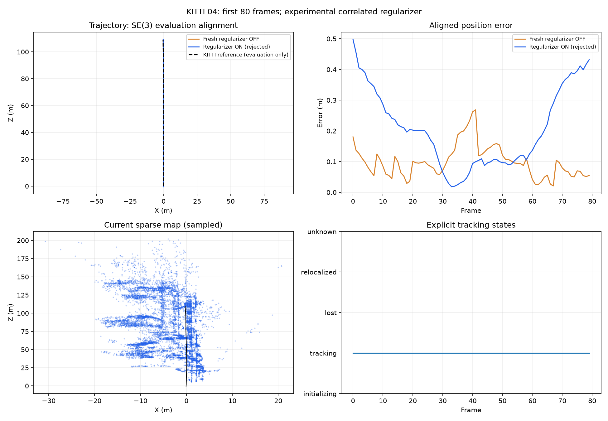

# Stereo motion regularizer experiment

The saved KITTI 01 audit shows local bundle adjustment reducing image error while
changing some previously verified stereo rotations. This branch tests a motion
term inside the local bundle objective. It remains disabled by default.

The term uses `Log(Z^-1 T_source^-1 T_target)` in right SE(3) translation/rotation
coordinates. Its fixed metric comes from raw stereo training observations with
point variables eliminated by QR projection. The declared one-pixel model is
independent in left u, v and disparity; computed right-u errors are correlated
with left-u errors. Rank and conditioning are checked in baseline-scaled units.

This deliberately reweights observations already used by tracking and mapping.
It is a **correlated regularizer**, not independent sensor fusion or a calibrated
pose covariance. A consistently biased raw motion can receive more influence.
Ground truth remains evaluator-only. No sequence-specific weights or relaxed
tracking thresholds are introduced.

Only exact raw fit-row geometry and pixel identities are eligible. Factors own
immutable measurement, information and provenance snapshots. Missing rows,
changed calibration or source geometry, duplicate physical training pixels and
singular information fail closed. Historical recorded poses follow their actual
keyframe anchors during optimization; both image and augmented objectives must
strictly improve before correction. Existing 0.5 m / 1.5 degree agreement gates,
map revision checks and the fixed origin remain in effect.

Enable this experiment with `--stereo-motion-regularizer` alongside `--slam --stereo` in the normal command, or `--stereo` in the shared evaluator. Saved
runs include active/skipped factors, objectives, fit-row IDs and frozen factor
provenance. Invalid unused training depth is explicitly null with validity masks;
information rows, poses and map exports must remain finite.

Synthetic checks cover finite-difference projection/SE(3) Jacobians, independent
point-block Schur elimination, correlated whitening, unit scaling, immutable
arrays, invalid inputs, delayed anchor corrections, unchanged hard gates, stale
calibration, and an actual SciPy solve with competing image/motion evidence.
These checks do not establish KITTI accuracy. The affected 01 prefix and wider
stereo/monocular, loop and reconstruction acceptance checks remain required.

## Validation checkpoint

The frozen estimator fingerprint is
`d620886b6cb4e01651b02595b8bf28ce7e6a51c5658cc8f533413c9cb02dc295`.
The full backend suite passes: 381 tests, with four optional GPU skips. The run
completed in 56.62 seconds and source/runtime fingerprints remained unchanged.

Two fresh, uncached KITTI 04 runs processed frames 0–79 on that same frozen
revision. They used identical calibration, inputs, mapping configuration and
evaluation; only the regularizer flag differed. Loop correction was disabled.

| Mode | SE(3)-aligned ATE (m) | Translation drift (%) | Rotation drift (deg/m) | Lost frames | Estimator time (s) | Peak memory (MiB) |
| --- | ---: | ---: | ---: | ---: | ---: | ---: |
| Regularizer off | 0.111884 | 0.280753 | 0.005653 | 0 | 60.00 | 264.34 |
| Regularizer on | 0.242564 | 1.085377 | 0.010650 | 0 | 57.91 | 287.05 |

**The experiment is rejected by the focused accuracy gate.** ATE increased
116.8%, translation drift 286.6%, and rotation drift 88.4%. There is only one
eligible 100 m segment in this short prefix; these are diagnostic results,
not full-sequence benchmark claims. The off control reproduces the previous
raw-reference implementation's exported poses exactly. KITTI 01 was not started
because this first gate failed.

The on run exports 79 factors and finite poses and sparse geometry. All nine
accepted bundle adjustments reduce both declared objectives. Their raw stereo
motions match the off control, but the regularizer suppresses useful multiview
corrections of coherent accumulated raw-motion bias. Reducing a reprojection
objective or preserving pairwise motions does not establish trajectory accuracy.

A saved-row mathematical audit also finds that the raw motion is not a
stationary point of the stereo-image objective used to form its Schur metric.
The corresponding linear term is missing from the zero-centered approximation.
However, that term is much smaller than the quadratic penalty on several useful
off-control corrections. Recentring alone is therefore not an evidenced fix;
measurement bias and repeated sensor evidence remain material.

One private supervisor's post-run reporting raised a TypeError after its worker
completed successfully. The original manifest and logs are retained. Its saved
estimator artifacts, source archives, finite exports and recomputed metrics were
audited independently; the reporting error is not presented as a clean cycle.

The regularizer stays disabled and separate from the integration branch. Next
work should diagnose the underlying stereo observation model and landmark
quality, rather than tune its strength to this sequence. The original 01 rotation
regression and wider stereo/monocular, live-loop and reconstruction acceptance
requirements remain open.
