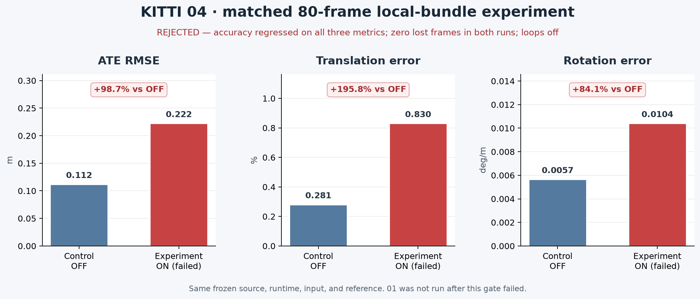
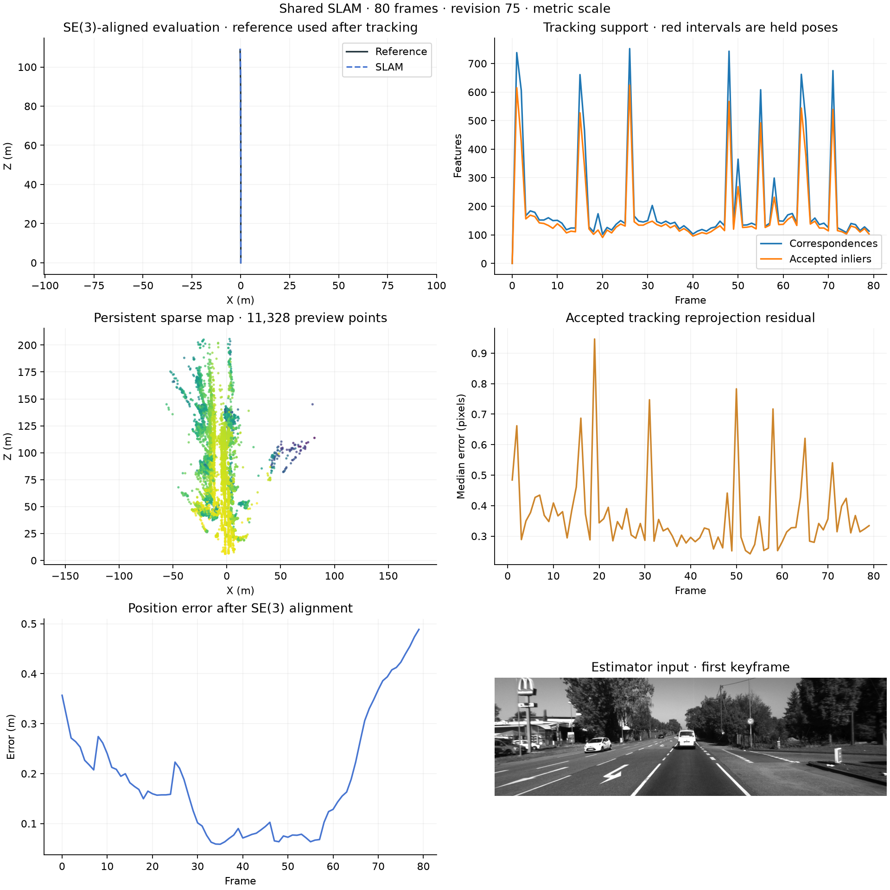

# Owned stereo image-bundle experiment

`stereo_owned_image_bundle` is an opt-in local bundle-adjustment experiment. It defaults to off in `MappingConfig`; enable it with `--stereo-owned-image-bundle`. The evaluator requires calibrated stereo and `--stereo-pose-arbitration`. When off, existing runs retain their original call path and residuals.

When enabled, the estimator may add correlated left/right image measurements from the already-run, reverse-verified reserved stereo fit to local bundle adjustment. It reuses points already selected by the bundle or current single-view map points and jointly optimizes those measurements with their shared camera poses and 3D points. Ambiguous or mismatched map observations, held-out rows, stale geometry, and any attempt to consume the full supported match pool make factors ineligible. The feature creates no new map points.

The model is explicitly a correlated physical stereo image-row model. Left and right measurements share sensor evidence, so these rows are not an independent validation set and the implementation makes no covariance claim. Eligibility requires that the final tracking decision selected the reserved stereo source; the feature does not fit a new pose or rematch descriptors.

Before applying a candidate, the bundle retains its existing affected-cost, positive-depth, finite-value, and stereo-motion checks. Both the original affected objective and the augmented objective, which also includes the new image rows, must strictly decrease. Immediately before map updates, the provider rechecks the captured map epoch, endpoint and anchor poses, live calibration, reused landmark positions, and exact keyframe-feature/Observation pixel and right-coordinate ownership. A stale or changed input rejects the augmentation.

## Latest matched smoke gate: rejected

A fresh, matched sequence-04 prefix compared the feature on and off for frames 0–79. Only the owned-image flag differed. Both runs used the same frozen source, runtime, input archive, reference, CPU configuration, and loop-off setting. The experiment regressed on every accuracy metric, so the gate stopped. Sequence 01 was **not run**; no full-sequence or broader-configuration conclusion follows from this prefix.

| Metric | Control OFF | Experimental ON | Change |
|---|---:|---:|---:|
| ATE RMSE (m) | 0.111884 | 0.222345 | +98.73% |
| Translation error (%) | 0.280753 | 0.830492 | +195.81% |
| Rotation error (deg/m) | 0.005653 | 0.010405 | +84.07% |
| Lost frames | 0 | 0 | — |
| Runtime (s) | 67.27 | 64.45 | descriptive only |
| Peak process memory (MiB) | 265.23 | 286.38 | descriptive only |



The captured ON run confirms that augmentation actually executed: frame 14 applied 108 owned image factors covering 214 unique image rows (106 current single-view points and 2 already-selected points); 8 candidate edges were rejected for ownership. The audit reports strict decreases in both gated objectives (original affected cost 130.8102 → 21.2405; augmented cost 172.5383 → 36.4275) and passes the existing hard motion checks. Its solver success flag is false, while the integration reports the validated candidate as applied. This mechanism evidence does not override the failed sequence-level accuracy gate or establish an accuracy benefit. The model makes no covariance claim and intentionally reuses sensor evidence.

The ON and OFF overview plots below are the actual evaluator exports; they show the aligned trajectory, tracking support, sparse map, reprojection residual, and post-tracking position error.

**Experimental ON — rejected:**



**Control OFF:**


The verified source fingerprint is `7a31a63ea1778ff76dbc0b818a1dd8984f009a7b2c6dcf5f502f1279fccd41a1`. The runtime, input, and reference identities matched; the development runner’s exact-identity export validator accepted both outputs and checked finite poses/maps and intact source/evaluator archives. Ground truth was evaluator-only. Detailed values and the validation record are in [`OWNED_IMAGE_BUNDLE_CHECKPOINT.json`](OWNED_IMAGE_BUNDLE_CHECKPOINT.json).

## Fresh sequence-04 acceptance check

For a future controlled rerun, compare two separately budgeted, matched, uncached 80-frame sequence-04 prefixes. Keep source, runtime, input archive, reference, CPU settings, output procedure, and loops-off setting fixed; change only the owned-image flag. Ground truth is evaluator-only. This check covers only this short prefix and configuration.

```powershell
python scripts/evaluate_shared_slam.py --stereo --sequence 04 --max-frames 80 `
  --max-wall-seconds 180 `
  --data-root <DATA_ROOT> --poses-root <POSES_ROOT> --output results/owned-image-04-off `
  --loop-mode off --stereo-depth-policy verified_fallback --stereo-pose-arbitration `
  --stereo-raw-reference-retry `
  --matching-backend cpu --retrieval current --opencv-threads 1

python scripts/evaluate_shared_slam.py --stereo --sequence 04 --max-frames 80 `
  --max-wall-seconds 180 `
  --data-root <DATA_ROOT> --poses-root <POSES_ROOT> --output results/owned-image-04-on `
  --loop-mode off --stereo-depth-policy verified_fallback --stereo-pose-arbitration `
  --stereo-raw-reference-retry `
  --matching-backend cpu --retrieval current --opencv-threads 1 `
  --stereo-owned-image-bundle
```

The off run should report the feature disabled and no active owned factors. For an on run, inspect factor provenance and ownership, held-out/full-pool exclusion, final validation, finite exports, and both objective gates before comparing evaluator metrics and tracking coverage. A passing smoke check alone would not demonstrate a benchmark improvement. The present matched check failed, and this experiment is not approved for the main release.

The earlier capture-only evidence and its limits are documented in [`stereo-training-observations.md`](stereo-training-observations.md). Those measurements do not test this optimizer integration and are kept separate from the failed ON/OFF comparison.

## Verification checkpoint

At the frozen source identity, the backend suite passed 411 tests with four optional GPU tests skipped. This publication update did not rerun tests or the estimator. The matched 04/80 gate failed; release readiness is false and sequence 01 was not run.
