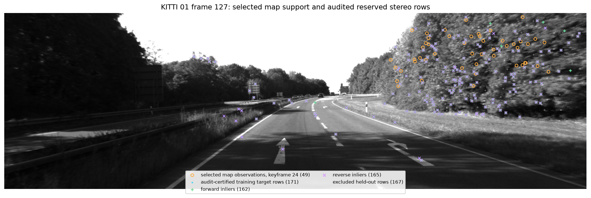
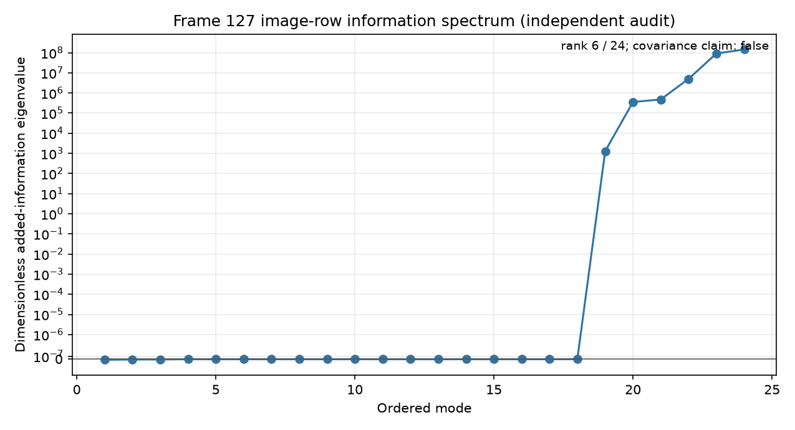
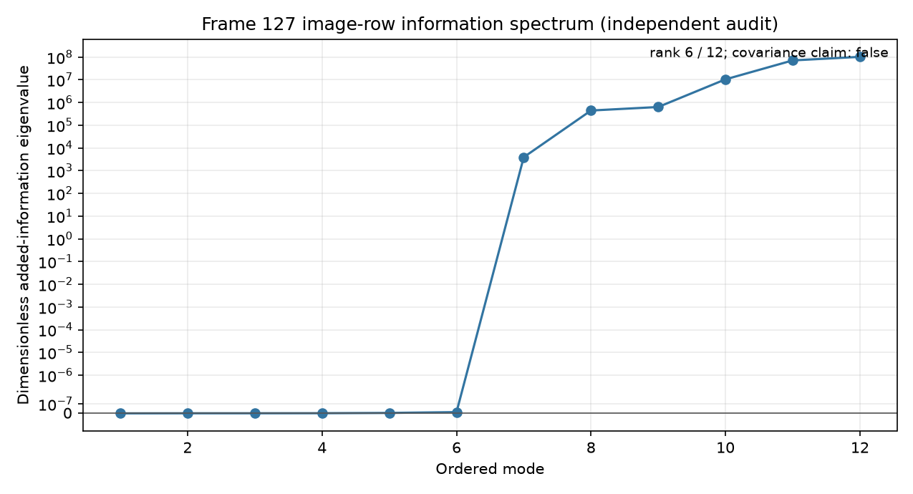
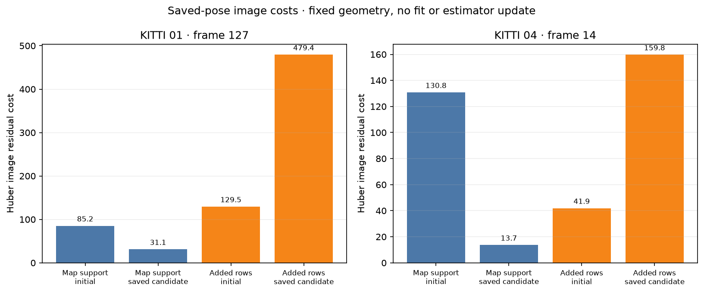
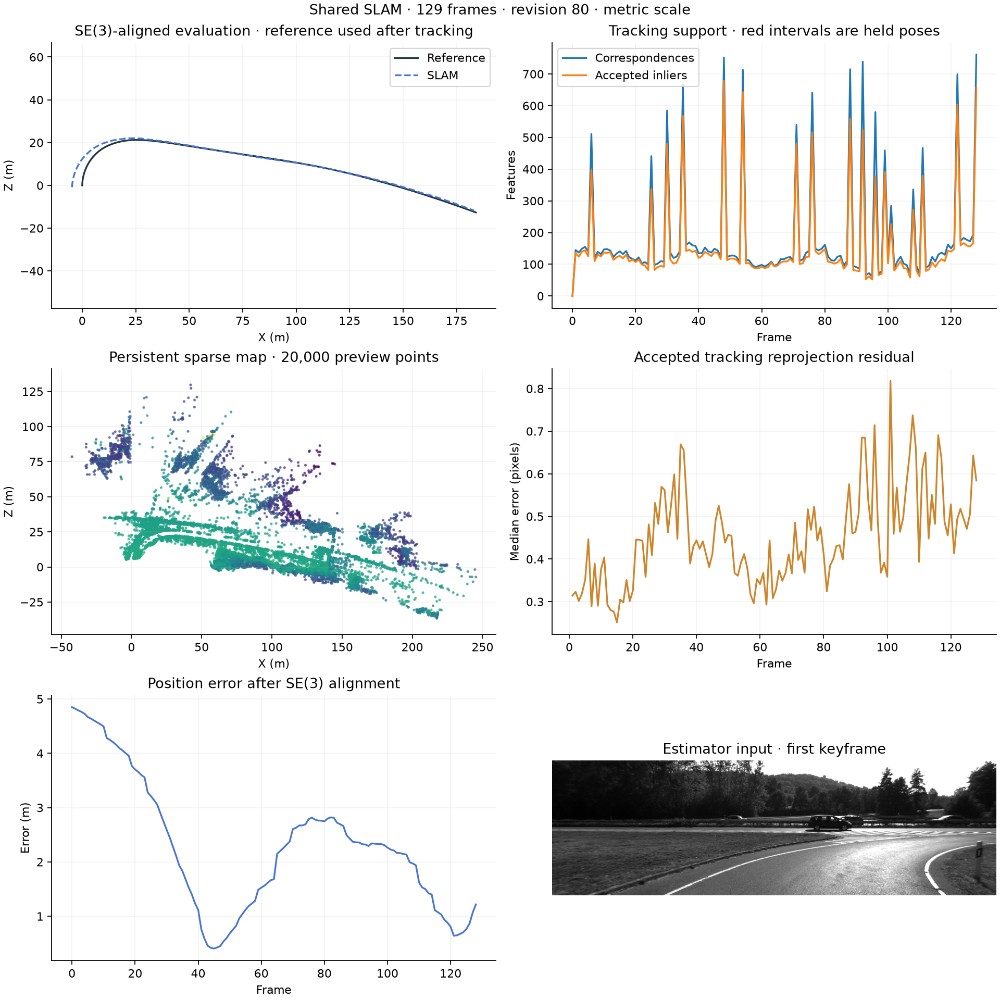

# Stereo training-observation capture diagnostics

This report documents a **capture-only** diagnostic. It records the exact
reserved stereo training observations at KITTI 01 frame 127 and compares
their image locations with the keyframe observations selected by local bundle
adjustment. The independent audit certifies 171 displayed raw
training rows; uncertified or ambiguous rows are excluded from the primary
overlay. The diagnostic does not change estimator decisions, establish an
accuracy improvement, or use ground truth during estimation.

The runs are partial prefixes: KITTI 01 frames 0–128 (129 frames) and KITTI 04
frames 0–79 (80 frames). Ground truth is evaluator-only. The 01 control uses
the same estimator source, runtime, inputs, calibration, and configuration,
with only the frame-127 diagnostic capture disabled. The 01 pose and sparse-map
exports are byte-identical between capture and control. Diagnostic files have
their own phase hashes in the saved manifest. Estimator configuration is
loop-closure off, current retrieval, CPU matching, and the same verified-fallback
stereo settings recorded in the JSON.

Source fingerprint: `5b6767d33ee9cf0e500a5ebaa20a270ebe8470d5a88ac55fcca5f7ac6088511a`. The JSON records the
source-manifest digest, evaluator digest, exact dependency/runtime identity,
input/reference identities, and checked export counts without local paths.
The source snapshot was `c634737b82dd8f54bcb2b8ede44f180b9cb1e618`; its frozen
backend suite recorded 391 passed and 4 optional skips. The capture/control
pair audit passed identity, tracking, pose, sparse-map, and bundle-report
parity checks without reusing metrics.

## Evaluator summaries

Ground-truth metrics below are computed after each estimator run. The reference
trajectory does not enter tracking, matching, map updates, or bundle adjustment.

| Run | Frames | ATE RMSE (m) | Translation (%) | Rotation (deg/m) | Lost | Estimator elapsed (s) |
|---|---:|---:|---:|---:|---:|---:|
| 01 capture · 129-frame prefix | 129 | 2.580982 | 4.330329 | 0.01305714 | 0 | 121.10 |
| 01 control · diagnostic off | 129 | 2.580982 | 4.330329 | 0.01305714 | 0 | 117.60 |
| 04 capture · 80-frame prefix | 80 | 0.111884 | 0.280753 | 0.00565278 | 0 | 67.14 |

## Frame 127 evidence

The overlay distinguishes current selected map observations, audit-certified
training target pixels, forward and reverse inlier memberships, and held-out
rows. This visualization shows evidence geometry; it does not establish that
the training rows improve pose accuracy.

## Saved prefix overviews

These are evaluator summaries of the saved prefixes. Sequence 01 has 49 selected map
observations in the newest keyframe and 171 independently accepted training rows at frame 127;
sequence 04's audit accepts 109 factors at frame 14. The information plots show audited image-row
constraints only; their spectrum is not a covariance or an accuracy guarantee. The authoritative run
identities, finite exports, statuses, and phase digests are summarized in
`TRAINING_OBSERVATION_RESULTS.json`; full identity validation remains in the
private run/audit artifacts.

For the matching capture command and diagnostic-off control, see
[`bundle-diagnostic-capture.md`](bundle-diagnostic-capture.md).

The cost plot evaluates saved camera/map states with the original Huber image
residual model while holding that geometry fixed. It performs no pose or
landmark fit. Added rows increase residual cost for both prefixes at the saved
state despite a nonzero information spectrum. That mismatch shows the local
information measure is not an accuracy score; it does not establish why the
evaluator outcomes differ.
