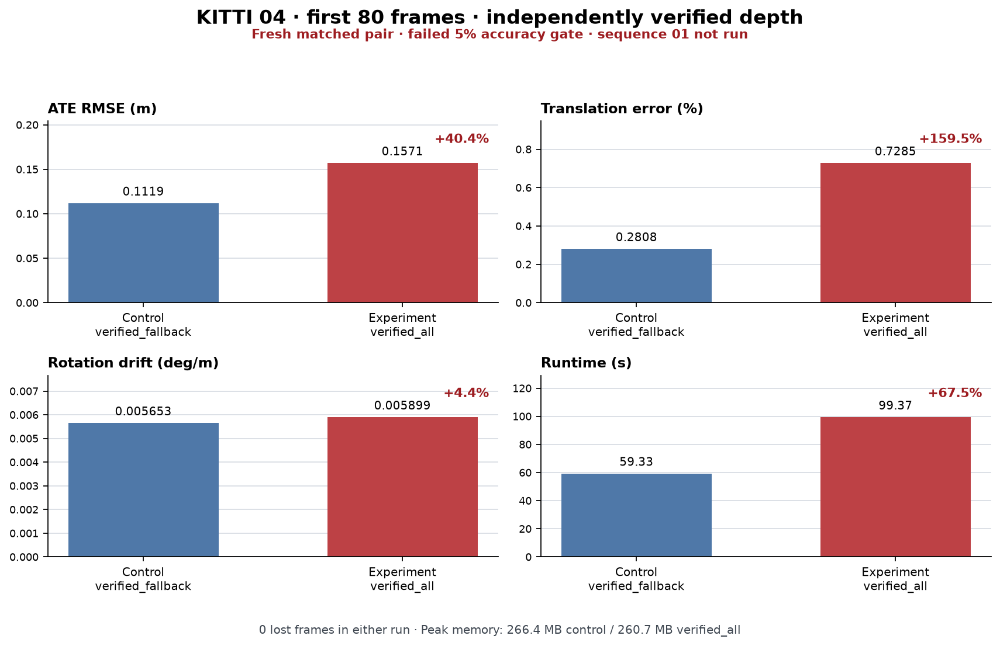

# Independently verified stereo measurements: matched 04/80 result

**Status: failed accuracy gate; not release-ready.** The fresh matched comparison
found that `verified_all` regressed ATE and translation error against the
`verified_fallback` control. This is a partial KITTI 04 diagnostic (frames 0–79),
not a full-sequence validation. KITTI 01 was not run because the 04 gate failed.
The default `supported` policy remains unchanged; this experiment is opt-in.

## Matched result

Both uncached runs used the same source fingerprint (`ba56a7277d33621256c98263d1d4aa6f43c9b9121c4c4b916fc68c2eaf0ee73b`),
input hash (`a6c5d77bcd5d974f499a497c1b883c480cfeaf433ab8e64f52874a19223ca317`), reference hash
(`4e1e0a630543706d76904b45f6ee2dbfa8b03b6e4319d6fc268ef302062806e1`), evaluator hash
(`1e91b813831bd64b2f8ae570abed796518420e7296f8826bdcc556814286d547`), CPU backend, current retrieval, one OpenCV thread,
CPU optimizations, stereo pose arbitration, raw reference retry, and loops off. The
only estimator configuration difference was the stereo depth policy. Ground truth
was used for evaluation only, and the gate confirms metrics were not reused.

| Metric | Control `verified_fallback` | Experiment `verified_all` | Change |
| --- | ---: | ---: | ---: |
| ATE RMSE (m) | 0.111884 | 0.157069 | +40.39% |
| Translation error (%) | 0.280753 | 0.728513 | +159.49% |
| Rotation drift (deg/m) | 0.00565278 | 0.00589895 | +4.35% |
| Runtime (s) | 59.33 | 99.37 | +67.5% |
| Peak memory (MB) | 266.39 | 260.71 | -2.1% |
| Lost frames | 0 | 0 | unchanged |

The declared 5% gate failed on ATE and translation; rotation stayed within 5%.
Both runs tracked all 80 frames, created 11 keyframes, and applied 9 bundle
adjustments. The new policy was about 67.5% slower;
peak memory was about 2.1% lower. These
results do not demonstrate an overall improvement.

The evaluator's inclusive stereo-verification stage measured 42.13 s for
`verified_all` versus 0.63 s for `verified_fallback`. These timings overlap the
extraction stage and are diagnostic, not additive runtime components.

The evaluation overview plots are saved separately for the experimental and
control runs: [verified_all](plots/verified-measurements04-verified-all-overview.png)
and [verified_fallback](plots/verified-measurements04-verified-fallback-overview.png).

## Run identity and limits

- Revision: `18e79ff`; source fingerprint: `ba56a7277d33621256c98263d1d4aa6f43c9b9121c4c4b916fc68c2eaf0ee73b`.
- Runtime: Python 3.12.14, OpenCV 5.0.0.93, NumPy 2.5.3, SciPy 1.18.1.
- Coverage: KITTI 04 frames 0–79 only. No KITTI 01 run is part of this checkpoint.
- Gate: `fail`; release readiness: `false`.
- The earlier `a275cef` verified-depth result remains in `VERIFIED_DEPTH_RESULTS.json`. The rejected `7a31a63` owned-image-bundle result remains a separate saved dashboard experiment; neither result was overwritten or combined with this pair.

Machine-readable details are in [VERIFIED_STEREO_MEASUREMENT_CHECKPOINT.json](VERIFIED_STEREO_MEASUREMENT_CHECKPOINT.json).
